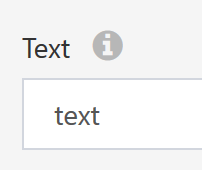

# Description

The **Description** column on a container field provides additional information about the field via hovertext. The value can be any string. When a description is provided, an info (I) icon will appear next to the label for the field:

Hovering over this icon will show the **Description**:

## Controls

The **Description** column applies to the following controls:

- [AppRun](../05.Control-Details/AppRun.md)
- [NumberFormatting](../05.Control-Details/NumberFormatting.md)
- [Category](../05.Control-Details/Category.md)
- [CheckBox](../05.Control-Details/CheckBox.md)
- [Computed](../05.Control-Details/Computed.md)
- [Date](../05.Control-Details/Date.md)
- [DateTime](../05.Control-Details/DateTime.md)
- [HyperLink](../05.Control-Details/HyperLink.md)
- [Label](../05.Control-Details/Label.md)
- [Phone](../05.Control-Details/Phone.md)
- [QueryView](../05.Control-Details/QueryView.md)
- [QueryViewChooser](../05.Control-Details/QueryViewChooser.md)
- [Radio](../05.Control-Details/Radio.md)
- [Rating](../05.Control-Details/Rating.md)
- [Reference](../05.Control-Details/Reference.md)
- [Spin](../05.Control-Details/Spin.md)
- [SSN](../05.Control-Details/SSN.md)
- [Table](../05.Control-Details/Table.md)
- [Text](../05.Control-Details/Text.md)
- [Textarea](../05.Control-Details/Textarea.md)
- [Voice](../05.Control-Details/Voice.md)
- [YesNo](../05.Control-Details/YesNo.md)
- [ZIP](../05.Control-Details/ZIP.md)
