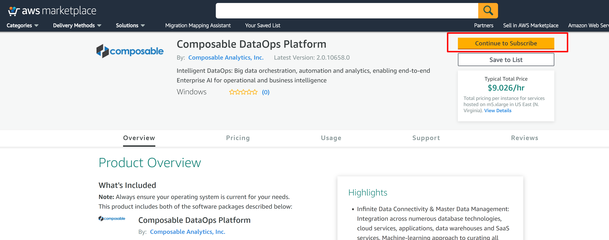
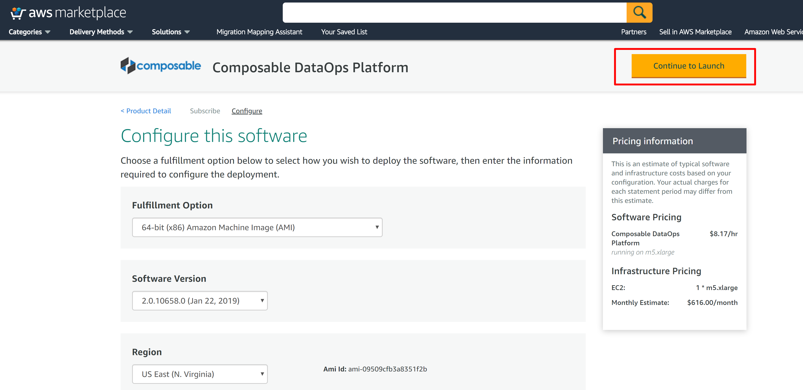
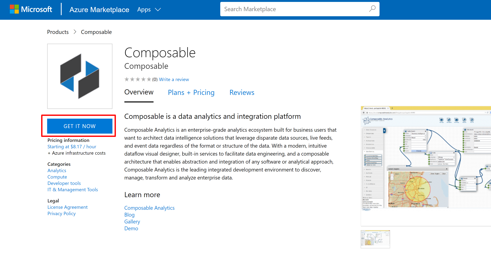
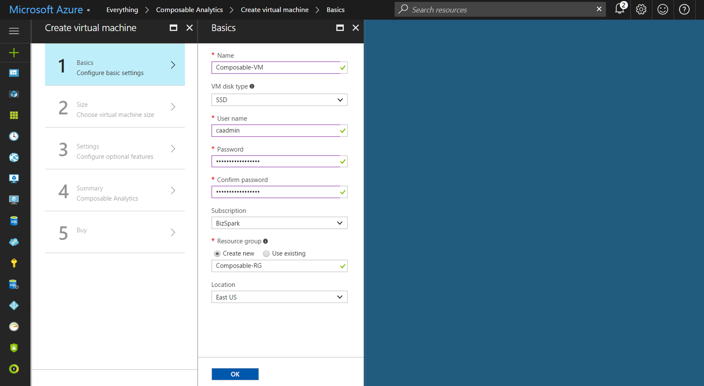
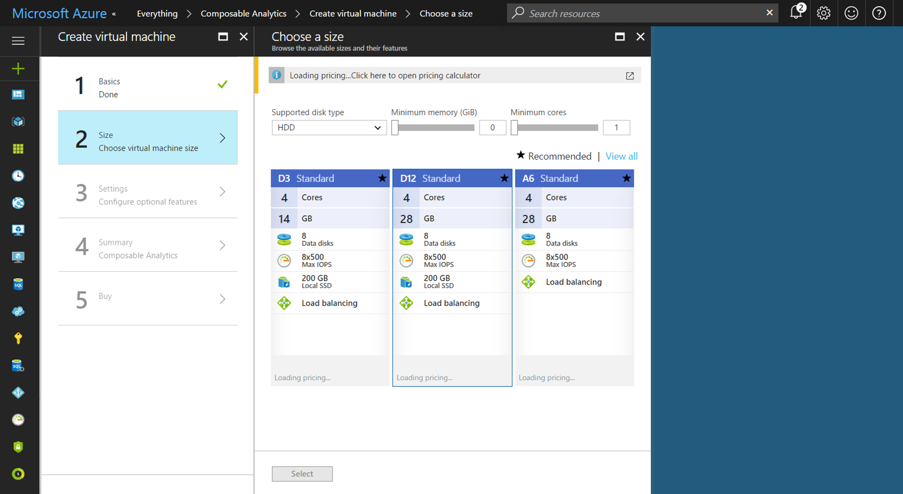
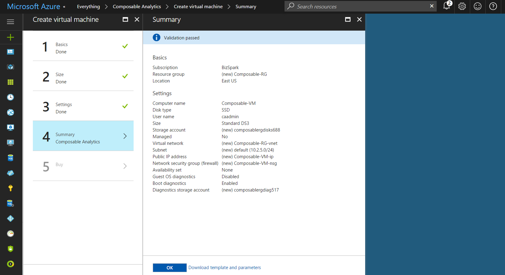

# AWS Marketplace

Composable is available in the AWS Marketplace at [AWS](https://aws.amazon.com/marketplace/seller-profile?id=911f5969-ae5e-4de9-acca-b8f606972771).

1. Navigate to [AWS](https://aws.amazon.com/marketplace/seller-profile?id=911f5969-ae5e-4de9-acca-b8f606972771) and select **Composable DataOps Platform** from the product list.
    - If not already, please make sure to be logged into your AWS account.
    
    
    
2. Click on Subscribe. 
    - You can review product information, including full pricing estimates.

    

3. Review and Accept the Terms and Conditions, then click on Continue to Configuration.

    

4. Select configuration and AWS region, then click Contiue to Launch.
    - Composable is available as a 64bit AMI running on Windows Server 2016. You can select an AWS region on this screen.

    

5. Select, finalize and review configuration, then click Launch.
    - Review the usage instructions, copied below for reference.
    
    > Composable DataOps Platform can be accessed via any browser (Chrome, Firefox, IE, Edge, ...). Once the instance is running, you can point your web browser to http://<public hostname>/CompAnalytics/, where <public hostname> is the public IP address for your instance (e.g., ec2-12-345-678-90.us-west-2.compute.amazonaws.com) listed in the EC2 Dashboard within the AWS Console. You may also connect to this instance directly using Remote Desktop Connection, and navigate to localhost/CompAnalytics. The password for username "admin" will be dynamically set to the EC2 instance ID. (e.g., username "admin" and password "i-03cfe92f81f787655"). Instance ID can be retrieved from the AWS Console once your VM is launched. You may modify rules in the security group to control the inbound and outbound traffic to this instance.
    
    - Select Choose Action - this is purely your preference of continuing via this webpage or continuing in the EC2 AWS Console.

    - EC2 Instance Type - This is where you select the VM size. We reccomend the m5.xlarge VM size, but smaller sizes, such as m3.medium can work as well.

    - VPC Settings, Subnet settings, Security Group Settings and Key Pair settings - please select from exisiting options already configured in your AWS account, or create new ones as needed.

    - Finally, click Launch!

    

# Azure Marketplace

Composable is available in the Azure Marketplace at [Azure](https://azure.microsoft.com/en-in/marketplace/partners/composable/composable).

1. Navigate to [Azure](https://azure.microsoft.com/en-in/marketplace/partners/composable/composable) and review product information, including full pricing estimates.
    - If not already, please make sure to be logged into your Azure account, and click Get it Now.
    
    
    
2. From the Azure Portal, once logged in, you can also select add New Resource, and search for 'composable'. 
    - You can review product information, including full pricing estimates.

    

3. Once you select Composable, you can review the product information and click Create.

    

4. Azure will present a 5-step wizard to select settings, VM size review pricing and terms.
    - The following screenshots represent the steps in the deployment wizard.

    

    

    

    

    

5. Finalize and review configuration, then click Purchase.