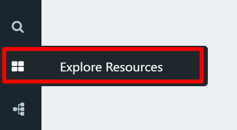

# Search

The best place to start exploring Composable is the Search page. You can get to the search page by clicking on the `Explore All` icon in the sidebar.

Once on the Search page, you will be presented with all the Composable resources (DataFlows, Folders, Groups, QueryViews, ...) that you have permision to "discover." A flexible faceted search panel is available on the left hand side, as well as some quick links to specific resources (e.g., "My DataFlows").

