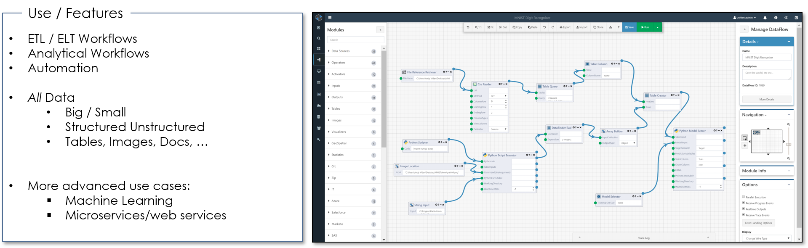
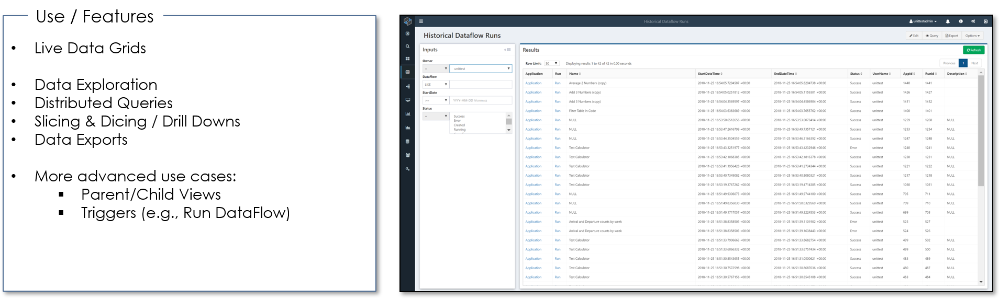
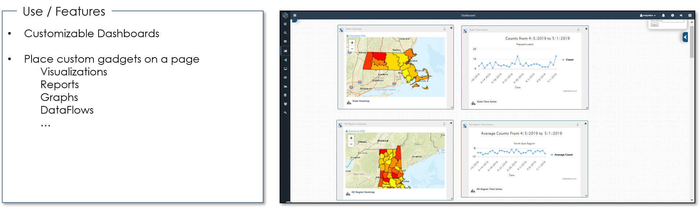

Composable is a full-stack dataops (data operations) environment for seamlessly executing all levels of data orchestration and processing, e.g., Extraction, Transformation, and Loading (ETL); Querying, Processing, Visualization and Dissemination.

The main capabilities offered by Composable are organized around product areas for:

- Data Processing & Transformations
- Data Exploration
- Data Modeling & Storage

# Data Processing & Transformations

## DataFlows

Composable DataFlows are data processing and analytical workflows, utilizing Composable's flow-based programming method. Each dataflow consists of modules that are connected together to produce higher-level functionality.

## WebApps

Composable WebApps are full web applications, including visualizations built with d3.js, built and seamlessly integrated with Composable using well-defined web services and API endpoints.

# Data Exploration

## QueryViews

Composable QueryViews provide an interface for distributed queires and live data grids. 

## DashBoards

Composable DashBoards are customizable web portals where users can publish various blocks of results and runs, for interactive visualizations and reporting.

## DataExplorer

Composable DataExplorer allows users to connect to a data repository, visualize relationships, explore the data and save a collection of reusable queries.

# Data Modeling & Storage

## DataPortals

Composable DataPortals provides a rapid application development environment for modelling data and automatically generating the web and business layers and custom web user interface.

## EntityHub

Composable EntityHub is a machine-learning driven approach to Master Data Management, providing a unique capability to identifying, creating and de-duplicating entities across datasets, going beyond simple deterministic and probabilistic (fuzzy matching) methods.

