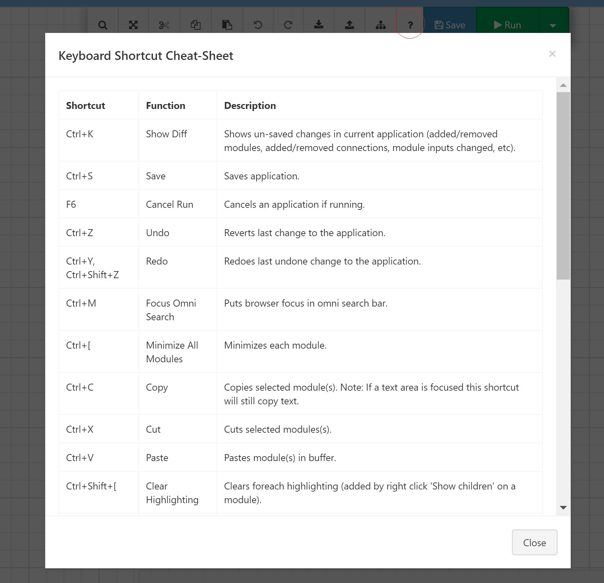

# Composable Designer Keyboard Shortcuts

|Shortcut|Function|Description|
|---|:---:|:---:|
|Ctrl+K|Show Diff|Shows un-saved changes in current application (added/removed modules, added/removed connections, module inputs changed, etc).|
|Ctrl+S|Save|Saves application.|
|F5|Run Application|Runs present application.|
|F6|Cancel Run|Cancels an application if running.|
|Ctrl+Z|Undo|Reverts last change to the application.|
|Ctrl+Y, Ctrl+Shift+Z|Redo|Redoes last undone change to the application.|
|Ctrl+M|Focus Omni Search|Puts browser focus in omni search bar.|
|Ctrl+[|Minimize All Modules|Minimizes each module.|
|Ctrl+C|Copy|Copies selected module(s). Note: If a text area is focused this shortcut will still copy text.|
|Ctrl+X|Cut|Cuts selected modules(s).|
|Ctrl+V|Paste|Pastes module(s) in buffer.|
|Ctrl+Shift+[|Clear Highlighting|Clears foreach highlighting (added by right click 'Show children' on a module).|
|Ctrl+I|Palette Search Focus|Puts browser focus in module pallete search.|
|Del|Delete Selected|Deletes selected modules.|
|Ctrl+E|Disable/Enable Selected|Toggles enabled status of selected module(s).|
|Ctrl+A|Select All|Selects all modules on the design surface.|

*You can view the keyboard shortcuts from within the Designer by clicking on the question-mark icon outlined in red.*

