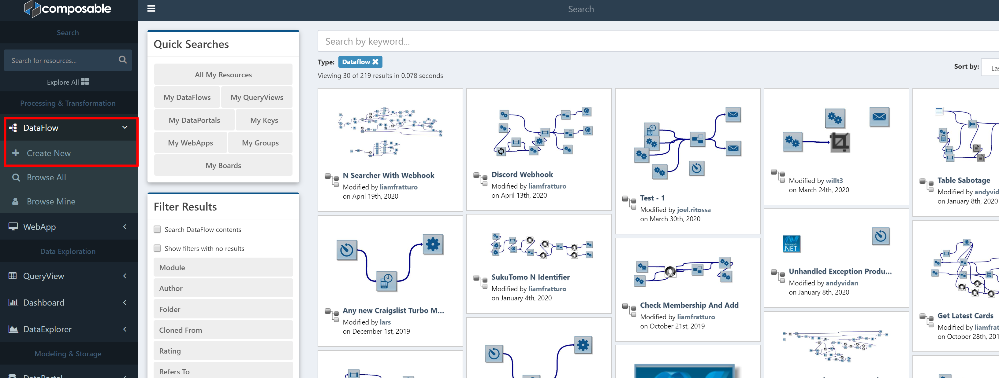
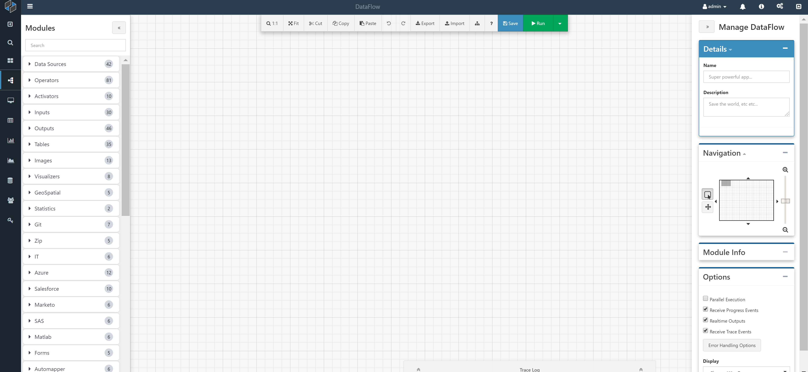

# Custom Module Extensions

Custom Modules may also be created in code and brought into the Composable platform as Custom Module Extensions. To do this, developers may install a local copy of Composable, and also an IDE such as Visual Studio. Once installed, a "Composable Analytics Plugin” template should be available in Visual Studio under C#. Developers can select this template, select a name and location, and press the OK button. The default plugin template comes with an example Module plugin that can be modified to create a custom Module with custom inputs and outputs.

## Create a Custom Module Extension

Environment Requirements:
* Visual Studio (2012 or later)
* Composable (local copy)

Open Visual Studio and create a New Project. There should be a “Composable Analytics Plugin” template under C#. Select this template, select a name and location, and press the OK button.



The default plugin template comes with an example Module plugin:



### Examples

#### "Hello World" Module

A simple “Hello World” example of a Module looks like this:

``` csharp
using CompAnalytics.Contracts;
using CompAnalytics.Extension;
using System.ComponentModel;
using System.Diagnostics;
 
namespace CompAnalytics.Execution.Modules
{
    [ModuleType(Name = "Hello World", Namespace = "comp.companalytics", Category = ModuleCategory.Operator)]
    [Description("A sample module")]
    public class HelloWorld : ModuleExecutor
    {
        public override void Execute(IExecutionContext context)
        {
            Trace.WriteLine("Hello World!");
        }
    }
}
```

If you were to save this in the project CompAnalytics.Execution.Modules, under the filename MyModule.cs (for example), then in the Composable Designer you see a Module named “My Module” in the operators bin. This Module has no inputs or outputs, and does not do anything visible in the browser when it is run; however, if you debug the IIS process in Visual Studio while running it, you will see “Hello World!” written to the console output.

!!! note
    CompAnalytics.Execution.Modules is only one possible namespace; Modules can exist in any namespace.

Every Module class inherits from ModuleExecutor (which specifies the Execute method), and has the ModuleType and Description attributes associated with it. Here is what the attribute parameters do:

* ModuleType.Name: The name of the Module which is visible to the user in the app designer.
* ModuleType.Namespace: e.g., comp.companalytics,
* ModuleType.Category: Determines which bin in the Module Library the Module will appear in. Use one of the constants from the ModuleCategory class.
* ModuleType.Icon: Not used in this example. A path to an image which appears next to the Module name in the app designer. For instance, “./images/module-icons/calculator.png” will result in a calculator icon.
* ModuleType.EditableInputs: Not used in this example.
* ModuleType.Width: Not used in this example. The default width of the Module in the Composable Designer. If not specified, it is 150 pixels.
* Description.Description: The text which appears in tooltips and in the Module Info box in the Composable Designer.

#### Sine Module with Inputs and Outputs

Here is a Module that does something slightly more interesting.

``` csharp
using CompAnalytics.Contracts;
using CompAnalytics.Extension;
using System;
using System.ComponentModel;
 
namespace CompAnalytics.Execution.Modules
{
    [ModuleType(Name = "Sine", Namespace = "comp.companalytics", Category = ModuleCategory.Operator, Icon = "./images/module-icons/calculator.png")]
    [Description("Calculates the sine of a number")]
    public class Sine : ModuleExecutor
    {
 
        [Description("The number to calculate the sine of")]
        public ModuleInput<double> X { get; set; }
 
        [Description("The sine of that number")]
        public ModuleOutput<double> SineOfX { get; set; }
 
        public override void Execute(IExecutionContext context)
        {
            double inputValue = this.X.Get(context);
            double outputValue = Math.Sin(inputValue);
            this.SineOfX.Set(context, outputValue);
        }
    }
}
```

When you view this Module in the Composable Designer, you will see that it has an input and an output; its input is a double, which it calculates the sine of and then sends this to the output.

For every input that you want a Module to have, give that Module's class a public ModuleInput property with default getters and setters. The Description attribute, again, specifies the tooltip text. The type parameter to ModuleInput specifies the type of the input. ModuleOutput works analogously.

ModuleInput has a method, Get, that should be called from the Execute method, passing the IExecutionContext argument. This returns the actual value passed to the Module as input. There's also an overloaded version of ModuleInput.Get that specifies a default value to be returned if no input has been supplied. If you don't specify a default value and no input is supplied, then Get will return null (or, if the type parameter is a non-nullable value type, throw an exception).

Similarly, ModuleOutput has a method, Set, that you call from the Execute method, passing the IExecutionContext argument and the value that you want to set as the output. If you don't call this, then the output will be the default value for the relevant type.

!!! note
    Module inputs and outputs can be lots of different types, including object. Module inputs and outputs of different types can be connected together; the values are converted implicitly.

There is another class, ModuleInputCollection, which is like ModuleInput except that more than one value can be passed into it (and so it can have more than one incoming connection in the Composable Designer). If you have, for instance, a ModuleInputCollection<int>, then its Get method returns a List<int> instead of an int. The default value for this kind of input is an empty List rather than null.

!!! note
    There are other attributes that inputs and outputs can be associated with, that do various things.

#### Word Counter Module

Create a new C# class called **WordCounterModule** with the contents:

``` csharp
using System;
using System.ComponentModel;
using System.Linq;
using CompAnalytics.Contracts;
using CompAnalytics.Controls;
using CompAnalytics.Execution;
using CompAnalytics.Execution.Validation;
using CompAnalytics.Extension;
using CompAnalytics.Contracts.Tables;
using System.Collections.Generic;
using CompAnalytics.Contracts.Isolation;

namespace TextAnalytics
{
    [ModuleType(Name = "Word Counter", Namespace = "TextAnalytics", Category = "Text Analytics", Icon = "Icons.example.png")]
    [Description("Creates a table of the word count in the given text.")]
    public class WordCounterModule : ModuleExecutor
    {
        [Description("Text String")]
        public ModuleInput<string> InputText { get; set; }

        [Description("Word counts")]
        public ModuleOutput<Table> Result { get; set; }

        public override void Execute(IExecutionContext context)
        {
            var inputText = InputText.Get(context);

            List<string> words = SplitIntoWords(inputText);

            Dictionary<string, int> wordCounts = CountWords(words);

            Table result = CreateTable(wordCounts, context);

            Result.Set(context, result);
        }

        /// <summary>
        /// Counts the words in a list of words
        /// </summary>
        /// <param name="words"></param>
        /// <returns></returns>
        private Dictionary<string, int> CountWords(List<string> words)
        {
            // Count Words
           var counts = new Dictionary<string, int>();
            foreach (var word in words.Select(w => w.ToLowerInvariant()))
            {
                if (!counts.ContainsKey(word))
                {
                    counts.Add(word, 0);
                }

                counts[word]++;
            }

            return counts;
        }

        /// <summary>
        /// Converts a dictionary of word, count pairs into a table
        /// </summary>
        /// <param name="counts"></param>
        /// <param name="context"></param>
        /// <returns></returns>
        private Table CreateTable(Dictionary<string, int> counts, IExecutionContext context)
        {
            ITableExtension ops = context.FindExtension<ITableExtension>();
            TableColumnCollection columns = new TableColumnCollection();
            columns.Add(new TableColumn() { Name = "word", Type = "VARCHAR" });
            columns.Add(new TableColumn() { Name = "count", Type = "INT" });

            Table table = ops.CreateTable(columns);

            using (var writer = ops.CreateWriter(table))
            {
                foreach (KeyValuePair<string, int> entry in counts)
                {
                    var row = new List<Object> { entry.Key, entry.Value };
                    writer.AddRow(row);
                }
                writer.Complete();
            }

            return table;
        }

        /// <summary>
        /// Splits a string of text into a list of words
        /// </summary>
        /// <param name="text"></param>
        /// <returns></returns>
        private List<string> SplitIntoWords(string text)
        {
            return text.Split(new char[] { '\t', ' ', '\r', '\n' }, StringSplitOptions.RemoveEmptyEntries)
                .ToList();
        }
    }
}
```

### Module ReadMe

When your Module is done, add a readme for it. Find the Product/ModuleResources folder. Inside it, find the folder for your Module's namespace (i.e., the “comp.companalytics” in the attribute “[ModuleType(Name = “Hello World”, Namespace = “comp.companalytics”, Category = ModuleCategory.Operator)]”). For new odules, this should be “companalytics”. Then, create a folder with your Module's full name (e.g. “Hello World”). Create a file called readme.md there. You won't have to build the solution after doing this – just try clicking the '?' button on your new Module and see if the readme appears. Refer to existing readmes for format. Markdown is supported for the formatting.
