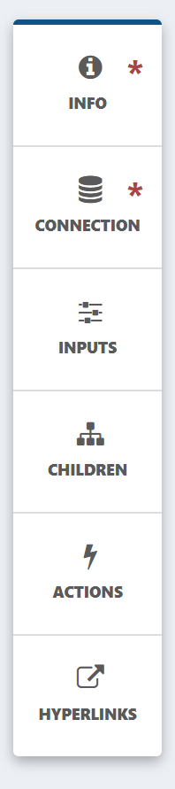
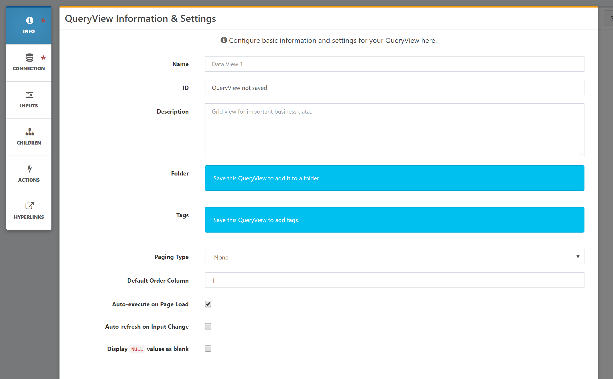
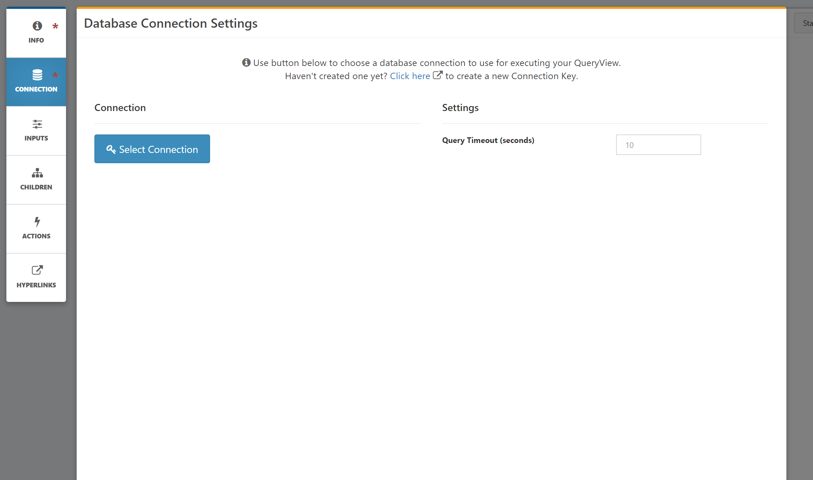
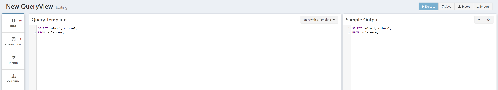

# Creating a QueryView

## QueryView Configuration

After clicking through the QueryView icon, you will be presented with a new, blank QueryView in Edit mode. A QueryView has two modes: Edit mode, which allows you to edit the configuration, settings and query, and View mode, which allows you to view the results.

The QueryView Edit mode looks as follows:

Note the three sections: a set of configuration menu items on the left, the query template window, and the sample output window.

To begin, click through the verticle menu items:

1. Info: On this modal, enter in the QueryView name, description, and other global settings.

2. Connection: Here, select the ["Composable Key"](./09.Keys/01.Overview.md) to connect to the data store of your choice.

With these set, you are now ready to write a query!

## Writing the Query

In the Query Template Window, you can write your SQL statement.

As an example, you can do the following:

Note that as you write your SQL statement, Composable checks and converst your query into a syntactically correct SQL statement viewable in the sample output window on the right. This will prove useful as we introduce inputs and paramters later on.

!!! note
    Composable will execute this query on the underlying SQL host you select via the Composable Key. So you can write your SQL in any flavor of the language (e.g., for Oracle, DB2, MSSQL, Hive, etc.!

## Viewing and Saving

You can now switch to the View mode by clicking on the Execute button. A grid of results will appear.

You can switch back and forth between Edit and View to iterate on the query. To save the QueryView, simply click on Save.

!!! note
    Once a QueryView is saved, you can share the QueryView, and also place it in a Folder or add Tags to it (found in the Info modal). A full revision history will also be available.