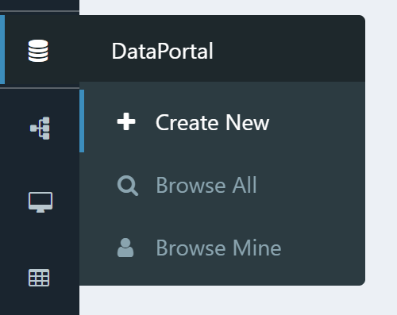
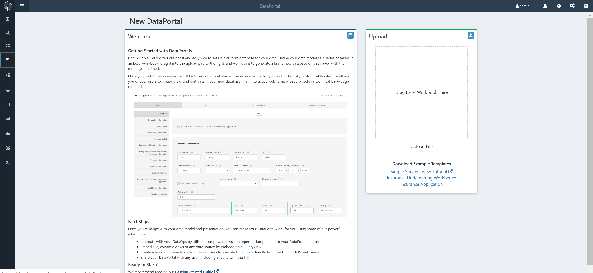

# Creating a DataPortal

Create a new DataPortal by choosing the icon in the side navigation bar.

You will be presented with an overview page. We urge you to read through the description shown, and also download the sample Excel template files that are available (on the right hand side of the screen).

## DataPortal Configuration

Begin with one of the Excel templates provided.

### Excel Sheet Structure

Each sheet in the Excel workbook represent a container or table. Column headings in a sheet is the control type, with rows representing values. The following column headers are typically found on each of the Excel sheets:

- Name: A whitespace-free name for the field. Think of this as the name you would give this field in a database.
- DisplayName: A human-friendly label that will be displayed above the input box for the field on the user interface.
- Description: A longer description that can be displayed in a tooltip on the user interface to more fully explain the field.
- Type: The name of the data type of the given field, such as integer or string.
- ControlType: The type of form control that will be shown to the user to input their data for this field.
- Required: Indicates whether the field is required.

!!! note
    Note the special case for ‘Label’ fields — DisplayName contains rich text written in Markdown.

**Master**: This is the first sheet that is processed by Composable and acts as a link to all other container sheets that will ultimately be shown to the end user. This is a required sheet in the workbook. The Name given as a value here will serve as the root database name.
 
**“Container”**:  These can be any name that is not reserved and specify what input fields are listed out in each web page the user sees, as well as any controlling logic of how they are saved and displayed.  Think of these sheets as tables in your datamodel, with each input field name representing a column in a SQL table.
 
**“Category"**:  These specify a single picklist for the end user, such as Gender or State you live in.  They can be in its own sheet or in the Categories sheet.
 
**Categories**: On this sheet, each column represents its own category to simplify the Excel structure if you have a lot of categories in your data model.
 
**ReadMe**: This sheet is not processed or displayed to the end user of forms, it is a place to store notes and comments on the model. 
 
**CSS**:  An optional sheet for the user to enter custom CSS rules to style the forms page with any colors, margins or other custom style behavior. 
	
 
#### Control Definitions

(Fields with an (*) are required to process a sheet.)
 
***Name**:­­ This is the name of the variable that is saved in the database.  The name must be unique on the page and cannot be ID or the sheet name.
 
**DisplayName**: This is the name displayed to the end user as a label above the input field. If left blank, the name field is used. If “NoDisplayName” is used, the label is left blank.
 
**Description**: This is optional extra information displayed to the user if they hover over an info (I) icon above the input field.
 
***Type**:  This is the variable that the input field represents in the database. There are three main types of values you can put in this field: system types, such as System.String; category types, which represent a sort of picklist; container types, which represent a link to another page or table if it’s a one to many relationships.
 
***ControlType**:  This field determines how the input field is displayed to the end user and must match the type on the backend.  
 
AppRun: Specifies a button that runs a composable app by AppID. Not an input type.
Boolean: Checkbox for Boolean types.
Category: Picklist for Category types.
DateTime: UI picker for a date type.
Decimal: Decimal input field.
Integer: Integer input field.
Label: A string input that can be styled by having the DisplayName be processed as markdown. Not an input type.
MultiCategory: Picklist Category types where multiple selections can be made.
Page: Link to a signle child Container types. Not an input type.
Spin: Supported for numeric types, offers a spin clicker UI for cycling through valid numbers.
SSN: Only allows valid SSN entries to be saved.
String: String input field.
Tab: Specifies a tab to be displayed on the page to control visibility between items. Not an input type.
Table: A link to many of the same child Container types.  New child containers can be created, but otherwise not an input type.
Textarea: Larger string input field.
Telephone: Only allows valid telephone entries to be saved.
Voice: Experimental, a Larger string input field that allows voice input.  Only supported in Chrome.
	
**Columns**: Only processed for the Table ControlType.  Specifies what columns in the child sheets appear in the table for the user.  Using JSON notation, have the option to rename the column names from their defaults.  If left blank, only each record ID is shown in the table.  
 
**SearchBoxes**:  Only processed for the Table ControlType.  If value is “True”, a search box appears below each column header in the Table. (See the next section for more information).
 
**Min**:  Only processed for numeric or date-time types, defines a lower bound on the value that can be stored in the database.  A warning is given to the user if the input is invalid.  
 
**Max**: Only processed for numeric or date-time types, defines an upper bound on the value that can be stored in the database.  A warning is given to the user if the input is invalid.  
 
**StrMin**: Only processed for System.String, defines a lower bound on the number of characters that can be stored in the database. A default value satisfy this min length must be provided to use this field. A warning is given to the user if the input is invalid.  
 
**StrMax**: Only processed for System.String, defines an upper bound on the number of characters that can be stored in the database.  A warning is given to the user if the input is invalid.  
 
**VisibilityCondition**: Checks the value of another input field on the page to see if this field is displayed to the user.  Supports Boolean logic ands (&&), ors (||) and parenthesis.  If the check returns false, the input is not displayed to the user. 
 
**MaskedCondition**: Checks the value of another input field on the page to see if this field is displayed to the user like visibility condition, but instead of not displayed the item, masks the item and shows white space where the input field normally is
 
**OptionController**: Uses a pipe separated list to determine visibility conditions for a category controlType.  
 
**ReadOnlyCondition**: Processed on all input types.  If set to “True”, the input field is grayed out and only data prepopulated in forms will be displayed.
 
**DeleteType**: Only processed for containers. If set to “Soft”, the record is still saved in the database on delete.  
 
**DefaultValue**:  Processed on all input types, sets the value that the user first sees. 
 
**Required**: Processed on all input types.  If set to “True”, a user must supply a value for the page to be saved.
 
**Group**: Processed on everything displayed on the screen, specifying which group 
 it is displayed within.  Groups are processed top-down.  Nesting of items in a group is achieved with separating group names with a “.” while horizontally laying out elements in a div is achieved by ending the group names with H or HC for horizontal and horizontally centered respectively.  Ending a group name with T and a digit 1-12 will place the field in a horizontal row, always taking up increments of 1/12 of the width of the page.  
 
**ControlGroup**: Only processed for the Tab Control Type.  Specifies which group in the Group column is displayed when the tab is selected.  Overrides visibility conditions.
 
##### Group layout example:

First, you don’t need to give any field a group. If you omit groups, fields will display vertically stacked on the page, each filling 100% of the width of the page.
The group column takes in a group name with no spaces.
Groups are arranged in a hierarchy by dot notation. “Cars.Chevy” puts a field in the “Cars” group, and in the “Chevy” subgroup inside of “Cars”.
A colored (light grey) background is displayed under each top-level group. If fields exist inside the “Cars” group and a “Trains” group, those groups will be visually separated on the page with gaps between their respective grey background areas.
Groups are stacked one below the other, vertically, on the page. The order of the groups is determined by the respective ordering in the Excel of the first field in a given group.
The most common way of laying out the form is by setting up groups of fields to be displayed horizontally next to each other across the page. We support a suffix notation to specify the widths of fields to support displaying a row of fields horizontally across the page. To have a field take up less than the full width of the page, append the letter “T” to the end of the group name, followed by a number between 1 and 12, representing the fraction of the page you’d like the field to fill. (“T6” is half the page, “T1” is 1/12 of the page).
Since this is the most common structure, I’ll show an example.
Let’s put all of our fields into a top-level group, so that all of the fields will be displayed in the same light grey box on the page. We’ll call this group “A”.
Let’s say we have 6 fields to display on the page, with the following layout: 
The first field on its own across the top of the page, taking up the full width.
Fields 2-3 below field 1, next to each other horizontally, each taking up half of the width of the page.
Fields 4-6 below fields 2-3, next to each other horizontally, each taking up a third of the width of the page.
To achieve this, we’d assign the following groups to the fields:
Field 1: “A.FirstRow”
The form will create a group called “A”, then a group called “FirstRow” inside of it. As no width was specified, this field will fill the full width of the page.
Field 2: “A.SecondRowT6”
The form will create a new group called “SecondRow” inside the existing group “A”, which will be displayed below the “FirstRow” group. This field will take up half of the width of the page (due to the “T6” suffix), aligned to the left of the new “SecondRow”. 
Field 3: “A.SecondRowT6”
The form will insert this field into the “SecondRow” group, where it will take up the remaining half of the page width, to the right of Field 2.
Field 4: “A.ThirdRowT4”
The form will create a new group “ThirdRow” inside top-level group “A”, which will appear below the “SecondRow” group on the page. This field will be displayed on the left side of the “ThirdRow” group and will take up 4/12 = one third of the width of the page.
Field 5: “A.ThirdRowT4”
The form will place this field inside the “ThirdRow” group, to the right of Field 4, taking up the middle third of the page horizontally.
Field 6: “A.ThirdRowT4”
The form will place this field inside the “ThirdRow” group, to the right of Field 5, taking up the right third of the page horizontally.

## DataPortal Build

TO build the DataPortal, simply save the Excel template, and drag and drop it into Composable. Done.

