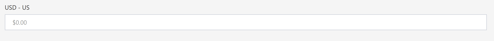
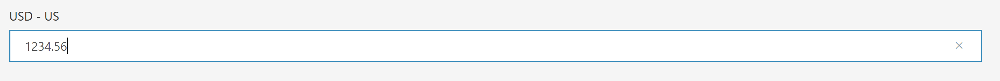
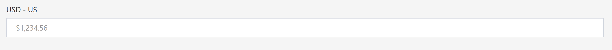

# Overview
Composable Analytics DataPortals supports number formatting functionality for numeric field inputs. Using Number Formatting, number values have the capability to be displayed as **notations**, **percents**, or **currencies**, in numeric formats specific to any locale, and subject to a number of other custom numeric specifications. In addition to granting form creators an array of formatting options to match their needs, this capability increases form readability as users are able to better understand field numeric types without the addition of text-based explanations. Easy and intuitive interpretation of input is provided to users, while database representation remains in the desired un-formatted type. 

# Excel Sheet Input
A Number Formatting field is declared using a number of columns in the Excel sheet - ControlType, Type, FormattingLocale, FormattingOptions, Min, Max, DefaultValue. These provide form creators with an array of formatting options to match their numeric representation needs.

## ControlType
Whenever a Number Formatting field is decalred, the value of the **ControlType** column is set to **NumberFormatting**. 

## Type
The database input representation can be declared in the **Type column**. Number Formatting supports the following types:
- System.Double
- System.Single
- System.Decimal 

## FormattingLocale
Numeric representation differs significantly throughout the world. Different regions have different syntactical customs which can lead to inconsisencies when displaying numbers. Number Formatting addresses this by supporting numeric format representation specific to a wide array of locales. Individual fields locales can be set by defining the specific locale within the **FormattingLocale** column. When left blank, the Local will be set to the USA by default, "en-US".

Methods for locale negotiation and identification can be found at:  
[https://developer.mozilla.org/en-US/docs/Web/JavaScript/Reference/Global_Objects/Intl#Locale_identification_and_negotiation](https://developer.mozilla.org/en-US/docs/Web/JavaScript/Reference/Global_Objects/Intl#Locale_identification_and_negotiation)

An extensive list of Locales can be found at:  
[http://www.codedigest.com/CodeDigest/207-Get-All-Language-Country-Code-List-for-all-Culture-in-C---ASP-Net.aspx](http://www.codedigest.com/CodeDigest/207-Get-All-Language-Country-Code-List-for-all-Culture-in-C---ASP-Net.aspx)

Numbering systems can be found at:  
[https://developer.mozilla.org/en-US/docs/Web/JavaScript/Reference/Global_Objects/Intl/NumberFormat/NumberFormat](https://developer.mozilla.org/en-US/docs/Web/JavaScript/Reference/Global_Objects/Intl/NumberFormat/NumberFormat)

## FormattingOptions
Number Formatting allows form creators to format numbers into **notations**, **percents**, **currencies**, and much more. These options can be declared in the **FormattingOptions** column. When blank, the Options will be set to empty options by default.

An array of formatting options can be found at: 
[https://developer.mozilla.org/en-US/docs/Web/JavaScript/Reference/Global_Objects/Intl/NumberFormat/NumberFormat](https://developer.mozilla.org/en-US/docs/Web/JavaScript/Reference/Global_Objects/Intl/NumberFormat/NumberFormat)

When defining the FormattingOption, it needs to be in a readable JSON form and thus will have to be formatted correctly. Find a number of examples bellow: 
- { "style":"percent" } 
- { "style":"currency", "currency":"JPY" }
- { "maximumSignificantDigits":"3" }

## Min
This defines the minimum possible numeric input into the NumberFormatting field and can be declared in the **Min** column. All input values below will display an error box to the user.

## Max
This defines the maximum possible numeric input into the NumberFormatting field and can be declared in the **Max** column. All input values below will display an error box to the user.

## DefaultValue
This defines the default balue that is displayed to the user and stored in number representation on the database upon initialization. It can be declared under the **DefaultValue** column.

# User Experience
The user experience for Number Formatting consists of three stages. 1) Pre-populated fields, 2) fields during numeric inputting, 3) post-populated field.

### Pre-Populated Fields
Prior to populating the Number Formatting field, the input display is set to a default display formatted value of the locale and options applied to a value of 0, as seen in the figure below. Please note that there has been no value representation set on the database at this stage.

### Field During Numeric Inputting
While the user is inputting a value into the Number Formatting field, the field will display the un-formatted number as it will be stored on the database. This display format will remain until the user clicks away and the field enters the post-population stage. 

### Post-Population Fields
Once the numerical input has been made, and the user has clicked away from the field, the Number Formatting field will display the formatted value of the input value. This value will only be displayed on the front-end, while the inputted value will be the value represented on the server. 

