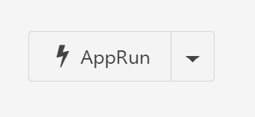

# AppRun

## Overview

The **AppRun** control type will create a button that runs a Composable DataFlow. Depending on the DataFlow this can accept user input and/or update values on the current container page.

## Excel Sheet Input

### Required fields

The **AppRun** control type requires the following Excel columns:

- [**Name**:](../05.Settings-Details/Name.md) The name of the field saved to the database.

- [**Type**:](../05.Settings-Details/Type.md) The name of the `C#` type backing this field. Must be set to `System.Int32`.

- [**ControlType**:](../05.Settings-Details/ControlType.md) The name of the desired control type. Must be set to `AppRun`.

- [**DefaultValue**:](../05.Settings-Details/DefaultValue.md) The default value of the field. Must be the `Id` of the DataFlow to run.

### Optional fields

The **AppRun** control type also supports the following Excel columns:

- [**Description**:](../05.Settings-Details/Description.md) Optional further details about the field.

- [**DisplayName**:](../05.Settings-Details/DisplayName.md) The name that will be shown on the generated button. This can be any string. If no **DisplayName** is provided, **Name** will be shown.

- [**Group**](../05.Settings-Details/Group.md)

- [**MaskedCondition**](../05.Settings-Details/MaskedCondition.md)

- [**ReadOnlyCondition**](../05.Settings-Details/ReadOnlyCondition.md)

- [**RefreshComponents**](../05.Settings-Details/RefreshComponents.md)

- [**Required**](../05.Settings-Details/Required.md)

- [**SaveBeforeRun**](../05.Settings-Details/SaveBeforeRun.md)

- [**Style**](../05.Settings-Details/Style.md)

- [**TabIndex**](../05.Settings-Details/TabIndex.md)

- [**VisibilityCondition**](../05.Settings-Details/VisibilityCondition.md)

## Usage Notes