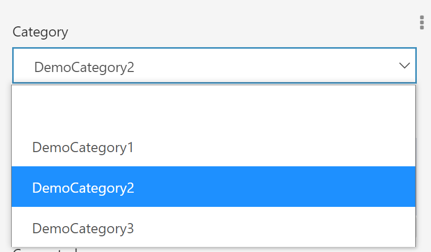

# Category

## Overview

The **Category** control type allows selection of one or more values from a predefined set of options. See [Categories](../04.Categories.md) for a complete discussion of creating and using categories.

A **Category** control that allows a single selection creates a dropdown menu showing the available options:

Menu Closed                              | Menu Open
:---------------------------------------:|:------------------------:
 | 

A **Category** control that allows multiple selections creates a multiselect control:

## Excel Sheet Input

### Required fields

The **Category** control type requires the following Excel columns:

- [**Name**:](../06.Settings-Details/Name.md) The name of the field saved to the database.

- [**Type**:](../06.Settings-Details/Type.md) The name of the `C#` type backing this field. Must be set to `Form.<CategoryName>` or `[Form.<CategoryName>]` where `<CategoryName>` is the name of a category field defined elsewhere in the Excel file. Enclosing `Form.<CategoryName>` in `[]` brackets allows multiple selection, while using just `Form.<CategoryName>` will create a single selection control.

- [**ControlType**:](../06.Settings-Details/ControlType.md) The name of the desired control type. Must be set to `Category`.

### Optional fields

The **Category** control type also supports the following Excel columns:

- [**ClearWhenHidden**](../06.Settings-Details/ClearWhenHidden.md)

- [**CustomIndex**:](../06.Settings-Details/CustomIndex.md) Settings for one or more indexes to create on the database that include this column.

- [**DefaultValue**](../06.Settings-Details/DefaultValue.md)

- [**Description**:](../06.Settings-Details/Description.md) Optional further details about the field.

- [**DisplayName**:](../06.Settings-Details/DisplayName.md) The name that will be shown for the field above the input box. This can be any string. If no **DisplayName** is provided, **Name** will be shown.

- [**Group**:](../06.Settings-Details/Group.md) The layout group position for this control.

- [**MaskedCondition**](../06.Settings-Details/MaskedCondition.md)

- [**OptionController**](../06.Settings-Details/OptionController.md)

- [**ReadOnlyCondition**](../06.Settings-Details/ReadOnlyCondition.md)

- [**Required**](../06.Settings-Details/Required.md)

- [**Style**](../06.Settings-Details/Style.md)

- [**TabIndex**](../06.Settings-Details/TabIndex.md)

- [**UniqueConstraint**](../06.Settings-Details/UniqueConstraint.md) *(deprecated)*

- [**UniqueConstraintScopeToParent**](../06.Settings-Details/UniqueConstraintScopeToParent.md) *(deprecated)*

- [**ValidationCondition**](../06.Settings-Details/ValidationCondition.md)

- [**VisibilityCondition**](../06.Settings-Details/VisibilityCondition.md)
