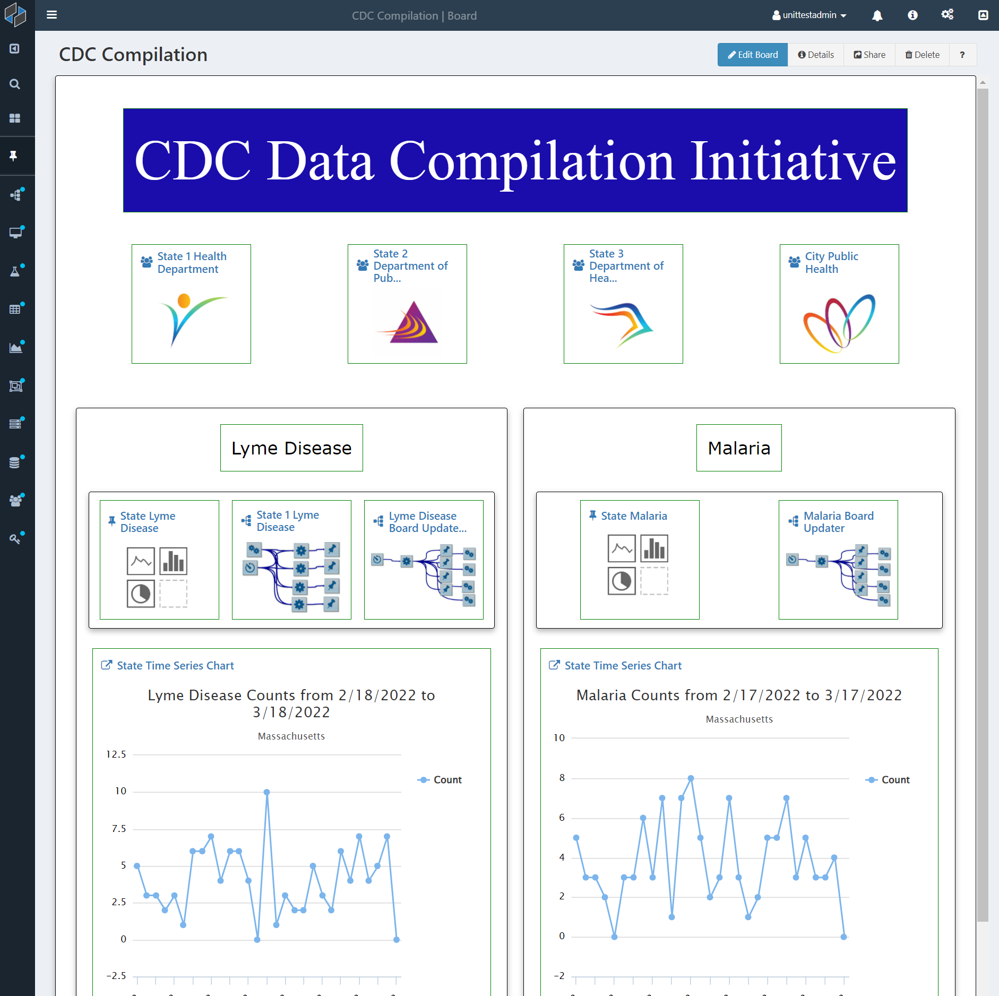

# Overview

Composable Boards are customizable web portals where users can organize their Composable tools and data, making it easy to share and visualize.

Users can arrange pins in a responsive and customizable layout. 'Shortcut' pins provide quick access to useful resources across Composable, and 'Data' pins allow users to keep searches, activity feeds, and DataFlow results in an easily accessible place.

