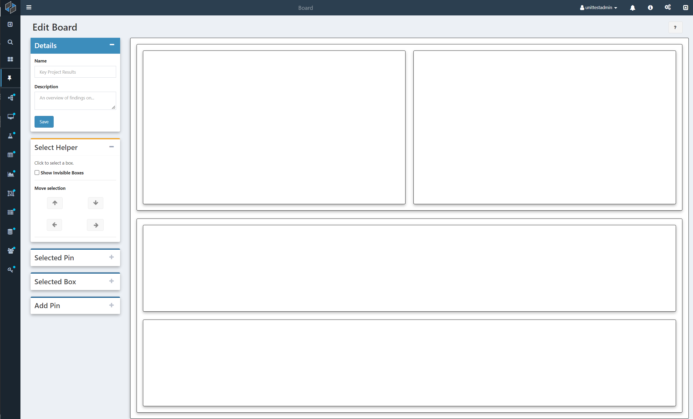

# Getting Started

To open a new board, click the pin button on the sidebar. To edit an existing board from the board's home page, look for the 'Edit' button on the top right row of buttons.

!!! note
    If the edit button is missing, that means you only have permission to view the board, not edit it. The board's owner can give you permission with the 'Share' button.

In the Board Editor, users can create a new board or alter an old one.

The board editor is broken into two sections, the sidebar on the left, and the board itself on the right. 

New boards open onto a blank canvas containing two columns and two rows. Click anywhere on the board to select a box and begin editing.

## Boxes

Boxes allow you to control the layout of your board. Boxes hold pins (such as charts, graphs, and images), and other boxes. You can control the orientation of your boxes, setting them to be either rows or columns.

If you want to use boxes for organization, but don't want them to be show up on your page, you can also set them to be invisible.

!!! note
    The board as a whole is a single box, which contains everything else. It is locked into the column orientation, and will expand vertically as you add new content.

## Pins 

Pins are the contents of the board. There are three types of pins.

First are Text Pins, which simply allow you to add text to the board directly.

Shortcut pins do as their name says, creating an instant shortcut to other Composable resources. Like on the search page, you can access other pages involving a Shortcut's resource by hovering over the icon. 

Data pins allow you to consolidate data from other parts of the website. Result pins display a result from a particular dataflow run. Saved Searches give you see the output of a search query, and update as new results are found. Activity Feeds show all changes to a particular resource, such as edits and dataflow runs.

!!! note
    You can run a DataFlow directly from its bookmark. Hover over the DataFlow icon next to the title and select 'Run' from the popup menu.

