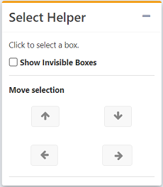
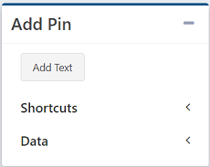

# The Sidebar

A board's sidebar is broken into a series of menus, each of which allows you to edit a different part of your board.

## Details

The details menu contains the basic information about your board, and also allows you to save any changes.

!!! note
    The Folder option and Board Id are only visible once you've saved your board.

## Select Helper

  

Once you've selected a box to start, the Select Helper lets you move around the board without having to click on items or boxes directly.

This is most useful when you have tightly nested boxes, invisible boxes, or when you've chosen to remove the spacing between boxes (an option available in the Selected Box menu). 

- **Show Invisible Boxes**  
    The 'Show Invisible Boxes' checkbox outlines all invisible boxes in a dotted orange line (dotted blue if the box is selected). This allows you to easily see the layout of the board. The Show Invisible Box is only active in Edit Mode, and will not leave the boxes highlighted in View mode.

- **Move selection**  
    The up and down arrows take you to the parent or child of your current selection.

    The left and right arrows are used to move between siblings, the pins or boxes sharing a container with your current selection.

## Selected Pin

  

The Selected Pin menu opens when a pin is selected.

- **Title Position**  
    Sets the title to the top or bottom of the pin.

- **Styling**  
    *Only available for text pins.*  
    Allows you to set the background color, font color, font, and font size of the text.

- **Set Pin Size**  
    *Only available for result pins.*  
    Checking 'Set Pin Size' opens a percentage slider. The slider sets the width of the pin as a percentage of the size of the parent box. This means an pin cannot be larger than its box. If multiple pins have their size set, exceeding the box size, a horizontal scrollbar will be created.

- **Reorder**:  
    Reorder allows you to change a pin's position within its box.   
    The double arrows move the pin to the very beggining or the very end of the box. The single arrows move the pin one position forward or backwards inside its box.

- **Move**  
    Click the move button to move the selected pin to a different box.   
    The pin will remain selected, highlighted in blue. You can then select another box, which will be highlighted in red. To move the pin to the new box, selected 'Confirm'. 

- **Delete**    
    Deletes the selected pin from the board.

## Selected Box

  
The Selected Box menu opens when a box is selected.

- **Direction**  
    Sets the box to be a row or a column. If content overflows on a column, the length of the board will be extended. If content overflows on a visible row, a horizontal scrollbar will be added. If the row is set to be invisible, the content will be allowed to extend outside of the box.

- **Invisible Container**   
    Turns the box invisible if selected.
    - **Retain Spacing**    
        If checked, an invisible box keeps the same spacing as if it were visible. If unchecked, an invisible box loses the spacing and padding around it.

- **Add Child**     
    Creates a new box inside of the selected box. 

!!! note
    Nesting depth is limited to six boxes deep.

- **Delete**    
    Deletes the selected box and all items and boxes it contains.

## Add Pin

The Add Pin menu opens when a box is selected, and adds a pin to the selected box.

- **Add Text**  
    Adds a textbox directly to the board.

- **Shortcuts**     
    A menu containing shortcuts for each type of resource on Composable. When a resource type is selected, a search box will pop up.

    Select your desired resource from the search menu and a shortcut pin will be added to the board.

- **Data**
    - **Result**    
        Results are the product of DataFlows.  
        When you selected a Result Pin, a modal will pop up. In the modal, select your desired dataflow, run, and then result. The selected result will be added.
    - **Activity Feed**     
        Activity Feeds show all of the activity on a Composable resource, such as a DataFlow or User.  
        When 'Activity Feed' is selected, a search modal pops up. Select the desired resource, and an activity feed will be added. The activity feed will automatically update with all new activity.
    - **Saved Search**  
        A saved search automatically searches all composable resources for the entered query.  
        When 'Saved Search' is selected, a modal will pop up with a Title and Search box. Choose a title, and then enter the query you want to search for in the Search box. When you save the search, it will be added to the board and automatically update with any new resources matching the search.
