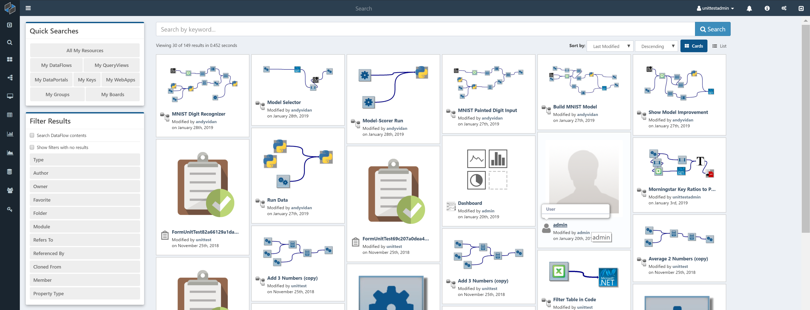

# Search

The best place to start exploring Composable is the Search page. You can get to the search page by clicking on the `Explore All` icon in the sidebar.

Once on the Search page, you will be presented with all the Composable resources (DataFlows, Folders, Groups, QueryViews, ...) that you have permision to "discover." A flexible faceted search panel is available on the left hand side, as well as some quick links to specific resources (e.g., "My DataFlows").

## Search Help

#### Search Basics

A Composable search has three optional components: _Search Text_, _Filters_, and [_Ordering_](#Ordering-Results). Resources with names, descriptions, or tags that contain _Search Text_ are matched. _Filters_ narrow down search results, and _Ordering_ determines the order in which results are displayed. A search without _Search Text_ returns all Resources that match the _Filters_. None of the search components are case sensitive.

*   `Very useful` returns all Resources with the text "very useful" in their name, description, or a tag.

_Filters_, defined using a `filterName:value` pair, limit results to Resources with the property `filterName` that matches `value`. These must be exact matches (case insensitive); `values` cannot be truncated or have words left out. `filterNames` and `values` that contain a space must be surrounded by double quotes ("like this"). [Combining _Filters_](#Combining-Filters) provides details on creating more complex searches.

*   `Very useful type:dataflow` narrows the search to only return DataFlows.
*   `name:"My App"` returns Resources of all types with the name "My App", but will not match "My App Rocks" or "MyApp".
*   `My App` only contains _Search Text_ and would return resources named "My App Rocks".
*   `name:My App` is interpreted as `name:My AND App`, with the _Search Text_ "App" and _Filter_ name:My. The filter would prevent a Resource named "My App" from being returned.

DataFlow module inputs can optionally be compared against the _Search Text_, by including the text "moduleInput:true" or selecting "Search DataFlow contents" in the Filter Results panel.

*   `ClientName moduleInput:true` will return DataFlows having a module with input that contains "ClientName" (such as "ClientName@email.com")

#### Available Search _Filters_

*   **Type** - Specify Resource type (Board, DataFlow, DataLab, DataPortal, Folder, Group, Key, QueryView, WebApp).
*   **Name** - Resources with names that are exact matches to `value`
*   **ID** - Specify Resource ID.
*   **Tag** - Resources any user has given the tag `value`. Note this must be an exact match, unlike _Search Text_
*   **Folder** - Limits results to contents of folder `value`. Adding "/*" to a folder name will also search all folders within it.

    *   *Example:* Suppose a team stores Resources for various projects in separate folders (ProjectA, Probject B...) within the folder "/TeamName".  `folder:TeamName/ProjectA` returns Resourcess in the ProjectA folder.
    *   *Example:* `folder:TeamApps/*` returns Resources in all ProjectName folders within "/TeamApps". If there are any folders within a project folder, their contents are returned listed as well.

*   **Author** - Resources created by user with Username `value`.
*   **Owner** - Resources owned by user with Username `value`.
*   **Favorite** - `values` "yes" or "true" return Resources marked at favorites; "no" or "false" returns non-favorites.
*   **Rating** - Resources user has given a rating of `value`.
*   **Key** - Resources that reference Key with ID `value`.
*   **Data Catalog** - DataRepositories referenced by DataCatalog with ID `value`.
*   Date _Filters_: These filters accept any `value` that can be parsed by the [C# DateTime.Parse method](https://docs.microsoft.com/en-us/dotnet/api/system.datetime.parse?view=net-5.0#the-string-to-parse); standard formats such as "MM/DD/YY" and "Month DD YY" are recognized and if a year is not specified the present year is assumed. If no timezone offset is specified, your browser's local time zone will be used. If `value` cannot be parsed, no search results will be returned.
    *   **CreatedUntil** - Resources created before the specified date
    *   **CreatedSince** - Resources created after the specified date
    *   **ModifiedUntil** - Resources last modified before the specified date
    *   **ModifiedSince** - Resources last modified after the specified date
        *   *Example:* `CreatedSince:01/01/2020 AND CreatedUntil:2021-01`returns all Resources created in 2020.
        *   *Example:* `ModifiedSince:"Jan 1"` returns all Resources that have been modified this year.
*   DataFlow only _Filters_.
    *   **Referenced By** - Dataflows that directly use DataFlow with ID `value`. Does not search for nested DataFlow references, meaning it is limited to those that appear directly on the DataFlow's Designer page.
    *   **Refers To** - DataFlows that are directly used by DataFlow with ID `value`.d Does not search for nested DataFlow references
    *   **Cloned From** - Dataflows created by cloning DataFlow with ID `value`
    *   **Module** - DataFlows that use built-in first-class module or custom module extension named `value`
*   **Property Type** - Only valid for Keys, limits results to Keys of type `value`.
*   **Member** - Only valid for groups. Limits results to groups Username `value` is a member of.

#### Combining _Filters_

Searches in Composable can be refined using logical operators `and` and `or`, to combine multiple _Filters_ and `not` to invert a _Filter_ or set of combined _Filters_. Parentheses determine the order of operations. Composable search defaults to `and` when no operator is placed between _Filters_.

*   *Example:* `owner:caUser1 or author:caUser1` returns Applications owned or created by caUser1.
*   *Example:* `owner:caUser1 and author:caUser1` returns Applications created by caUser1 which they currently own.
*   *Example:* `not author:caUser1` returns all Applications created by all users except caUser1.
*   *Example:* `owner:caUser1 author:caUser1` is interpreted as the 2nd example, with the two Filters combined with `and`.

The `and` operator takes precedence over `or`. Parentheses can be used to specify order of operations when multiple search terms are combined.

*   *Example:* `type:dataflow or type:queryview and author:caUser1` returns QueryViews created by caUser1, and _all_ DataFlows.
*   *Example:* `(type:dataflow or type:queryview) and author:caUser1` returns DataFlows and QueryViews created by caUser1.

`&` can be used for `and`, `|` for `or`, and `-` for not.

*   *Example:* `(type:dataflow | type:queryview) & -author:caUser1` returns DataFlows and QueryViews created by all users except caUser1.
*   *Example:* `(type:dataflow or type:queryview) and not author:caUser1`is an equivalent search.
*   *Example:* `author:caUser1 & -(type:dataflow | type:queryview)` returns all Resources created by caUser1, except DataFlows and QueryViews.

#### _Ordering_ Results

Results can be ordered using `sort:sortName:direction`. `direction` is optional, and can be either "asc" or "desc"; the default is "desc". Searches can have multiple levels of sorting. Available sortNames are:

*   **Age** - Datime when Resources were created
*   **CloneCount** - Number of times Resource has been cloned.
*   **Modified** - DateTime when Resources were last modified
*   **Name** - Note the default descending direction starts at the end of the alphabet.
*   **Rating** - Ratings you have given to Resources. Non-rated Resources behave with Rating=0.
*   **Relevance** - Default
*   **RunCount** - How many times a DataFlow has been run. Non-DataFlow Resources behave with RunCount=0

*   `type:dataflow sort:name:asc` returns DataFlows sorted alphabetically starting with at the letter A.
*   `type:dataflow sort:name:asc sort:age` sorts DataFlows with the same name by age, with the oldest first.

#### Search Tips

*   The "Filter Results" panel on the main search page can also be used to select `filterName:value` pairs to narrow search results.
*   Search results are limited by your permissions. If a search does not return expected Resources, you may need to be granted permissions on the Resources you wish to find.
*   Unrecognized date formatting will also prevent searches from finding Resources.
*   After a search, the search term remains in the search bar, and applied _Filters_ are shown below the search bar. These _Filters_ are retained in future searches unless removed, and are combined with new _Filters_ using `and`.

    *   *Example:* `client author:caUser`will return all Resources created by caUser that match the _Search Text_ "client".
    *   *Example:* Subsequently searching for `email` will return Resources matching the _Search Text_ "email", also filtered to those created by caUser.
    *   *Example:* Adding `type:DataFlow`, will limit the results to DataFlows, created by caUser, matching the _Search Text_.
