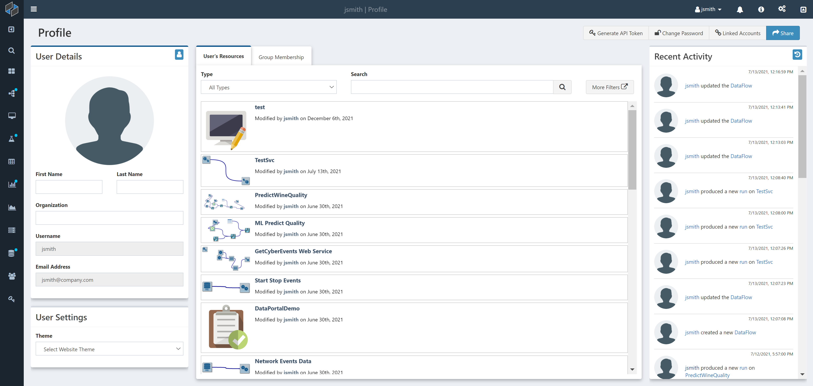
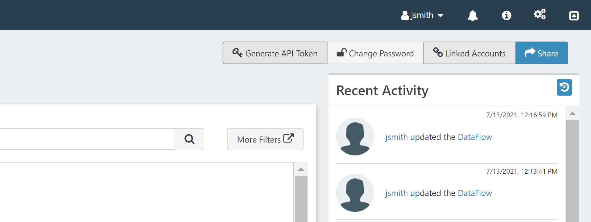
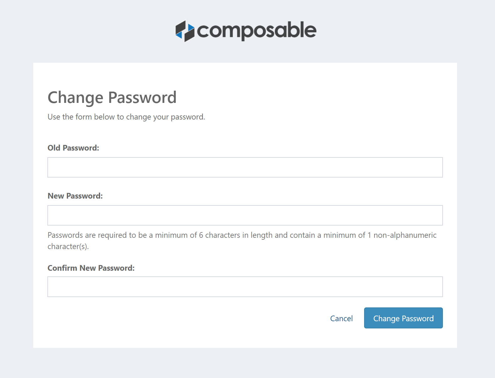
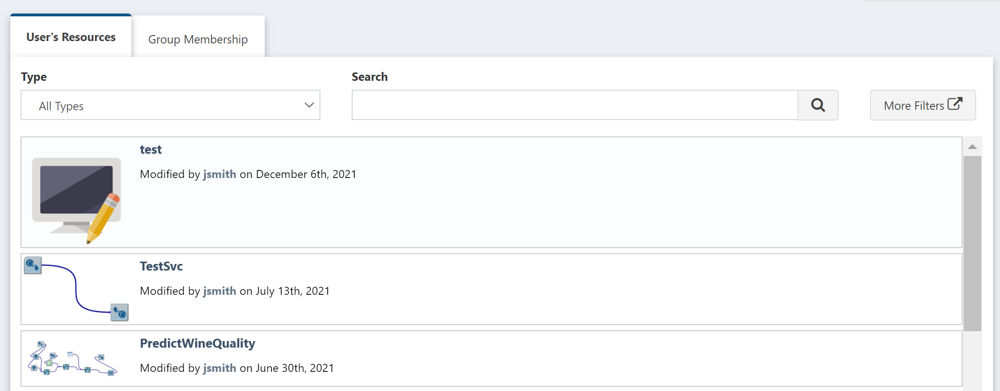

# Overview

Every User in Composable has a User Profile page that contains basic information about the user. If read access is provided, Users in Composable can view other User Profile pages.

In the User Profile page, you can access account management features and update information about the User, like name, profile photo and password.

# Find your User Profile

To find your User Profile, click on your username at top right of the screen, then choose Profile.

To find someone else's User Profile, navigate to the [Search](../Composable-Platform/03.Search.md) page, and search for a user. You can filter the results down to Users using that faceted search filter for Type: User.

!!! note
    User Profiles are securable resources, similar to DataFlows, QueryViews, and WebApps. This means you can only have read (or write) access to other users' profiles if they provided you with such access.

# User Profile

The User Profile page will look as follows:

The top right side of the page includes a set of links:

These are for:
 * Share: As mentioned above, User Profiles are securable resources. This button opens up the permissions modal that allows you to provide read/write access to other Users.
 * Linked Accounts: This opens up a menu that allows the User Profile to be integrated with various third-party systems, such as Slack and Twitter.

* Change Password: This opens up a page that allows you to change the User password.

* Generate API Token: This opens up a modal that allows you to generate an API token. The generated API Token can be used when programmatically communicating with various web resources on the Composable server to authenticate. The token needs to be provided as the value for the Authorization HTTP header on all requests made to the Composable server that requires authorization.

## User Details

In the User Profile, you can update basic information such as First and Last Name and Organization, and you can also add a profile photo. This information is displayed on the left side of the User Profile page in the User Details section of the page.

!!! note
    A User's username and email address are set to read-only, based on what was used when first registering the account. This information can only be changed by an Admin.

## User Settings

The User Settings section allows you to select a Theme color.

## User Resources and Group Membership

The center of the User Profile page provides you with two tabs, one for User Resources and one for Group Membership. User Resources shows you all resources (DataFlows, QueryViews, etc.) created by the User. The Group Membership shows you what [Groups](../Users-and-Groups/01.Overview.md) the User is a member of.

## Recent Activity

The right side of the User Profile page provides you with the recent activity of the User. here, you can see when a User performed various actions, such as modified or executed a DataFlow.

