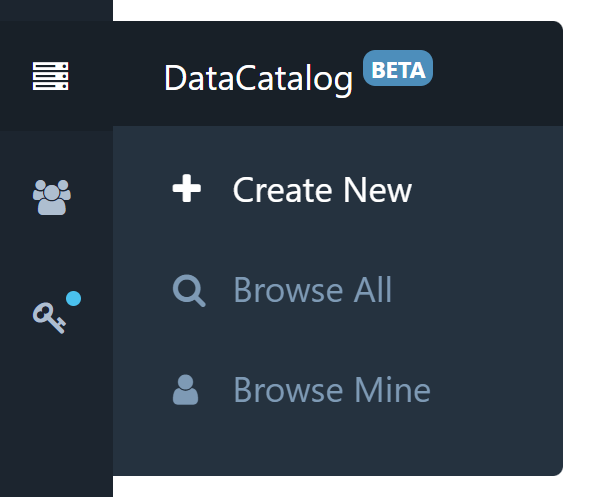
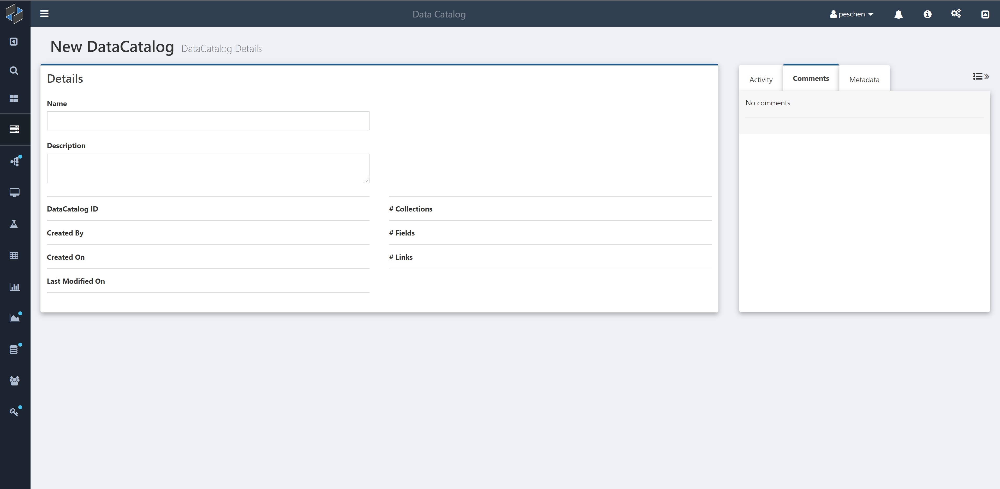
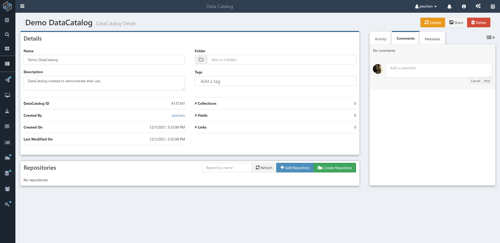
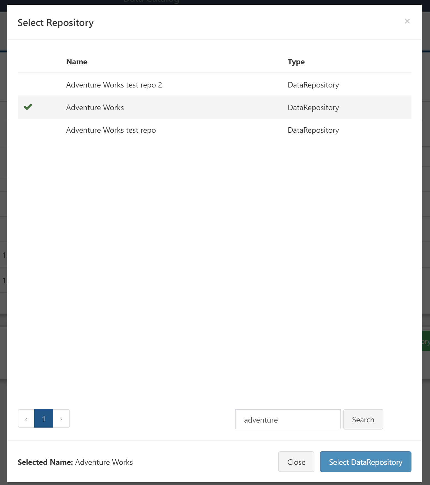
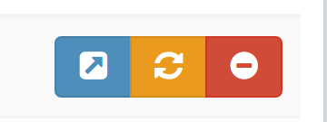

# DataCatalog

Composable DataCatalogs provide a way to organize a collection of data sources, with top-level metadata and sharing capabilities as well as easy access to powerful tools to explore and query the individual data sources via [Composable DataRepositories](../DataRepository/01.Overview.md).

## Creating a DataCatalog

To create a new DataCatalog, select the icon in the side navigation menu.

You'll be presented with an overview page for your new DataCatalog. Simply fill in the name and description.

Once you give your catalog a name, a new "Repositories" box will appear, from which you can add [Composable DataRepositories](../DataRepository/01.Overview.md) to your catalog. 

## Adding Repositories

To add an existing DataRepository, click "Add Repository" and select the repository you want from the searchable list of all repositories you have access to.

If you want to create a new repository, click "Create Repository" to open a new tab with a new DataRepository. See [DataRepository Basics](../DataRepository/Create-DataRepository.md) for details on creating a DataRepository. Once your repository has been created, return to your catalog and add the repository via "Add Repository".

## Interacting With Repositories

Once you have some DataRepositories in your DataCatalog, you can interact with them via these three buttons that appear on each line of the list of repositories:

The left blue button will open the DataRepository in a new tab. See [Repository Details](../DataRepository/Repository-Details.md) for a discussion of this view.

The middle orange button will refresh the given DataRepository. This involves querying the underlying data source and updating the set of collections, fields, and links. You usually won't need to refresh DataRepositories because Composable updates them regularly in the background. You can also refresh all of the DataRepositories in the DataCatalog by clicking the orange "Update" button at the top of the screen.

The right red button will remove the DataRepository from the DataCatalog. Note that it will not delete the DataRepository.