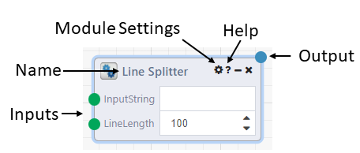

# Composable Modules

Composable Modules are functional blocks that have multiple inputs and outputs. A module is analogous to a function in any programming language. A module takes in one or many inputs, and produces one or many outputs. These outputs can then be connected to any number of other module inputs.

A module is an atomic processing element with strongly typed inputs and outputs. All information required for a module to execute is retrieved from its inputs through connections. Modules can be reused easily and interchanged with other modules.

Each input and output on a module has a name, description and a type. Inputs and outputs are strongly typed. Objects of the same type can be assigned, and objects having types that extend base types can be assigned to inputs of the base types. For example, outputs of types ‘integer’ can be fed into a module input of type ‘object.’ Convertibility is also permitted. For example, if a DataFlow author connects an output of type ‘string’ to an input of type ‘integer,’ then the system tries to perform the conversion automatically. Note that this can result in exceptions during the running of the DataFlow application. Composable is currently using the built-in conversion framework in the type system, and new input and output types can register conversions by creating casting operator.

## First-Class Modules

Composable includes hundreds of first-class modules that are developed by the product team and shipped with the product. First-class modules are found in the Module Library, and classified under a specific category. For example, modules for Image Processing can be found under the Images category, and modules for integrating with Git can be found in the Git category.

## Application Reference Module

Custom modules may be created by creating a new DataFlow with externalized inputs and outputs. For more information, please see [DataFlow Reuse](./06.DataFlow-Reuse.md). These Application Reference Modules may then be found under  the My DataFlows or Search All DataFlows categories in the Module Library.

## Custom Module Extensions

Custom Modules may also be created in code and brought into the Composable platform as Custom Module Extensions. To do this, developers may install a local copy of Composable, and also an IDE such as Visual Studio. Once installed, a "Composable Analytics Plugin” template should be available in Visual Studio under C#. Developers can select this template, select a name and location, and press the OK button. The default plugin template comes with an example module plugin th at can be modified to create a custom module with custom inputs and outputs.

After importing a Custom Module Extension into the Composable instance, these custom modules appear as first-class modules in the Module Library. The following [Custom Modules Extensions](./07.Custom-Modules.md) page includes more detailed information on authoring your own Modules.

# Module Features

- **Name**: A module can be renamed by the user.
- **Inputs**: Inputs can come from an output of another module, or be defined in the module itself. Values from other modules take priority over the value defined in the module. Hovering over the green node for each input will show a description and datatype of the input. Right-clicking on the input node will bring up modules whose output object type matches the input object type. Clicking one of these module options will add it to your dataflow, and add a connection to the module.
- **Outputs**: Outputs have similar hover and right-click features as inputs. After running a dataflow or viewing a run, clicking on the output connection node will display the outputted results of the module. These can also be accessed by right-clicking the circle and selecting "View Results".
- **Module Settings**: Clicking the settings icon will bring up a modal with error handling options
    - **Retry Count**: Number of times to retry module execution if it errors
    - **Retry Delay**: Allows the user to set a delay between retry executions
    - **Continue on Error**: An error will not prevent the rest of the DataFlow from running.
    - **Cache Run Results**: Caches the output values of the module with the inputs when executing. When the same inputs are used on a later run within the user-defined caching period, the cached value is used instead of executing again. For example, if you have a slow SQL query from which the returned data is not expected to change often, you could choose to cache the results of your query module for 30 minutes in order to avoid running the query as frequently
- **Help**: Clicking the Help icon will bring up a modal with the description of the module as well as descriptions and object types for all of the inputs and outputs.
- **Right Click**: Right clicking a module or a selection of modules brings up several options
    - **Disable/Enable**: Disables/enables execution of the module. Only applies to current Designer session, disabled status is not saved. Keyboard shortcut Ctrl+E
    - **Duplicate**: Adds a copy of the selection to the dataflow.
    - **Pin Results**: Pinned Results allow you to carry a module’s output values from one run to the next, allowing you to skip executing that module *and* guaranteeing that its results will not change. Only applies to current Designer session, pinned results are not saved. Intended as a tool to help with developing, testing and debugging.
    - **Unpin Downstream Modules**: Unpin any modules downstream of the current module to ensure that it will use the inputs generated for the current
    - **Enable Forced Execution**: Tells the execution engine to *always* execute this module, regardless of whether it has results from a previous run it can draw from. In a sense, Pin Results and Force Execution are opposites
    - **Statistics**: Shows timing and duration history of an executed module.
    - **Show Children** (loop modules only): Adds a red border to modules downstream of a loop module.
    - **Iterations** (looped modules only): Similar to statistics, displays the timing, duration and status for each iteration of a executed module in a loop.
    - **Create DataFlow from Selection**: This will consolidate all of the selected modules into one "Nested" module and save it as a separate DataFlow. Double-clicking this nested module will navigate you to the nested DataFlow.

