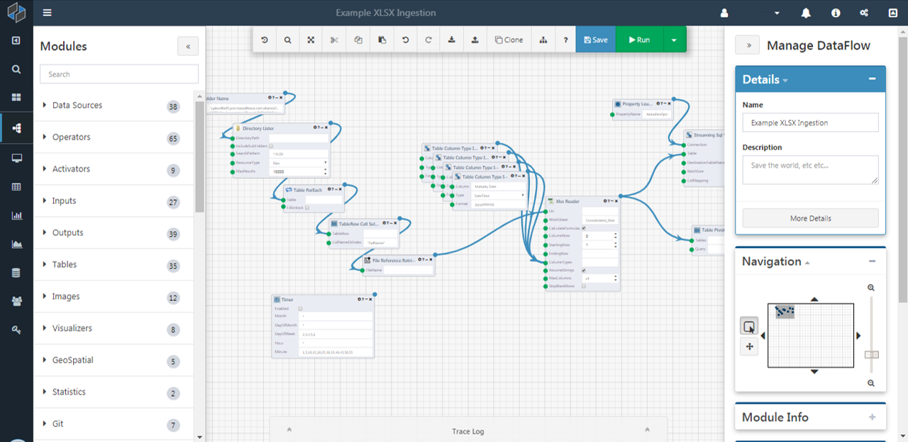

# DataFlow Applications

## Overview

Composable focuses on bringing together disparate datasets, disseminating results, and producing data feeds and services. The platform's strength and inifinite flexibility for consuming, querying, and joining of data is achieved by composing event-driven workflows.

Composable DataFlow Applications ("DataFlows") are event-driven workflows that consists of functional blocks, [*Modules*](./04.Modules.md), strung together with connections to form full analytical workflows.

At its core, a DataFlow is a directed graph, where the nodes are the modules, and the edges are the connections between module inputs and outputs. DataFlows are authored using an intuitive, flow-based programming methodology available in the [Composable Designer](./02.Composable-Designer.md).

For developers, DataFlows can represent microservices, and can be used in a microservice-based approach to building large software applications. DataFlows are independently deployable services that are part of a broader Microservice Architecture.

DataFlow Applications in Composable consist of functional blocks, [Modules](./04.Modules.md), strung together with connections to create new functionality. A DataFlow Applications model is an acyclic directed graph, where the nodes are the modules, and the edges are the connections between module inputs and outputs.

## Executing DataFlows

The most common way of running a DataFlow Application is in the [Composable Designer](./02.Composable-Designer.md). As users develop a DataFlow Application, they can run it at any time by clicking the run button. Designing and running an application within the same space creates a very interactive experience for the user.

### DataFlow Execution

Because a DataFlow is fundamentally a directed graph, the Composable execution engine is able to determine the order in which modules execute (there can be many valid orders), via [topological sorting](https://en.wikipedia.org/wiki/Topological_sorting) techniques. Composable's execution engine loops through the selected order and executes the modules. Before each module execution, the execution engine assigns the inputs to the module based on the input connections.

!!! note
    Although the user creates and interacts with the DataFlow in a web browser, the actual execution of the Dataflow occurs in the backend web servers and status and results are sent back and forth in a real-time manner.

!!! note
    In certain cases, e.g., if a module in a DataFlow is actually a web service, DataFlow execution can also result in computations or queries on remote systems outside the Composable host server.

Whenever the DataFlow is run from the [Composable Designer](./02.Composable-Designer.md), the entire DataFlow application model in the browser is sent to the application web service for execution. This is required because the user may want to change the DataFlow and run it, without saving the DataFlow to the database.

## Debugging DataFlows

The [Composable Designer](./02.Composable-Designer.md) has a built in debugging environment to aide in troubleshooting the creation and running of DataFlow Applications.

Users can step through a DataFlow run, halting execution after each module execution. This allows users to understand the order in which modules are running and also look at intermediate outputs. If a DataFlow is calling another DataFlow (see [DataFlow Reuse](./06.DataFlow-Reuse.md)), the user can ‘step into’ and start debugging the referenced DataFlow run. Assuming the user has the required read and execute permissions, the referenced DataFlow and the current execution context is loaded in another designer tab, where they can then step through and debug the DataFlow just like the parent DataFlow. Once complete, they can then switch back to the parent DataFlow to continue debugging the current run.

If the user has enabled debugging, the execution context is set with a debug flag, and the DataFlow executor on the server will wait for a “step” call from the user before continuing execution. If the engine is stepping over a module, the call step returns the results of that module, and also notes which module will be executed next. This allows for a visual cue in the user interface of the Designer, letting users know which modules have been executed, and also which module will be executed next. If the module that is executing is a reference to another DataFlow, the step call returns handle information, giving the user interface the ability to launch the Designer loaded with the nest DataFlow in debug mode. The calling DataFlow will then wait until the nested DataFlow is complete, similar to other module step calls.

## Error Handling and Highlighting

If an error occurs during a DataFlow run, an exception is thrown and the run is stopped. If a module throws the error (from validating inputs, connection errors, or timeouts), Composable stores which module threw the exception, and displays the error on the offending module in the Designer. In addition, if the exception is due to the assignment of a module output to an input, Composable also stores this information and highlights the input and connection in the Designer for the user. This allows users to
understand and resolve the root causes of application errors.

## Activation

DataFlow Applications do not always have to be run by the user. Users can design DataFlows to be triggered by other external factors including, but not limited to time, email, and web requests. To run a DataFlow at the same time every day, simply drag and drop a Timer Module to the DataFlow on the Designer canvas and set the specific schedule. Composable includes an activation service running in the backend monitoring DataFlow applications with Timer Modules, and activates the DataFlows according to the configured schedules.

Similarly, a background service periodically checks a system email inbox for DataFlow application emails. If an
email is received with a DataFlow application ID, the message contents are assigned to the email module inputs in
the DataFlow application, and the DataFlow is run.

A DataFlow application can also act like a web service or a web page. Simply drag and drop a ‘Web Receive’ and a ‘Web Send’ module onto the canvas. Next, fill in the logic of processing the request and assigning the response with more modules and connections. The web request activator running in the backend receives web requests, and determines which DataFlow needs to run based on the specified DataFlow application ID in the request. The service then assigns the web request contents to the web receive module and runs the DataFlow application. The activator then takes the results from the DataFlow application and assigns them to the web response.

!!! note 
    DataFlows are web services! Not only can you coordinate calls to web services, but you can now *also* graphically program the internal workings of web services.

!!! note
    Callers of the DataFlow application web service need execute permissions on the DataFlow application. The web request for the DataFlow should have a correct authentication cookie, or if everyone has been given ‘execute’ permissions on the application, then an anonymous web request will be accepted.

## Results

Each time a DataFlow application is executed by a user or through external activation, a [*Run*](./10.Runs.md) is produced. A *Run* consists of *Results* for each module’s outputs. *Results* are strongly typed objects, and correspond to the output of a module. Examples of *Results* include graphs, charts, maps, strings, integers, and tables.

*Runs* and *Results* are also securable resources, similar to DataFlows, QueryViews, WebApps, etc. A *Run* and its included *Results* share the same access control entry.