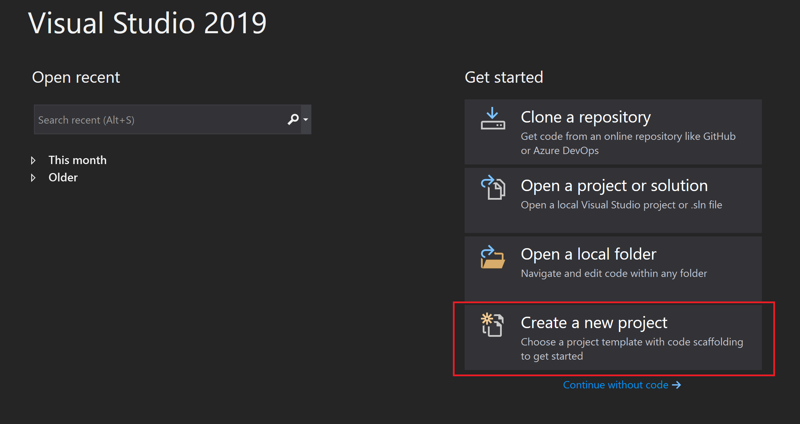
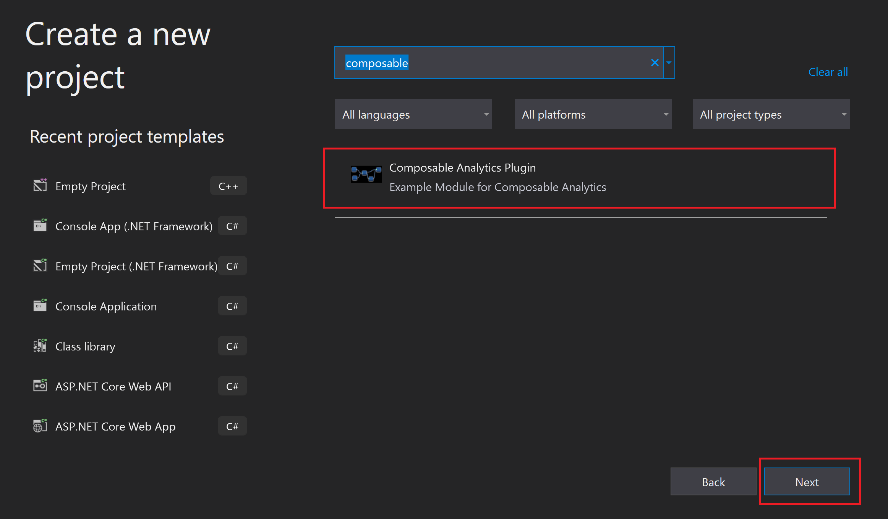
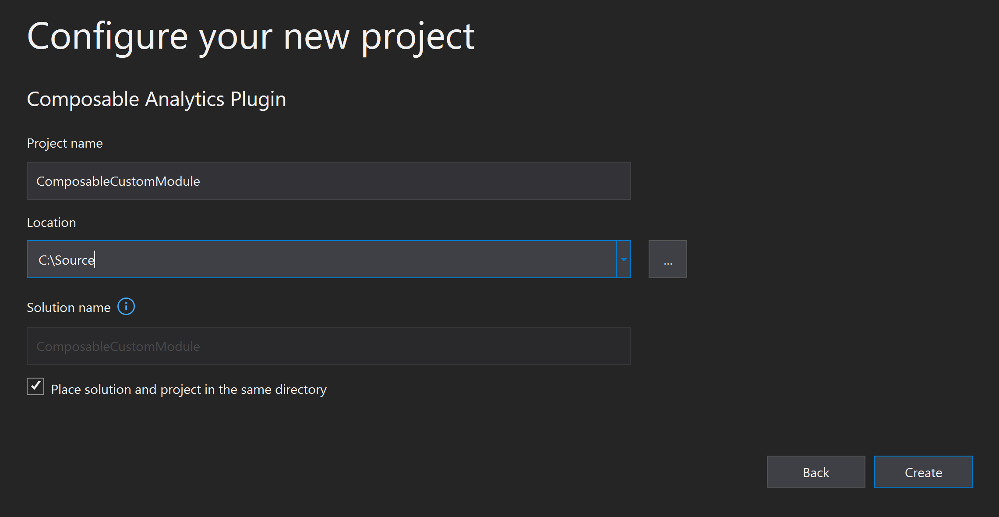
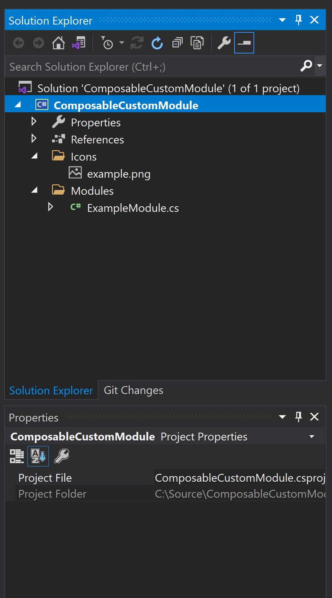
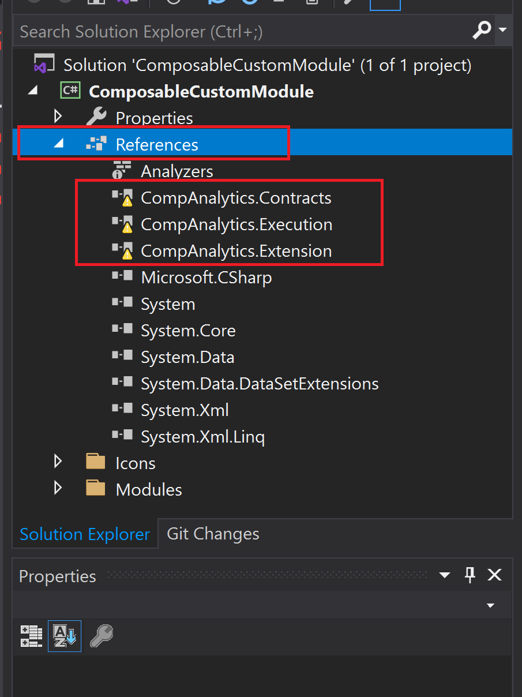
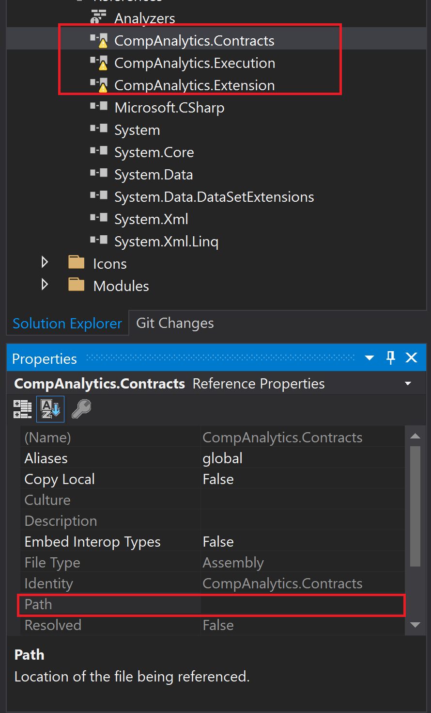
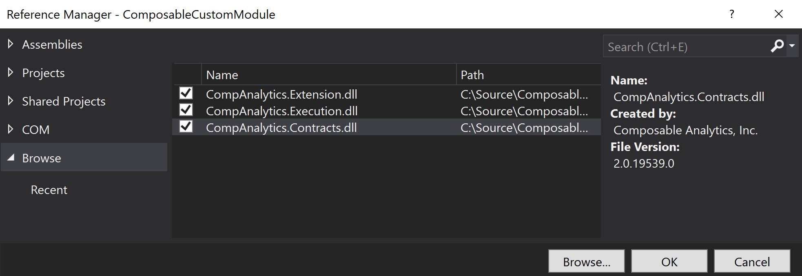
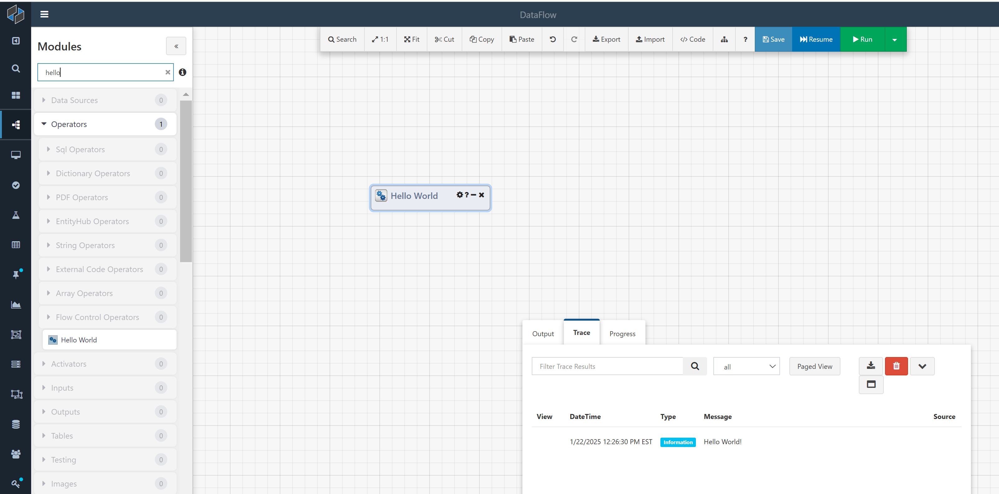
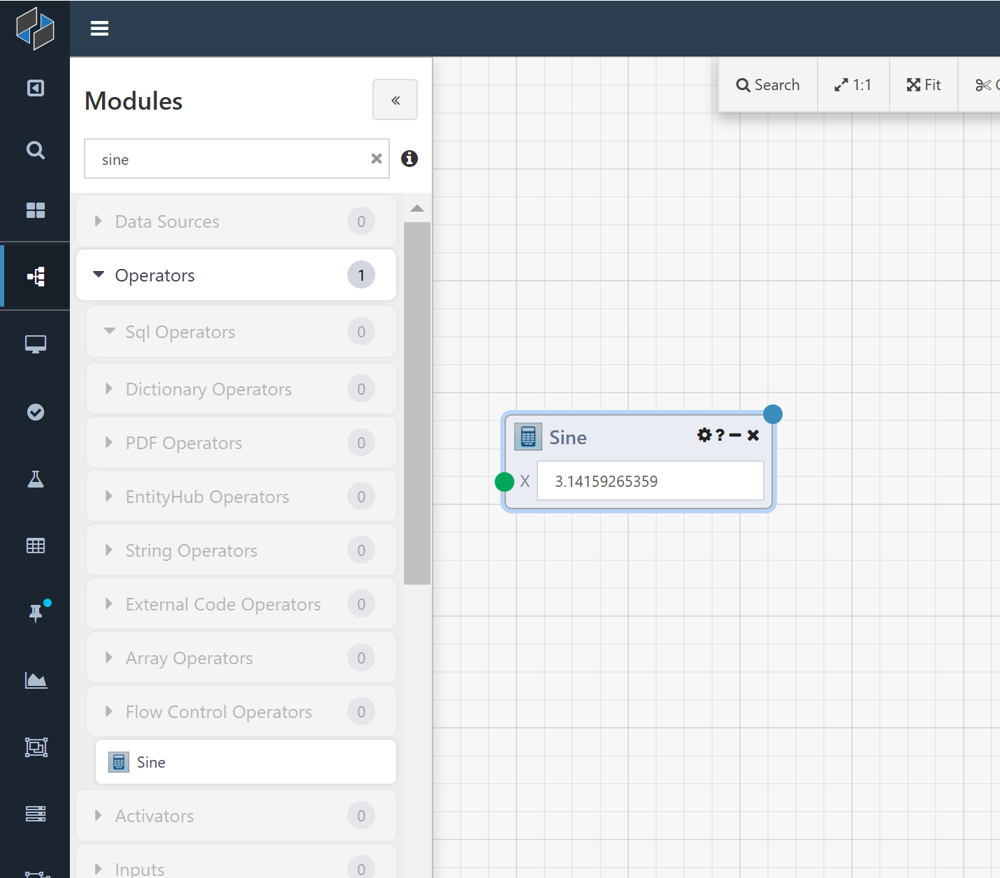

# Custom Module Extensions

Custom Modules may also be created in code and brought into the Composable platform as Custom Module Extensions. To do this, developers may install a local copy of Composable, and also an IDE such as Visual Studio. Once installed, a "Composable Analytics Plugin" template should be available in Visual Studio under C#. Developers can select this template, select a name and location, and press the `OK` button. The default plugin template comes with an example Module plugin that can be modified to create a custom Module with custom inputs and outputs.

## Create a Custom Module Extension

Open Visual Studio and select `Create a New Project`. 



Search for the “Composable Analytics Plugin” template. Select this template, and press `NEXT`.



Select a name and location, and press the `CREATE` button.



The default plugin template comes with an example Module plugin:



Use the Solution Explorer to find the references and ensure they are set appropriately.



Specifically, look at the `Path` of the reference and set it to the correct path.



If needed, to set the Paths or other Properties, right click on References, and select `Add Reference...` and use the Reference Manager to add the three dll libraries, as shown below.



The project can now be Built! In your build directory, you can find the resuting dll file that can then be copied over to your Composable instance `bin` directory (e.g., `C:\Program Files\CompAnalytics\WebApp\bin`). In this case, building the project results in a `ComposableCustomModule.dll` file, since we named the Project `ComposableCustomModule`, in the `C:\Source\ComposableCustomModule\bin\Debug` folder.

## Examples

### "Hello World" Module

A simple “Hello World” example of a Module looks like this:

``` csharp
using CompAnalytics.Contracts;
using CompAnalytics.Extension;
using System.ComponentModel;
using System.Diagnostics;
 
namespace CompAnalytics.Execution.Modules
{
    [ModuleType(Name = "Hello World", Namespace = "comp.companalytics", Category = ModuleCategory.Operator)]
    [Description("A sample module")]
    public class HelloWorld : ModuleExecutor
    {
        public override void Execute(IExecutionContext context)
        {
            Trace.WriteLine("Hello World!");
        }
    }
}
```

Follow the instructions above to build the project and copy over the resulting dll file to the Composable instance `bin` directory (e.g., `C:\Program Files\CompAnalytics\WebApp\bin`).

In the Composable Designer, since we specified `Name = "Hello World"` and `Category = ModuleCategory.Operator`, this custom Module will appear as `Hello World` in the `Operators` bin within the Module Library on the left side of the canvas. This Module has no inputs or outputs. If you simply Run the DataFlow and open up the Trace tab in the Output and Progress Panel at the bottom of the Designer, you will see “Hello World!” written to the console output.



Every Module class inherits from `ModuleExecutor` (which specifies the Execute method), and has the `ModuleType` and `Description` attributes associated with it. Here is what the attribute parameters do:

- **ModuleType.Name**: The name of the Module which is visible to the user in the app designer.
- **ModuleType.Namespace**: e.g., comp.companalytics,
- **ModuleType.Category**: Determines which bin in the Module Library the Module will appear in. Use one of the constants from the ModuleCategory class.
- **ModuleType.Icon**: Not used in this example. A path to an image which appears next to the Module name in the app designer. For instance, “./images/module-icons/calculator.png” will result in a calculator icon.
- **ModuleType.EditableInputs**: Not used in this example.
- **ModuleType.Width**: Not used in this example. The default width of the Module in the Composable Designer. If not specified, it is 150 pixels.
- **Description.Description**: The text which appears in tooltips and in the Module Info box in the Composable Designer.

!!! note
    comp.companalytics is only one possible namespace; Modules can exist in any namespace (e.g., CompAnalytics.Execution.Modules).

#### Sine Module with Inputs and Outputs

Here is a Module that does something slightly more interesting.

``` csharp
using CompAnalytics.Contracts;
using CompAnalytics.Extension;
using System;
using System.ComponentModel;
 
namespace CompAnalytics.Execution.Modules
{
    [ModuleType(Name = "Sine", Namespace = "comp.companalytics", Category = ModuleCategory.Operator, Icon = "./images/module-icons/calculator.png")]
    [Description("Calculates the sine of a number")]
    public class Sine : ModuleExecutor
    {
 
        [Description("The number to calculate the sine of")]
        public ModuleInput<double> X { get; set; }
 
        [Description("The sine of that number")]
        public ModuleOutput<double> SineOfX { get; set; }
 
        public override void Execute(IExecutionContext context)
        {
            double inputValue = this.X.Get(context);
            double outputValue = Math.Sin(inputValue);
            this.SineOfX.Set(context, outputValue);
        }
    }
}
```

When you view this Module in the Composable Designer, you will see that it has an input and an output; its input is a double, which it calculates the sine of and then sends this to the output.



For every input that you want a Module to have, give that Module's class a public ModuleInput property with default getters and setters. The Description attribute, again, specifies the tooltip text. The type parameter to ModuleInput specifies the type of the input. ModuleOutput works analogously.

ModuleInput has a method, Get, that should be called from the Execute method, passing the IExecutionContext argument. This returns the actual value passed to the Module as input. There's also an overloaded version of ModuleInput.Get that specifies a default value to be returned if no input has been supplied. If you don't specify a default value and no input is supplied, then Get will return null (or, if the type parameter is a non-nullable value type, throw an exception).

Similarly, ModuleOutput has a method, Set, that you call from the Execute method, passing the IExecutionContext argument and the value that you want to set as the output. If you don't call this, then the output will be the default value for the relevant type.

!!! note
    Module inputs and outputs can be lots of different types, including `object`. Module inputs and outputs of different types can be connected together; the values are converted implicitly.

There is another class, `ModuleInputCollection`, which is like `ModuleInput` except that more than one value can be passed into it (and so it can have more than one incoming connection in the Composable Designer). If you have, for instance, a `ModuleInputCollection<int>`, then its `Get` method returns a `List<int>` instead of an `int`. The default value for this kind of input is an `empty` `List` rather than `null`.

!!! note
    There are other attributes that inputs and outputs can be associated with, that do various things.

### Word Counter Module

Create a new C# class called **WordCounterModule** with the contents:

``` csharp
using System;
using System.ComponentModel;
using System.Linq;
using CompAnalytics.Contracts;
using CompAnalytics.Controls;
using CompAnalytics.Execution;
using CompAnalytics.Execution.Validation;
using CompAnalytics.Extension;
using CompAnalytics.Contracts.Tables;
using System.Collections.Generic;
using CompAnalytics.Contracts.Isolation;

namespace TextAnalytics
{
    [ModuleType(Name = "Word Counter", Namespace = "TextAnalytics", Category = "Text Analytics", Icon = "Icons.example.png")]
    [Description("Creates a table of the word count in the given text.")]
    public class WordCounterModule : ModuleExecutor
    {
        [Description("Text String")]
        public ModuleInput<string> InputText { get; set; }

        [Description("Word counts")]
        public ModuleOutput<Table> Result { get; set; }

        public override void Execute(IExecutionContext context)
        {
            var inputText = InputText.Get(context);

            List<string> words = SplitIntoWords(inputText);

            Dictionary<string, int> wordCounts = CountWords(words);

            Table result = CreateTable(wordCounts, context);

            Result.Set(context, result);
        }

        private Dictionary<string, int> CountWords(List<string> words)
        {
            // Count Words
           var counts = new Dictionary<string, int>();
            foreach (var word in words.Select(w => w.ToLowerInvariant()))
            {
                if (!counts.ContainsKey(word))
                {
                    counts.Add(word, 0);
                }

                counts[word]++;
            }

            return counts;
        }

        private Table CreateTable(Dictionary<string, int> counts, IExecutionContext context)
        {
            ITableExtension ops = context.FindExtension<ITableExtension>();
            TableColumnCollection columns = new TableColumnCollection();
            columns.Add(new TableColumn() { Name = "word", Type = "VARCHAR" });
            columns.Add(new TableColumn() { Name = "count", Type = "INT" });

            Table table = ops.CreateTable(columns);

            using (var writer = ops.CreateWriter(table))
            {
                foreach (KeyValuePair<string, int> entry in counts)
                {
                    var row = new List<Object> { entry.Key, entry.Value };
                    writer.AddRow(row);
                }
                writer.Complete();
            }

            return table;
        }

        // Splits a string of text into a list of words
        private List<string> SplitIntoWords(string text)
        {
            return text.Split(new char[] { '\t', ' ', '\r', '\n' }, StringSplitOptions.RemoveEmptyEntries)
                .ToList();
        }
    }
}
```

## Module ReadMe

When your Module is done, add a readme for it. Find the `Product/ModuleResources` folder. Inside it, find the folder for your Module's namespace (i.e., the `comp.companalytics` in the attribute `[ModuleType(Name = "Hello World", Namespace = "comp.companalytics", Category = "ModuleCategory.Operator")]`. For new Modules, this should be `companalytics`. Then, create a folder with your Module's full name (e.g. "Hello World"). Create a file called readme.md there. You won't have to build the solution after doing this - just try clicking the `?` button on your new Module and see if the readme appears. Refer to existing readmes for format. Markdown is supported for the formatting.

# Versioning Modules

Every so often it becomes necessary to update a Module, wether to add new inputs or outputs, or change the underlying function and logic. It is important to avoid breaking-changes to callers when updating a Module. In general, across all software development, "versioning" is a tough problem, because there often is existing code that takes a dependency on a specified interface, and that interface now needs to be updated.

In most object-oriented and functional languages, there are a few ways developers accomplish making changes. One option is to change the interface and force callers to update, or be broken. With internal code, this is the standard operating procedure. But this is a hard stance, and most people outside the inner circle of the code-base will be upset with breaking changes.

If you simply need to accept another argument from the caller, there are a couple of options. One is to add an optional argument, and set it's default value. Another way is to add an overloaded method with different arguments.

If it's a large change, then the supporting modifications typically involve adding an additional method with a different name, arguments, and return values. And you can then deprecate the old functions. In a few versions down the road, most developers assume they can safely remove the code, and force any remaining callers of the old methods to update their code.

The other option is to branch / snapshot the code base, and increment the version of your assemblies / packages. Callers will not be affected with changes to the newer versions of the assemblies, but will not get any updates or features, unless developers back port non-breaking changes to the older branches.

In Composable, as described previously, [Modules](./04.Modules.md) have inputs and outputs (also called arguments). Developers specify their arguments through properties on a `ModuleExecutor` as described above. When a DataFlow application references a Module, a snapshot of the current Module version is taken to allow for connections and values to hang off the inputs and outputs. Any meta attributes (control, description, validation) on the inputs and outputs will be referenced rather than copied.

!!! note
    Composable allows you to make updates to a Module (such as adding a new argument, remove one, or changing the type of one) while still maintaining backwards compatibility.

A `ModuleType` has a version, and a Module (the instantiated representation of a `ModuleType`) has a version.  A Module's version number is the ModuleType's version at instantiation time.  A developer can increment the `ModuleType`s version if argument changes are needed. These changes may include the following:

- Adding an input or output
- Removing an input or output
- Renaming an input or output (add / remove)
- Changing the type of a module input or output (add / remove)
- Changing the order of inputs and outputs

To increment the Module type version, just set it in the `ModuleType` attribute. Version numbers start at 0 by default.

```csharp
        [ModuleType(Name = "ModuleUpgradeTest", Namespace = "com.companalytics.unittest", Category = "UnitTest", Version = 2)]
        [System.ComponentModel.Description("Test Upgrade Scenarios")]
        public class ModuleUpgradeTest : ModuleExecutor
        {

        }
```
If you need to remove an argument, but still want old Modules to use it, and not be broken, you can use the `[Obsolete]` attribute.

```csharp
            [Obsolete("Use Param3")]
            [System.ComponentModel.Description("numerical input")]
            public ModuleInput<double> Param2 { get; set; }
 
            [System.ComponentModel.Description("input")]
            public ModuleInput<object> Param3 { get; set; }
```

`Param2` can still be used in the Module’s execute method to support old behaviors and code paths, but `Param2` won't exist on any new module instances.

If you want to deprecate an entire Module, but still allow old instances to execute, you can mark the module type class with the `[Obsolete]` attribute. Modules with this attribute will no longer show up in the Module Library pallette.

To perform an actual upgrade from one version to another, you need to create a Module upgrader. You can extend from the class `ModuleUpgrader<T>` where T :  ModuleExecutor.

```csharp
        [ModuleUpgrade(FromVersion = 0, ToVersion = 1, Description = "Remove Param1 and add Param2")]
        public class ModuleUpgradeTestUpgrade1 : ModuleUpgrader<ModuleUpgradeTest>
        {
            public override void UpgradeModule(Module module)
            {
              //do anything you want to the module
            }
        }
```

Each Module upgrader migrates a Module from one version to another version. You will typically have an upgrader for each version. An upgrader can essentially do anything it wants to the Module to get into shape for the next version (e.g., adding arguments, removing arguments, changing / converting inputs values, and moving or removing connections). The base `ModuleUpgrader` class does have several methods to make the ugprade job a little easier.

The default methods create the argument for you, and then it's your job to add it to the module in the right order, and move any values and connections over.

```csharp
    ModuleInput CreateDefaultInput(string name)
```
```csharp
    ModuleOutput CreateDefaultOutput(string name)
```

The migrate methods will create the new default default argument, move any connections and values to the new argument, and remove the old one. These may not work in some scenarios: sophisticated types, connections should be removed rather than moved, argument order matters.

```csharp
void MigrateInput(Contracts.Module module, string fromName, string toName)
```
```csharp
void MigrateOutput(Contracts.Module module, string fromName, string toName)
```