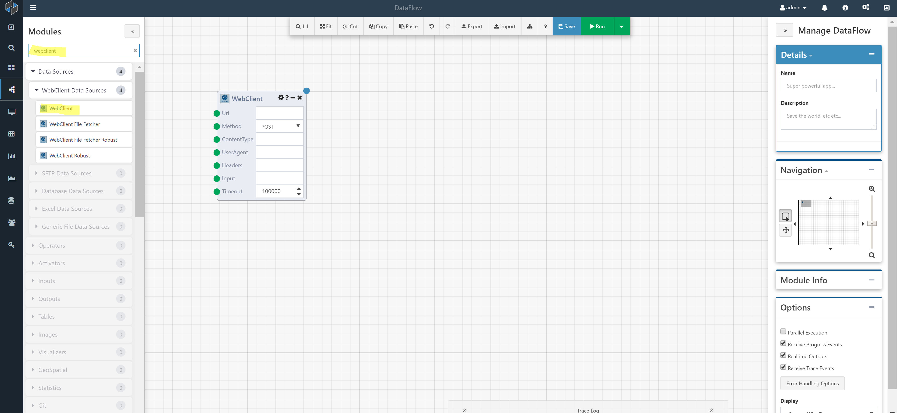
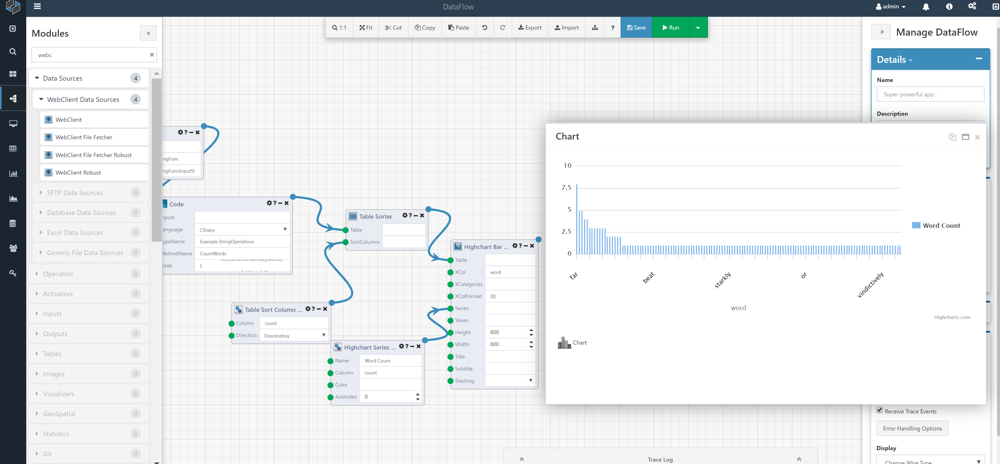

# Example DataFlows

Below are some example DataFlows that you can build to gain some familiarity with the Composable platform.

## Word Count using Python and C#

In this DataFlow, we will be creating a simple histogram of word frequency in a random block of text.
While there are simpler approaches to do this, we will use separate Python and C# Modules so that we can specifically show the approach of combining different languages in a single DataFlow. The basic workflow will be as follows:

1. Parse (split) text into a list of words
2. Calculate the frequency of each word

### Step 1 - Create A New DataFlow

Create a new DataFlow by clicking on the DataFlow icon or select DataFlow > Create New from the side menu.

The Composable Designer will load, and you will be presented with a new canvas as shown below.


As explained previously, the Composable Designer is made up of five primary areas: the canvas, the module library, the toolbar, the properties panel, and the output and progress panel.


### Step 2 - Retrieve Text

The DataFlow we are creating will parse a set of text and produce a frequency count. Therefore, we need some text at the start of this DataFlow. This text can be retrieved from any number of sources, including a file, a database table, a web service, etc.

Here, we will use a web service available at randomtext.me to produce some random text.

To use this web service, simply find the WebClient Module in the Module Library on the left hand side of the Designer. You can either type WebClient in the search bar, or find the Module under the Data Sources category. Drag and drop the Module onto the canvas.

The WebClient Module has a number of input. For this example, simply "hard-code" in the following URL:
http://www.randomtext.me/download/txt/gibberish/p-5/25-45



Your DataFlow should look like the above. You can even run the DataFlow at this point, and view the results of the Module by right-clicking on the blue output dot.

### Step 3 - Split the String

The WebClient Module returns a block of text. Our next step will require us to split this string into a list of words. While there are many (simpler) ways to do that in Composable (including a Split String Module), we will use Python here to illustrate the use of Python from within a DataFlow.

Find the Python Code Module in the Module Library and drag and drop it onto the canvas. Then, set the following three inputs on the Python Code module:

1. Inputs: Connect the output of the WebClient Module to the Inputs of the Python Code Module.

2. FunctionName: This will be the name of the Python function to execute. Use 'splitStringFunc'

3. Code: Insert Python code for splitting the string:

``` python
def splitStringFunc(inputString):
    return inputString.split()
```

!!! note
    Some Module inputs can accept multiple connections. While in this example we are only showing one connection, multiple inputs can be connected into the Inputs parameter of the Python Code Module.

!!! note
    There are two ways to set input parameters: "hard-code" an input by directly typing in a value in the parameter box or connecting the input from other Module(s) output(s). When both are set (a hard-coded input and a connection), Composable will utilize the connection and ignore the hard-coded input.

When this Module executes, it will take the text input from the WebClient Module and execute the Python function splitStringFunc.

At this point, your DataFlow should look like this:


You can go ahead and run the DataFlow, and inspect the output of the Python Code module. You should see a list of words as the output.

### Step 4 - Calculate Word Frequency

To calculate the word frequency (in the list of words obtained above), we will use a Code Module.

In the Module Library, search for "code", and drag and drop the Code Module onto the canvas.


The [Code Module](../DataFlows/09.Module-Details/Code-Module.md) is an extremely robust module that allows you to execute blocks of Code in a number of .NET languages. Here, we will use C#. Set the Code Module inputs as follows.

1. Inputs: This will be the list of words that the Python Module will generate. Connect the output of the Python Module to this input.

2. Language: Set this to C#

3. TypeName. This will be the namespace and class of the code block. Use "Example.StringOperations".

4. MethodName: This is the name of the method. Use "CountWords".

5. Code: This is the clode block to execute. Use the following:

``` csharp
using System;
using System.Linq;
using System.Collections.Generic;
using CompAnalytics.Contracts.Tables;
using CompAnalytics.Contracts.Isolation;

namespace Example
{
    public class StringOperations
    {
        public Table CountWords(List<string> words)
        {
            // Count Words
            var counts = new Dictionary<string, int>();
            foreach(var word in words) {
                if(!counts.ContainsKey(word)) {
                    counts.Add(word, 0);
                }
                 counts[word]++;
            }
            
            // Create table to return
            ITableOperations ops = ExecutionOperations.Current.FindOperations<ITableOperations>();
            TableColumnCollection columns = new TableColumnCollection();
            columns.Add(new TableColumn() { Name = "word", Type = "VARCHAR" });
            columns.Add(new TableColumn() { Name = "count", Type = "INT" });
            Table table = ops.CreateTable(columns);
            
            using(ITableWriter writer = ops.CreateTableWriter(table))
            {
                foreach(KeyValuePair<string, int> entry in counts)
                {
                    var row = new List<Object>{ entry.Key, entry.Value };
                    writer.AddRow(row);
                }
                writer.Complete();
            }
            
            return table;
        }
    }
}
```

!!! note
    This code block outputs a Composable Table, and therefore uses the directive 'using CompAnalytics.Contracts.Tables;.' For more information on Composable Tables, see [this article](https://blog.composable.ai/2016/10/31/advanced-table-manipulation-with-the-code-module/).

The result is a table.


### Step 5 - View Results

With that, we are done! We retrieved a block of text, split it into a list of words and calculated the word frequency. At this point, you can take the resulting table, and do any number of things (export to a xlsx/csv, insert into a database, etc.).

In this final picture, we show how you can connect the Bar Chart Module to generate a visualization.


You can subsequently take the visualization, convert it to an image and attach it to a email using the Mail Send Module.


