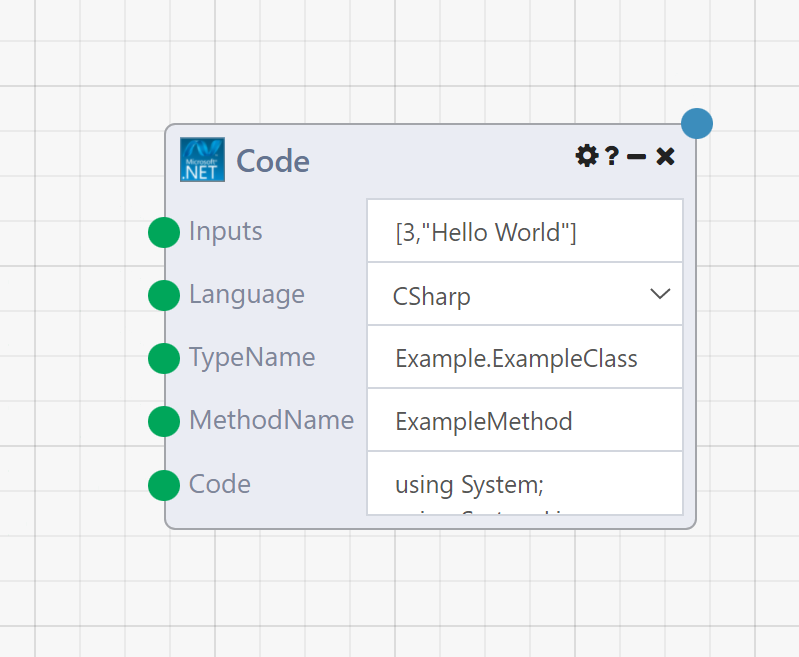
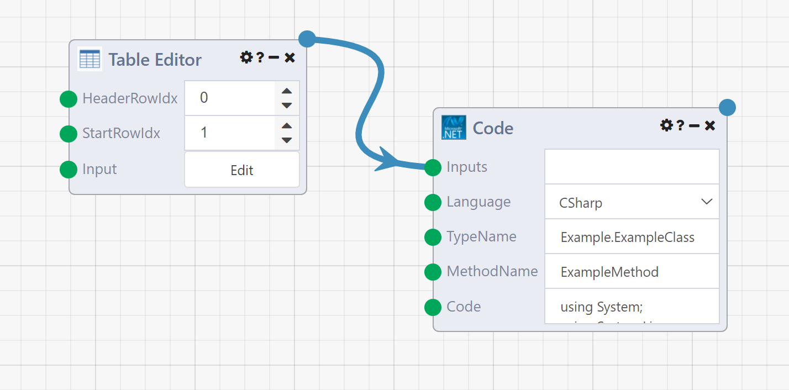

# Code Module

## Overview

The **Code Module** is a powerful Module that allows users to execute custom code in one of the .NET framework programming languages (CLR languages), such as C#, VB.NET, and F#. C#(pronounced "C sharp") is a simple, modern, object-oriented, and type-safe programming language. Its roots in the C family of languages makes C# immediately familiar to C, C++, Java, and JavaScript programmers. F# (pronounced "F sharp") is a programming language that makes it easy to write succinct, robust, and performant code. VB (Visual Basic) is an approachable language with a simple syntax for building type-safe, object-oriented apps.

The Code Module allows for complex code to be developed and executed. 



!!!note
    Composable executes the Code Module's code in a sandbox environment, thereby ensuring that no system failures or security vulnerabilities harm the host machine or operating system.

The following are the Code Module input parameters:

- **Inputs**: List of inputs that will be mapped to the functions parameters. For complex input types, inputs should be in JSON string format.
- **Language**: A parameter to select the programming language, C#, VB.NET, and F#.
- **TypeName**: The name of the class type where the method resides.
- **MethodName**: The name of the method to execute.
- **Code**: This is the actual code that will be compiled and executed, specifically including the class with method to execute specified in the above inputs, along with any other dependent classes. The code editor window provides IntelliSense (for code-completion aid), live syntax highlighting and live compiler warning.


!!!note
    Composable has additional, similar "Code Modules" the support other languages, such as the Python Code Module, R Code Module, SAS Code Snippet Module and Matlab Module.

## Advanced Table Manipulation with the Code Module

Composable offers a wide range of tools for working with your most important data tables, regardless of how large or complex they might be. But even with our toolbox of helpful table modules at your disposal, some DataFlow applications might demand dynamic manipulation that could be tedious to accomplish using general-purpose tools. That's where the Code Module comes in. In this section, we will describe how to access the data in any table and build tables from scratch using Composable libraries for the Code Module.

While the Code Module supports other CLR languages, in this section we will use C#.

### Reading a Table

A `Table` in Composable is an important data type that often gets passed across different Modules within a DataFlow. You can think of a Composable `Table` as a high-performance dataframe. There are many ways to generate a `Table`: as the result of one of the query modules, manual input via the Table Editor or Table Creator, or reading in a CSV or Excel spreadsheet, to name a few. Once you have your table ready at a module output, add a Code Module to your DataFlow. Connect your table output to the Inputs of the Code Module, and remove the default input values from the box to the right.



To read the input table and use it within the Code Module, we first need define a method that will accept a single argument of type "Table," corresponding to the Table object we connected to the Module's input. To do this, we need to add a reference to the `CompAnalytics.Contracts.Tables` namespace, which contains Composable's internal implementation of the tables (e.g., dataframes) flowing through Composable DataFlow Applications. We add this reference by adding the following line to the top section of the code under the existing "using" statements:
```csharp
  using CompAnalytics.Contracts.Tables;
```
Now that the class has access to the Composable Table libraries, we can define a method that can accept a `Table` object by setting the argument in the method declaration to read `Table table` as in:
```csharp
  public void ExampleMethod(Table table)
```
We're going to use a TableReader to dive into the contents of our table, but before we begin, there are a few properties of the Table object itself that are useful. Keeping in mind that our table object is called "table", here they are:

- table.Headers is a list of strings containing the names of each column in the table. You can iterate over this or access an element just like any other IEnumerable, by using the  table.Headers[columnNumber] syntax.
- table.Columns is a TableColumnCollection object that includes details about the columns themselves. This can be iterated over or indexed into using the column name (which you can obtain from the Headers list). Each TableColumn in the TableColumnCollection has Name and Type fields, which can be useful, as for example  table.Columns["Name of Column"].Type would refer to the SQLite type of each column (e.g. "VARCHAR").

Because table contents are stored out of memory, on disk, to actually view the data inside the rows of the table, we need to use a TableReader. To obtain a valid TableReader object for our input table, add the following code to the body of the method:

```csharp
ITableOperations ops = ExecutionOperations.Current.FindOperations<ITableOperations>();
using (ITableReader reader = ops.CreateTableReader(table))
{
    // we can use the TableReader inside this block
}
```
You'll also need to add `using CompAnalytics.Contracts.Isolation;` to the top of your file to gain access to the necessary classes.

Now that the table is ready, we can begin reading the table row by row using a foreach loop:

```csharp
using (ITableReader reader = ops.CreateTableReader(table))
{
    foreach (TableRow row in reader)
    {
        // 'row' is effectively a list of each cell in the given row
        // To access the data in a given column of this row, 
        // you can use the row["Column Name"] syntax. E.g.:
        string firstColumnValue = (string) row[table.Headers[0]];
 
        // 'row' is also iterable, so the following works as well:
        foreach (object cellValue in row)
        { 
            ...
        }
    }
}
```
Remember that the "row" object is a list of objects, so you'll need to cast the value to the appropriate type if you want to perform any manipulation on it. The types in `table.Columns` can be useful for this, as is the `GetType()` method.

Now, you should be able to access all of the data in the table in whichever access pattern works best for your use case. The full code should appear as below:

```csharp
using System;
using System.Linq;
using CompAnalytics.Contracts.Tables;
using CompAnalytics.Contracts.Isolation;
 
namespace Example
{
    public class ExampleClass
    {
        public void ExampleMethod(Table table)
        {
            ITableOperations ops = ExecutionOperations.Current.FindOperations<ITableOperations>();
            using (ITableReader reader = ops.CreateTableReader(table))
            {
                foreach (TableRow row in reader)
                {
                    // 'row' is effectively a list of each cell in the given row
                    // To access the data in a given column of this row, 
                    // you can use the row["Column Name"] syntax. E.g.:
                    string firstColumnValue = (string) row[table.Headers[0]];
 
                    // 'row' is also iterable, so the following works as well:
                    foreach (object cellValue in row)
                    { 
                        ...
                    }
                }
            }
        }
    }
}
```

### Creating a New Table

`Tables` in Composable are immutable, so if you want to make changes to a table, you'll need to create a new table to output from the Code Module. First, change the return type of your method to `Table`. Then, create 3 objects: a `TableColumnCollection` with column names and types, a `Table` object using that `TableColumnCollection` as its schema, and a `TableWriter` to create the rows of data.

Keep the `ITableOperations` object we called "ops" as before. Create the `TableColumnCollection` and `Table` objects first, specifying the name and type of each column:
```csharp
Table retTable = ops.CreateTable(new TableColumnCollection()
{
    new TableColumn() { Name = "Column 1 Name", Type = "VARCHAR" },
    new TableColumn() { Name = "Column 2 Name", Type = "VARCHAR" },
    new TableColumn() { Name = "Column 3 Name", Type = "VARCHAR" },
    ...
});
```
If you're combining a `TableWriter` with a `TableReader`, use the same `ITableOperations` object. The `using` block looks similar, as below:
```csharp
using (ITableWriter retWriter = ops.CreateTableWriter(retTable))
{
    // we can use the TableWriter inside this block
}
```
For both table reading and writing at the same time, combine the using blocks as below:
```csharp
using (ITableReader reader = ops.CreateTableReader(table))
using (ITableWriter retWriter = ops.CreateTableWriter(retTable))
{
    // we can use the TableReader and TableWriter inside this block
}
```
To write the table's contents, we create one row at a time, then add them using the writer. Each row should be a `List` of objects with the same length as the number of columns in your table. To create and add a single row to the table, we can do something like this:
```csharp
using (ITableWriter writer = ops.CreateTableWriter(retTable))
{
    
    List<object> newRow = new List<object>
    {
        "Column 1 Value",
        "Column 2 Value",
        "Column 3 Value"
    };
    writer.AddRow(newRow);
 
    // When all rows are added, close the writer
    writer.Complete();
}
```
Once the writer is closed, all we need to do is return the `retTable` object.

Putting that all together, here is the code for simply duplicating the input table to a new output table:
```csharp
using System;
using System.Linq;
using System.Collections.Generic;
using CompAnalytics.Contracts.Tables;
using CompAnalytics.Contracts.Isolation;
 
namespace Example
{
    public class ExampleClass
    {
        public Table ExampleMethod(Table table)
        {
            ITableOperations ops = ExecutionOperations.Current.FindOperations<ITableOperations>();
            
            // Create output table
            TableColumnCollection newColumns = new TableColumnCollection();
            foreach (TableColumn col in table.Columns)
            {
                newColumns.Add(new TableColumn() { Name = col.Name, Type = col.Type });
            }
            Table retTable = ops.CreateTable(newColumns);
 
            // Initialize reader and writer
            using (ITableReader reader = ops.CreateTableReader(table))
            using (ITableWriter writer = ops.CreateTableWriter(retTable))
            {
                // Copy each row from the input table to the output table
                foreach (TableRow row in reader)
                {
                    List<object> newRow = new List<object>();
                    foreach (object cellValue in row)
                    {
                        newRow.Add(cellValue);
                    }
                    writer.AddRow(newRow);
                }
                writer.Complete();
            }
            
            return retTable;
        }
    }
}
```
Combining these strategies, you can perform any kind of manipulation on Composable Tables.