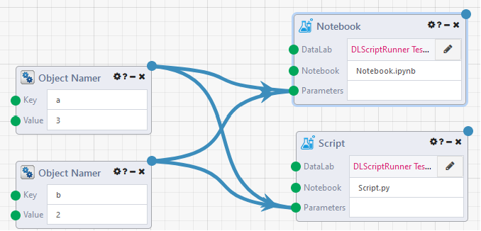
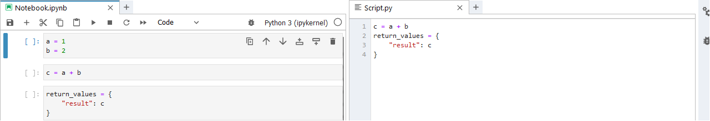

# DataLab Notebook Runner

## Overview

The **DataLab Notebook Runner** module is for remotely running your DataLab notebook files in a [Composable DataLab](../../DataLabs/Overview.md) using [Composapy](https://github.com/ComposableAnalytics/ComposaPy) and [Papermill](https://github.com/nteract/papermill). It takes a DataLab ID, a name of the notebook to run, a list of string-object pairs as parameters, and returns a list of string-object pairs.

The **DataLab NotebookRunner** module now also supports running python **.py** scripts.

## Example Notebook

### Setup
----


1) Create a new [DataLab](../../DataLabs/Overview.md), naming it "An Overly Complicated Calculator"

2) Create a new notebook, naming it "add.ipynb".

3) Using the logic for parameterizing from the [Parameterize](https://papermill.readthedocs.io/en/latest/usage-parameterize.html) docs page, tag the first cell (`a = 1, \n b = 1`) as "parameters". This cell's parameters will be overridden by the inputs passed in from the DataFlow Notebook Runner module.


## **`return_values`** : dict
The keyword **`return_values`** is used by Composable to send your results back to the DataFlow Notebook Runner module.

- Each key must be a string

- A restricted number of types are supported for values:
    - `int`
    - `str`
    - `None`
    - `CompAnalytics.Contracts.FileReference` (although FileReference may be passed to and from a notebook, any file references created in the notebook context will be unaccessible by the DataFlow)
----

## Example Script



The process does not change in the DataFlow setup as shown above. The script will need to be modified according to the instructions below:



NOTE: You will need to remove the Parameters cell as it is not necessary for the Python script to run. Simply pass in your parameters as normal in the DataFlow. You will also need to handle imports within function definitions to make them global as appropriate.

### DataFlow
----


1) Create or <a href = "https://raw.githubusercontent.com/ComposableAnalytics/Docs/master/docs/DataFlows/09.Module-Details/files/DataLabNotebookRunnerExample.json" download>import</a> the DataFlow as seen above.
    - Click the pencil icon and choose the DataLab named `"An Overly Complicated Calculator"`
    - In the notebook input, include the relative path to your notebook (in this case, the notebook `add.ipynb` was contained within the custom `calculator` subdirectory)
    - When passing inputs into parameters, use an object namer module to preserve your input types

2) Run the DataFlow. Your results window should contain the **`return_values`** passed from your `add.ipynb` notebook.


## Notes
----

Although not officially supported, you can pass other csharp types back with pythonnet by importing loading composapy into your notebook session.
```python
import composapy
``` 

You can then import C# and Composable types as python objects.
```python
# example imports
import System
from CompAnalytics.Contracts import *
```

To learn more about this type of behavior, check out the [pythonnet](https://github.com/pythonnet/pythonnet) github.
