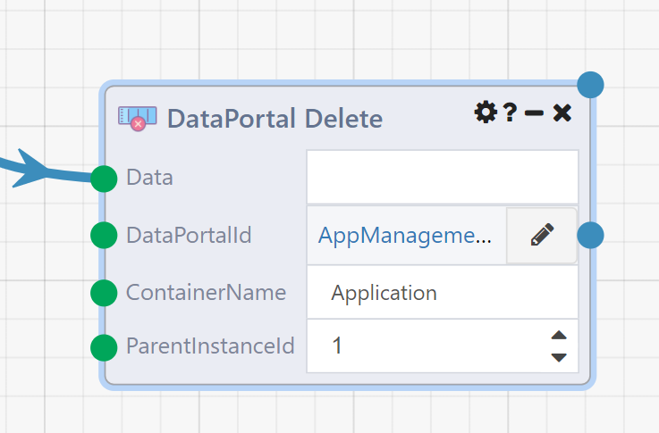

# DataPortal Delete

## Overview

The **DataPortal Delete** module allows mass deletion of data in a [Composable DataPortal](../../DataPortals/01.Overview.md). It takes a Composable Table and uses each row to identify a container to delete from the DataPortal.

The behavior of DataPortal Delete closely follows the behavior of the [DataPortal Sync](./DataPortalSync.md) module. The example DataFlow linked and described [here](./DataPortalSync.md) includes an example usage of DataFlow Delete and also includes more detailed discussion of the logic used by both modules to identify existing DataPortal containers.

## Input Details

### Data (required)

This is your input table, which is used to identify the container instances to delete. There are two methods of identifying instances: the ID and join columns.

To identify containers by ID include a column in the table with header `InstanceId`. The integer value in this column should match the ID of an existing instance. You can find this in the page URL when viewing the instance in question:

> ... /DataPortal.aspx#/form/2340034/SurveyManager/1/Survey/**324**

If an ID is provided for every row, **Data** need not contain any additional columns.

To identify containers by join columns, provide the values to join on as the columns of **Data**. Each column header should be the exact name of the field in the container (or one of its children) that the data from that column should be joined into. For example, if your DataPortal's container has a field defined as such:

| Name      	| DisplayName 	| Description 	| Type          	| ControlType 	|
|-----------	|-------------	|-------------	|---------------	|-------------	|
| FirstName 	| First Name  	|             	| System.String 	| Text        	|

Then, the name of your field is `FirstName`. When specifying your source data table, all values that should be joined into this field should be in the column whose header is `FirstName`. You can list any number of the fields in your container in this source data table; all of them will be used as join columns.

For each row in the table, if an instance exists with the same values as the row for every join column then that instance will be deleted. If no matching instance is found the row is skipped. **If multiple matching instances are found, the module will fail.**

Matching on join column will be scoped down by `ParentInstanceId` if the **JoinOnParent** input is checked. This includes `ParentInstanceId` either as a module input or as an additional column in the table. Otherwise the match will be performed across all containers regardless of parent.

There is no need to worry about exact type matching for the values of the join columns — the module will automatically attempt to convert the data provided in the table to the appropriate type in the container's underlying database. Category fields (those with `Category` as the `ControlType` in the DataPortal definition) should be entered as the string value in the table, rather than the integer ID.

If you include both an `InstanceId` column and join columns, the `InstanceId` value will be used first to identify the instance to delete. If the value is null then the join columns will be used. If the ID is not null but does not match an existing instance a warning will appear in the trace and that row will be skipped; the join columns will *not* be used.

### DataPortalId (required)

This is the ID of the DataPortal you'll be deleting from. Usually this will be filled in automatically when you select the DataPortal by clicking the pencil icon on the input.

If you need to set it manually (for example over a connection), you can find it in the URL when you're viewing your DataPortal on the web, in the bolded section below:

> ... /DataPortal.aspx#/form/**2340034**/SurveyManager/1/Survey/324

### ContainerName (required)

This is the name of the container that the module will be deleting instances of. You can find it in your DataPortal's Excel template as we did for the field names, or from the page URL when viewing an instance of the container in question:

> ... /DataPortal.aspx#/form/2340034/SurveyManager/1/**Survey**/324

### ParentInstanceId

If you are identifying containers to delete by join columns rather than by an instance ID, you may want to scope that join down by the parent of the container to be deleted. You can find this parent ID in the URL just before the name of your container:

> ... /DataPortal.aspx#/form/2340034/SurveyManager/**1**/Survey/324

You can also choose to leave this input blank and instead include `ParentInstanceId` as a column in the **Data** table. In this case each row will be joined under the corresponding parent instance, allowing instances under multiple parents to be deleted with a single input table.

An error will be raised if this input is set and `ParentInstanceId` is a column in **Data**. If `ParentInstanceId` is a column but is not set for some rows then the join performed for those rows will not be limited by parent.

## Output Details

### Errors

A list of any errors that occured during the deletion of instances. These can be any kind of "safe" error that doesn't prevent further processing, such as a row that couldn't be matched to a container instance.

### Count

The number of instances that were deleted.