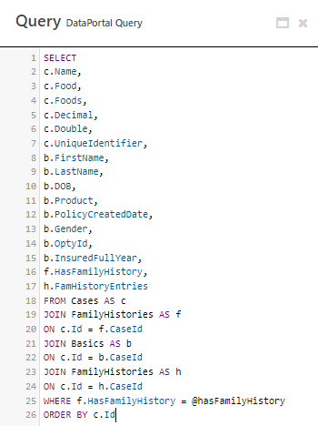
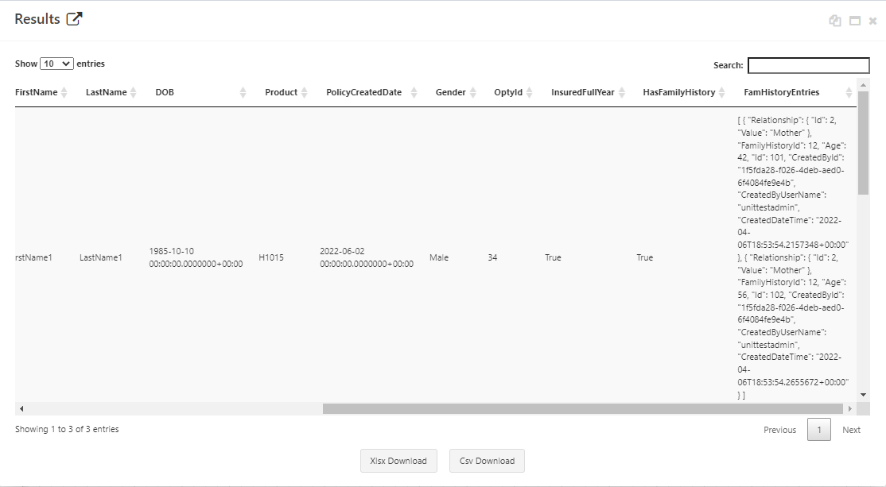
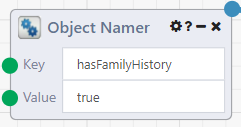

# DataPortal Query

## Overview

The **DataPortal Query** module allows querying of data in a [Composable DataPortal](../../DataPortals/01.Overview.md) using [Entity SQL](https://docs.microsoft.com/en-us/dotnet/framework/data/adonet/ef/language-reference/entity-sql-reference). It takes a DataPortal ID, an SQL query, and a list of objects as parameters and returns a Composable Table.

See [below](#input-details) for a complete discussion of inputs and options.

## Example DataFlow
The following <a href = "https://raw.githubusercontent.com/ComposableAnalytics/Docs/master/docs/DataFlows/09.Module-Details/files/DataPortal%20Query%20Example.json" download>example DataFlow</a> demonstrates many of the possible ways to use the **DataPortal Query** module. This DataFlow uses the <a href="https://github.com/ComposableAnalytics/Docs/blob/master/docs/DataFlows/09.Module-Details/files/DataPortalQuery.xlsx?raw=true" download>DataPortal Query</a> sample DataPortal model, which creates a DataPortal called `DataPortalQuery` by default. **WARNING: this DataFlow deletes all existing data in the DataPortal, so only run it against a test DataPortal.** You can change the name in the Excel file if you already have a `DataPortalQuery` DataPortal, just be sure to select the right DataPortal when configuring the DataFlow.

### Adding New Data
This DataFlow uses the [**DataPortal Sync**](./DataPortalSync.md) module to add entries to the DataPortal we can query from. These will create 5 entries, each having two FamilyHistoryEntries.

### Querying Data Using Entity SQL
The recommended way to write your SQL queries with this module to ensure the proper types are returned, do not use the VALUE keyword. The module will provide a warning if the user attempts to use it and no data is returned. 

There is no '*' selector in Entity SQL. If you want all the rows to be returned in a query you must manually specify them. For a full list of the differences between Transactional SQL queries and Entity SQL queries refer to the [official documentation](https://docs.microsoft.com/en-us/dotnet/framework/data/adonet/ef/language-reference/entity-sql-reference).

## Results

The output of the **DataPortal Query** module is a Composable Table. If the object is a one-to-one relationship such as Double, the value will simply be returned as it exists in the database. If the object is a one-to-many relationship in the case of FamHistoryEntries, the results will be serialized into a valid JSON string as shown in the picture above.

## Input Details

### DataPortalId
This is the Id for the DataPortal you wish to query. Simply click on it and select the DataPortal from the list that appears.

### Query
This is the SQL query you wish to execute on the DataPortal. Specific formatting can be found in the example.

### Parameters

This takes in a list of KeyValuePairs of type <string, object>. The **Object Namer** module is the recommended module to supply these values. These can be referenced in the query by prepending '@' before the object name. For example: 
> SELECT c.Name FROM Cases AS c  
> JOIN FamilyHistories AS h  
> ON c.Id = h.CaseId  
>  WHERE h.HasFamilyHistory = @hasFamilyHistory
