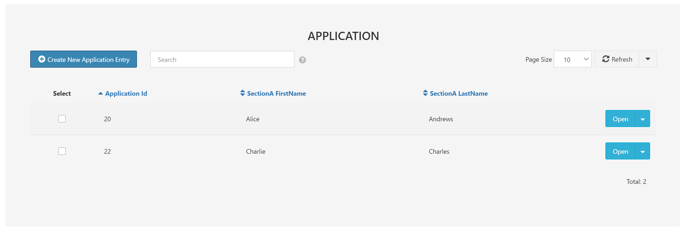
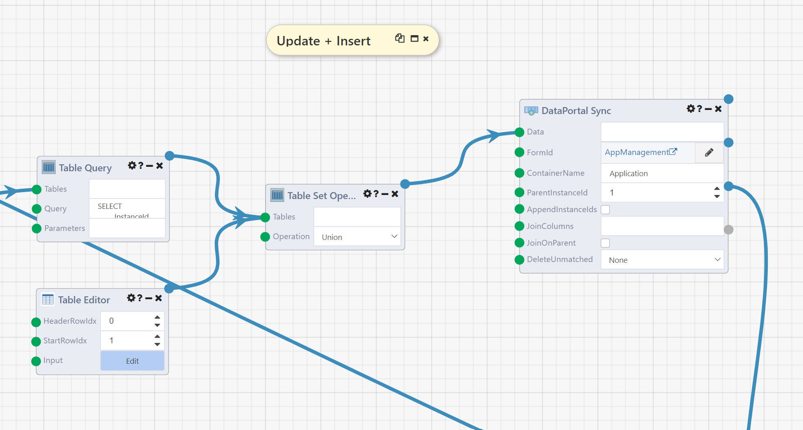
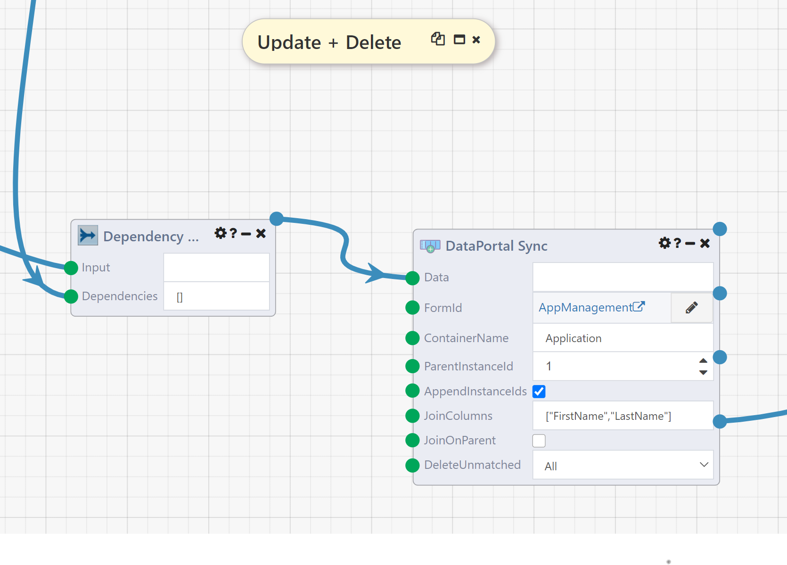
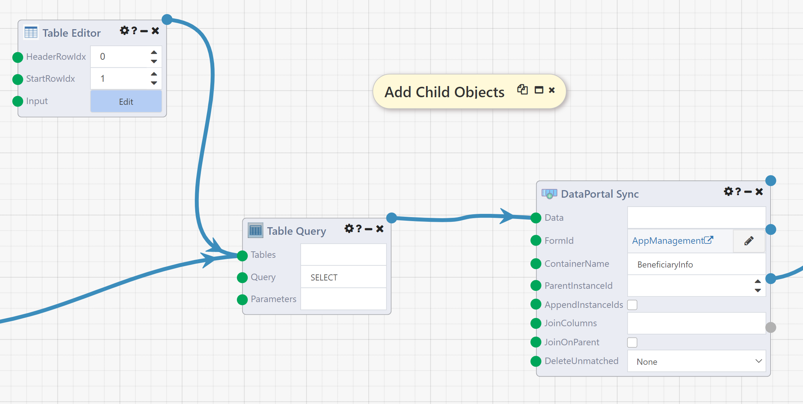
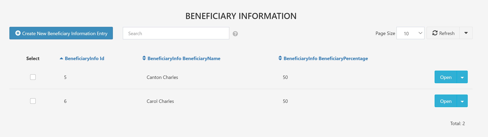

# DataPortal Sync

## Overview

The **DataPortal Sync** module (formerly known as **Table To Form Automapper**) allows mass creation, modification, and deletion of data in a [Composable DataPortal](../../DataPortals/01.Overview.md). It takes a Composable Table and converts each row into a "Container" in the DataPortal, either creating a new container or updating the values in an existing container.

The basic behavior of **DataPortal Sync** is best demonstrated via an example. See [below](#input-details) for a complete discussion of inputs and options.

## Example DataFlow

The following <a href="https://raw.githubusercontent.com/ComposableAnalytics/Docs/master/docs/DataFlows/09.Module-Details/files/DataPortal%20Sync%20and%20Delete%20Example.json" download>example DataFlow</a> demonstrates many of the possible ways to use the **DataPortal Sync** module. This DataFlow uses the <a href="https://github.com/ComposableAnalytics/Docs/blob/master/docs/DataFlows/09.Module-Details/files/InsuranceApplication.xlsx?raw=true" download>Insurance Application</a> sample DataPortal model, which creates a DataPortal called `AppManagement` by default. **WARNING: this DataFlow deletes all existing data in the DataPortal, so only run it against a test DataPortal.** You can change the name in the Excel file if you already have an `AppManagement` DataPortal, just be sure to select the right DataPortal when configuring the DataFlow.

### Create New Containers

The simplest way to use DataPortal Sync is to create new entries in a [DataPortal Table](../../DataPortals/05.Control-Details/Table.md). In the `AppManagement` DataPortal, the first page we see is a table of `Application`s. Each of these is a DataPortal "Container" with type `Application`, defined in the DataPortal model. Each container encompasses many fields, which may be spread across multiple tables in the underlying database by use of the [Page](../../DataPortals/05.Control-Details/Page.md) control type.

The first DataPortal Sync module in our DataFlow will create three new `Application`s from a Composable Table (here created in a TableEditor module). Each of the created containers will be populated with the values from the table.

To see how this module works, disable the Table Query module that follows it by right clicking and selecting "Disable":

This will allow you to run just first DataPortal Sync, which is being used to create new containers. Click Run to see the results. You can look at the output values and Trace log on the DataFlow for some information, but the best way to see the work the module did will be to go to the `AppManagement` DataPortal. There you will see three rows in the `Application` table, each with a `FirstName` and `LastName` showing on the table. If you navigate in to one of those `Application`s, you'll see that various values are filled out on the Application, Proposed Insured, and Policy Owner tabs.

#### Module Inputs

To see how these entries were generated, return to the DataFlow and examine the first DataPortal Sync module. Notice that seven inputs are set; for the most basic implementation of creating new containers, the first 4 of these are required:

- **Data**: This is the table defining the containers to be created, and will be discussed in more detail below.
- **FormId**: This defines which DataPortal to work with; here we have clicked the pencil icon and selected the `AppManagement` DataPortal from the window that appeared.

- **ContainerName**: This is the name of the container to be created, as defined in the Excel model.
- **ParentInstanceId**: The ID of the container into which new containers should be inserted. For `Application` this is always `1` because `Application` is at the top level of the DataPortal. More complex behavior will be demonstrated later in the DataFlow.

The following two inputs are set to non-default values only to facilitate further demonstrations later in this DataFlow:

- **AppendInstanceIds**: This is checked so the **Table** output will be set; this output will be used and discussed downstream.
- **JoinColumns**: This is set to `["Name"]`, so if you run this DataFlow more than once it will update the containers created on the first run rather than creating new ones again. This makes it easier to see the changes in the DataPortal values by running portions of the DataFlow. Details on usage of this column are [below](#update-and-delete-existing-containers).
- **DeleteUnmatched**: This is set to `All`, to clear the DataPortal before proceeding with the remainder of the DataFlow, deleting any previously existing `Application` containers. **This setting is required to allow the DataFlow to be run repeatedly and stopped at various points for demonstration purposes. For simply creating new containers leave the DeleteUnmatched input at the default value `None`.**

#### Data Input

This is the table being fed into **Data** in the first module:

|Name|FirstName|MiddleName|LastName|Sex|DOB|Citizenship|Occupation|PolicyOwnerType|
|----|---------|----------|--------|---|---|-----------|----------|---------------|
|Application 1|Alice|A|Andrews|Female|10/10/1985|Yes|Student|Individual|
|Application 2|Bob||Bennett|Male|1980-01-01|true|Homemaker|Trust to be Established|
|Application 3|Charlie||Charles|Male|May 15, 1965|No|Retired|Existing Trust|

The column names are all names of fields in the DataPortal. Note, however, that they are not all directly defined on the Application container. Most are defined on separate containers linked to `Application` via the [Page](../../DataPortals/05.Control-Details/Page.md) control type. Because these are in a one to one relationship with `Application`, the DataPortal sync module treats them identically to fields defined directly on `Application`.

The values in this table will be written to the DataPortal in the appropriate fields when this module is run. Because there are three rows, three `Application` entries will be created. Any fields not included in this table will be left with their default value (which is usually no value). If there were any additional columns in this table that didn't map to any field on `Application` or one of it's pages, those values would be ignored.

Finally note the types of information present in the table. In general, the DataPortal sync module will try to convert whatever values it receives into the appropriate format for the DataPortal field being written to. In this case, because this data is coming from a Table Editor module, all the raw values are simply text; conversions will also work with differently typed data from other sources.

- For [Text](../../DataPortals/05.Control-Details/Text.md) controls like `FirstName`, the value to be stored will simply be the string.
- For [Category](../../DataPortals/05.Control-Details/Category.md) controls like `Sex` and `Occupation`, the values in the table match the picklist values (case-insensitive); if a value doesn't match one of the options no value will be set and an error will be included in the **Errors** output.
- For [Multi-Select Categories](../../DataPortals/05.Control-Details/Category.md) the values in the table should be comma separated picklist values (case-insensitive). For example, if `Occupation` was a multi-select category (change the type from: `Form.Occupation` -> `[Form.Occupation]`), you can select 'Student' and 'Unemployed' at the same time by using "Student,Unemployed". Note that the order of the comma separated values does not matter.
- For [CheckBox](../../DataPortals/05.Control-Details/CheckBox.md) controls like the `Citizenship` field, the DataPortal stores a Boolean value (`true` or `false`). This can be expressed in a variety of ways in the input table, we use `Yes`, `No`, and `true` for the values here; the strings `0`, `1`, `N`, and `Y` also work, as will a variety of non-string values.
- For [Date](../../DataPortals/05.Control-Details/Date.md) controls the input will be parsed as a date; a wide variety of formats are possible.

### Updating Existing Containers

The second DataPortal Sync module demonstrates one way to update existing containers, while also inserting a new instance at the same time.

To see the results of this module, disable the Dependency Waiter the Counts output connects to and run the DataFlow. Go back to the DataPortal.

The DataPortal will now have four applications, and if you enter the Alice Andrews application you'll see that the `MiddleName` field on the Proposed Insured tab is now `Alexis` rather than `A`.

The inputs **FormId**, **Application**, and **ParentInstanceId** are all the same here as above. **JoinColumns** and **DeleteUnmatched** have been set to their default values, rather than the special values they needed above to facilitate a clean demo environment.

The **AppendInstanceIds** output has been unchecked, which for this module means that the final output, **Table**, is not set (and any modules connected to it would not execute). Note, however, that the **Table** output of the first DataPortal Sync module is used in the construction of the **Data** input table for this module. Here is that table:

|InstanceId|Name|FirstName|MiddleName|LastName|Sex|Occupation|
|----------|----|---------|----------|--------|---|----------|
||Application 4|Doris||Davidson|Female|Employed|
|31|Application 1|Alice|Alexis|Andrews|Female|Student|

Most of this table is similar to the previous **Data** table. The `InstanceId` column is new, and is being used to identify existing containers to update rather than creating new containers. Thus the second row will update the existing instance, changing the `MiddleName` from `A` to `Alexis`. Because the first row doesn't have an `InstanceId` value, a new entry will be created for it.

The `InstanceId` value is the ID of the `Application` to map into. When you're looking at the DataPortal you can find it in the URL:

> ... /DataPortal.aspx#/form/1662747/AppManagement/1/Applications/**31**

In this DataFlow, however, we instead got the `InstanceId` from the **Table** output of the first DataPortal Sync. That output looks like this:

|InstanceId|Name|FirstName|MiddleName|LastName|Sex|DOB|Citizenship|Occupation|PolicyOwnerType|
|----------|----|---------|----------|--------|---|---|-----------|----------|---------------|
|31|Application 1|Alice|A|Andrews|Female|10/10/1985|Yes|Student|Individual|
|32|Application 2|Bob||Bennett|Male|1980-01-01|true|Homemaker|Trust to be Established|
|33|Application 3|Charlie||Charles|Male|May 15, 1965|No|Retired|Existing Trust|

This is simply the input table **Data** with a new `InstanceId` column appended. Each value in that column is the correct ID for the container created (or updated) by that row of the table. Thus to create our new input table we simply modified this output table. Of course, it is somewhat unnatural to create and then immediately edit the same values of an entry; this `InstanceId` column is often more useful when [creating child containers](#create-child-containers).

### Update and Delete Existing Containers

The next DataPortal Sync module shows another way to update existing containers and a way to delete existing containers.

To see the behavior of this module, disable the Table Query module immediately downstream and run the DataFlow. When you go back the DataPortal, there will once again be only three `Application` entries, and the Alice Andrews entry will have `A` as the `MiddleName`. Thus this module has undone the modifications [above](#updating-existing-containers).

The key inputs here are **JoinColumns** and **DeleteUnmatched**. All of the other inputs, including **Data**, are identical to the first DataPortal Sync module, defining the values to be created.

**JoinColumns** defines an alternate way to identify existing containers using columns of **Data**. Its value must be a list of column names. The values in those columns are then compared to existing containers, with three possible outcomes:

- If no existing container matches on all join columns, a new container is created. Note that this is what happened on the first run of [the first DataPortal Sync module](#create-new-containers), so the behavior was the same as it would be with no value for that input
- If exactly one existing container matches on all join columns, that container is updated with the values from **Data**.
- If more than one existing container matches on all join columns, the module fails. Thus the join columns should uniquely identify entries in the DataPortal; it is often a good idea to have a [CustomIndex](../../DataPortals/06.Setting-Details/CustomIndex.md) enforcing that uniqueness on columns you intend to use as **JoinColumns**.

**DeleteUnmatched** allows you to delete any containers that aren't part of the current sync. The `All` option selected here means that any containers not included in **Data** will be deleted. This allows for a true "sync" behavior where the data in the DataPortal exactly matches the input data after the sync. `None` does no deletion and is usually the desired behavior. The `MatchedParents` option [is discussed below](#delete-unmatched)

### Create Child Containers

The next, and final, DataPortal Sync module in this example DataFlow demonstrates how to create containers that live inside other containers.

To see the effects of this module, disable the dependency waiter downstream of it and run the DataFlow. In the DataPortal, navigate to the Charlie Charles application and open the Beneficiary Information tab. The Beneficiary Information table should now have two entries:

If you go to the same place in the Alice Andrews application you'll find one entry in the table.

Returning to the DataFlow, there are two key inputs to notice on this DataPortal Sync module. The first is **ContainerName**, which is now `BeneficiaryInfo` indicating that we are now intending to work with `BeneficiaryInfo` containers rather than `Application` containers.

The other is **ParentInstanceId**, which is now empty. This signals to the module that we will be providing the necessary parent ID in the **Data** table. Here is that table:

|ParentInstanceId|ApplicationFirstName|BeneficiaryName|BeneficiaryPercentage|BenficiaryRelationship
|----------------|--------------------|---------------|---------------------|---------------------|
|31|Alice|Andrew Anderson|100|Individual|
|33|Charlie|Canton Charles|50|Individual|
|33|Charlie|Carol Charles|50|Individual|

Note the `ParentInstanceId` column. The values in this column are `InstanceId` values for `SectionC` instances, where `SectionC` is the [Page](../../DataPortals/05.Control-Details/Page.md) under `Application` that contains a [Table](../../DataPortals/05.Control-Details/Table.md) of `BeneficiaryInfo` entries. Thus the "Parent" of each `BeneficiaryInfo` is the `SectionC` instance we want to write to. Because `SectionC` is in a one to one correspondance with `Application`, in this small demo example the instance ID of `SectionC` will match the ID of `Application`, so in this case we have retrieved them from a previous run of DataPortal Sync on `Application`. **This identity is not guaranteed to hold in general, and you should always use the ID of the direct parent as the ParentInstanceId.**

### DataPortal Delete

The final module in this example DataFlow is a DataPortal Delete module; a close relative of the DataPortal Sync module.

To see the impact of this module, enable all modules and run the full DataFlow. When you go to the DataPortal, there should be two `Application` entries, those for Alice Andrews and Charlie Charles. The entry for Bob Bennett has been deleted.

The DataPortal Sync module has many of the same inputs as the DataPortal Sync module, but uses them to identify existing containers to delete rather than creating or updating containers. The **DataPortalId** input behaves the same as the **FormId** input on DataPortal Sync, and **ContainerName** has the same meaning.

In this case, we have submitted the following table for **Data**:

|FirstName|LastName|
|---------|--------|
|Bob      |Bennett |

This one row table will result in one `Application` entry being deleted. Because we have chosen to include columns corresponding to fields on `Application` or its [Page](../../DataPortals/05.Control-Details/Page.md) containers, this **Data** table is treated as containing join columns. Every column in the table is used to join to the existing data, in this case finding the entry with `FirstName` Bob and `LastName` Bennett. Because **ParentInstanceId** is set this search is also limited to those with parent ID 1, but all `Application` entries have parent 1 because they are at the top level of the DataPortal (underneath only the singleton `AppContainer`). We could also have included a `ParentInstanceId` column in the table to limit the join to different parents on each row. Finally, we could have instead identified the containers to delete by `InstanceId` as the only column in **Data**.

## Input Details

### Data

This is your input table, containing the data to sync into your DataPortal and optionally including information to use to identify existing data to update.

Most column headers should be the exact name of a field in the container or one of its [Page](../../DataPortals/05.Control-Details/Page.md) children. For example, suppose your DataPortal's container has a field defined as such:

| Name      	| DisplayName 	| Description 	| Type          	| ControlType 	|
|-----------	|-------------	|-------------	|---------------	|-------------	|
| FirstName 	| First Name  	|             	| System.String 	| Text        	|

Then, the name of your field is `FirstName`.

Columns whose name is a DataPortal field have two potential purposes:

- Data to be mapped. This is the more common usage, in which the values that should be written into a particular field are included in the column. This applies whether a new container is being created or an existing container is being updated
- Join columns. It is also possible to use data on fields to identify existing columns. See [JoinColumns](#join-columns) for details.

There are two other columns that may optionally be included in **Data**:

- `InstanceId` - This column allows you to directly identify an existing container by ID. Find the correct ID in the DataPortal URL when looking at the container to be mapped:

> ... /DataPortal.aspx#/form/2340034/SurveyManager/1/Survey/**324**

- `ParentInstanceId` - This column allows you to identify which parent container each row should be mapped under. This is usually the parent under which a new instance will be created, though it can also be used to restrict the identification of an existing container (see [JoinColumns](#join-columns)).

Join columns, `InstanceId`, and `ParentInstanceId` will be used to determine which container, existing or new, to write data to. The data in all other columns will be stored to the identified container. If a column does not match a field on the container that column will be ignored.

There is no need to worry about exact type matching — the module will automatically attempt to convert the data provided in the table to the appropriate type in the container's underlying database. [Category](../../DataPortals/05.Control-Details/Category.md) fields should be entered as the string value in the table, rather than the integer ID.

### FormId

This is the ID of the DataPortal you'll be mapping into. Usually this will be filled in automatically when you select the DataPortal by clicking the pencil icon on the input.

If you need to set it manually (for example over a connection), you can find it in the URL when you're viewing your DataPortal on the web, in the bolded section below:

> ... /DataPortal.aspx#/form/**2340034**/SurveyManager/1/Survey/324

### ContainerName

This is the name of the container that the module will be creating instances of and attempting to map values into. You can find it in your DataPortal's Excel template as we did for the field names, or from the page URL when viewing an instance of the container in question:

> ... /DataPortal.aspx#/form/2340034/SurveyManager/1/**Survey**/324

Note that data may be written to containers with different names if they are [Page](../../DataPortals/05.Control-Details/Page.md) children of the given container name.

### ParentInstanceId

The container to be created/mapped into might exist inside another multi-instance container. Therefore, you must specify exactly which parent holds all of the new instances of your container or will hold them after they are created. You can find it in the URL just before the name of your container:

> ... /DataPortal.aspx#/form/2340034/SurveyManager/**1**/Survey/324

You can also choose to leave this input blank and instead include `ParentInstanceId` as a column in the **Data** table. In this case each row will be mapped under the corresponding parent instance, allowing instances under multiple parents to be mapped with a single input table. If the `ParentInstanceId` column is blank for any row that does not contain an `InstanceId` value or join columns identifying a single existing container the module will fail. That is, if all rows of **Data** refer to existing containers by `InstanceId` or join columns then `ParentInstanceId` need not be set, but if any row of **Data** should create a new container, then `ParentInstanceId` must be provided either as a column or as this input.

### AppendInstanceIds

Optionally return a copy of the input **Data** table with a column `InstanceId` holding the IDs of every mapped container. All other columns will be preserved, whether they were mapped or not. If `InstanceId` was already a column in **Data**, the column will be updated with the IDs of the mapped containers.

### JoinColumns

A list of names of columns in **Data** that will be used to identify existing container instances. For each row in the table, if an instance exists with the same values as the row for every join column then that row's other values will be mapped into the identified instance. As with general mapped values, there is no need to worry about exact type matching.

Matching on join column will be scoped down by `ParentInstanceId` if the **JoinOnParent** input is checked. This includes `ParentInstanceId` either as a module input or as a column in the table. Otherwise the match will be performed across all containers regardless of parent.

If no matching instance is found a new instance will be created. **If multiple matching instances are found, the module will fail.** If **Data** contains multiple rows with the same values in the join columns the matching container will receive the values from each row in order, thus ending up with the values from the last matching row.

If **Data** contains an `InstanceId` column, the value in that column will be used rather than the join columns, but join columns will be considered for any row without a provided instance ID.

### JoinOnParent

Include the parent in the join columns. If join columns are not set this option is ignored. If they are set, checking this option will limit matches by `ParentInstanceId`, whether that is defined as a column in **Data** or as an input. Without this option parent will be ignored and only the values of the listed join columns will be considered in matching to containers.

### DeleteUnmatched

Choose a setting to define what containers the module should delete, if any. The options are:

- `None`: No containers will be deleted *(default)*
- `MatchedParents`: Containers will be deleted if they are not synced and live underneath a parent that had some containers synced.
- `All`: Containers will be deleted if they are not synced, regardless of their parent.

This option can be used to achieve syncing behavior between the source **Data** table and the set of containers in the DataPortal. That is, if set to `MatchedParents`, after running this module the containers under the matched parents will exactly correspond to those defined by **Data**. If set to `All`, the containers for the entire table will correspond to those defined by **Data**.

## Output Details

### Result

The module outputs a `ContainerReference` object corresponding to the last container created during the execution. This is the container that was created or identified and filled in for the last row of your source table. 

After execution, however, you should expect to see one new instance of the named container created inside the parent instance for each row of the source data table. Those container instances should also contain the values for each field (each column) of the table. If you don't see values in one of the fields you were attempting to fill in, check that you properly specified the name of that field in the column header above those values in your table. Beyond that, ensure that the type of that column in the table is as close to the correct data type as possible, to ensure mapping occurs successfully.

### Errors

A list of any errors that occured during the mapping of properties. These can be any kind of "safe" error that doesn't prevent further processing, such as a table value of an incompatible type with the destination field.

### Counts

A dictionary containing counts for the number of records inserted, updated, and deleted along with the total number of records processed. You can use this to verify that rows expected to update existing container instances were correctly processed as updates and those expected to create new containers did so.

### Table

A copy of the input table **Data** with a complete `InstanceId` column containing the IDs of every mapped instance. If `InstanceId` was already a column it is updated with the IDs used during mapping. All columns of **Data** are preserved even if they were not mapped. **If the input `AppendInstanceIds` is `false`, this output will not be set.**
