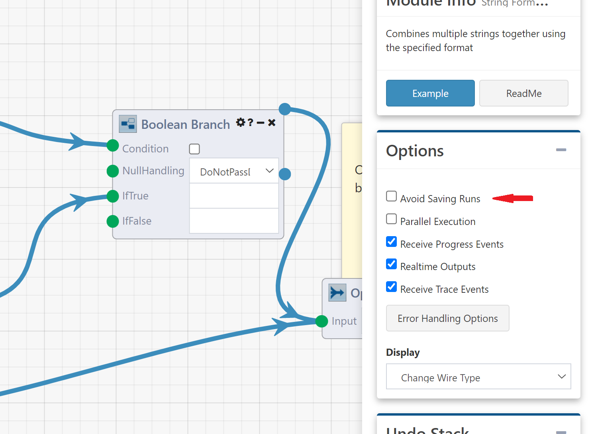
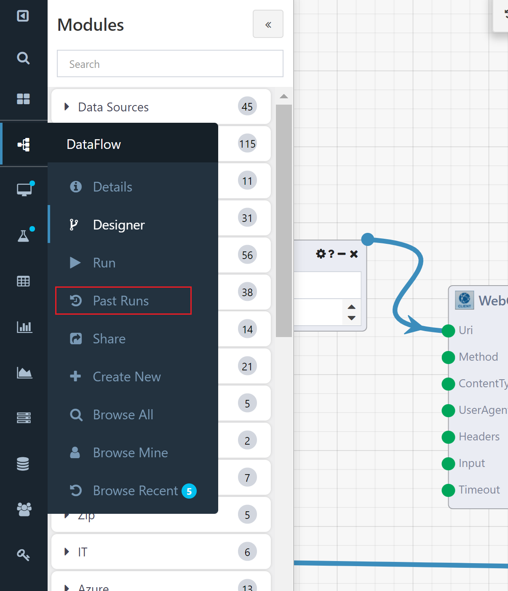
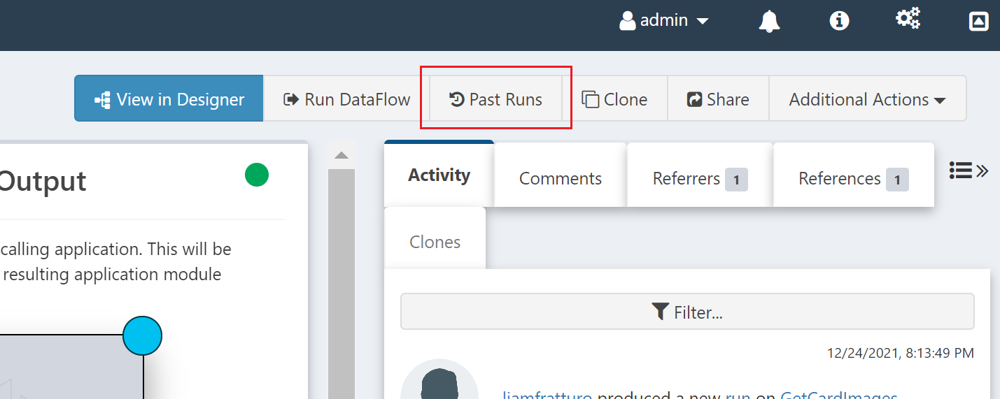
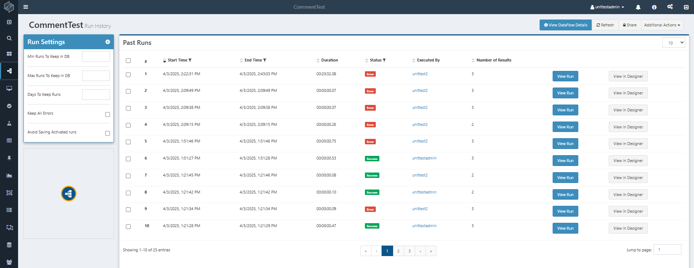

# DataFlow Runs

Each time a DataFlow application is executed by a user or through external activation, a `Run` is produced. Composable automatically saves the results for each Module and saves them within a run. Previous Runs can be accessed through the Run History page, which displays the runs Times, status, and number of Module results. The Run History page can be reached from the DataFlow Details page, or in the sidebar when viewing a DataFlow, as explained below.

!!! note
    `Runs` are securable resources, similar to DataFlows, QueryViews, and WebApps. A `Run` and its included `Results` share the same access control entry.

## Run Settings

In the DataFlow Designer Settings, there is an option to turn off Saving Runs.

## Past Runs

All past Runs of a DataFlow are generally saved for a specified period of time (based on both the specific DataFlow's Run Retention Setting and the global Composable instance retention settings configured by the Composable system admin).

Past Runs can be view on the Run History page, by navigating to it from the Designer using the side navigation bar or from the DatFlow details page.

The Run History page provides two main features: the **Run Settings** on the left and the **Past Runs** in the center of the page.

### Run Settings

On the Run History page, the Run Settings panel allows the user to:

- Set the min and max number of Runs that should be saved
- Set the number of days Runs will be stored for
- **Keep All Errors**: If selected, ensures that Runs that errored will not be removed
- **Avoid Saving Activated Runs**: If selected, ensures that Runs activated outside of the designer, such as from activation Modules or timers, will not be saved.

!!! note
    A global Composable Custodian Service cleans up (i.e., deletes) past Runs across the entire Composable instance based on a set schedule. This is typically set at 60 days, but can be configured differently by the Composable system administrator based on different business requirements.

### Past Runs

On the Run History page, the Past Runs panel provides an audit trail of all saved past Runs. A list is provided showing the start and end times, duration, status, number of results and the User that executed the DataFlow. You can filter runs by their Start Time, End Time, or Result to locate specific runs more efficiently. Importantly, two buttons are available to view the Run details and to open the Run in the DataFlow Designer. Doing so, a user can inspect a given past run, including all intermediary results. This is a very powerful and valuable feature, since it provides an opportunity, in case of any errors, to open a given Run and debug it in the Designer or Resume execution.

!!! note
    A `Share` button is available in the top right of the Run History page which provides the option to assign permissions on Runs.
