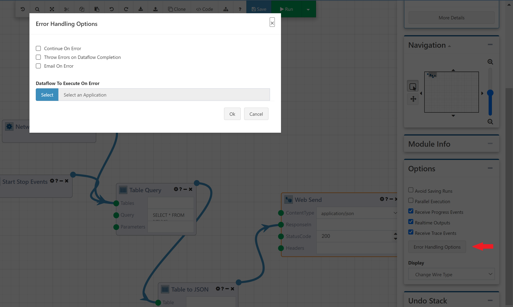
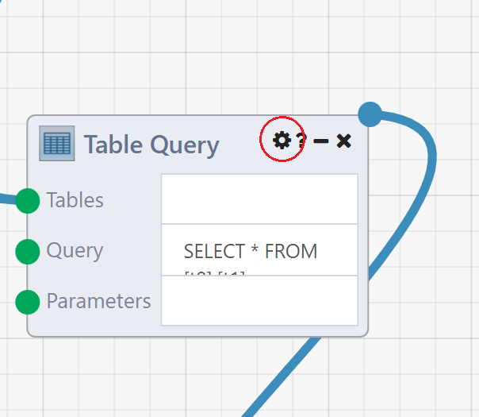
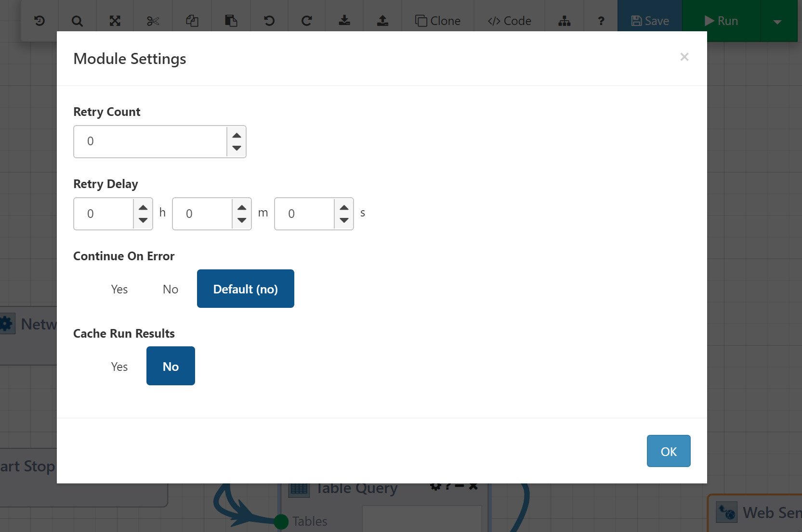

# DataFlow Error Handling Options

The Composable DataFlow Designer provides a full (visual) development environment, with features ranging from debugging to version control, to replicate the concepts of coding in an IDE. To further that goal, the DataFlow Designer allows the user to define how to handle errors, at both a global (DataFlow) level and granular (Module) level. There are three major features that encompass error handling for DataFlows: 

- Continue On Error
- Email On Error
- Execute On Error

The global DataFlow error handling settings can be altered in the Error Handling Options modal by selecting the `Error Handling Options` button in the Designer.

The granular Module level error handling can be set by clicking on the gear icon on the top right of a Module.

A Module Settings modal is provided to set individual Module options, including:

- Retry (retries a given Module during Execution for a specified number of times, with each retry separated by a specified amount of time)
- Continue on Error
- Cache Run Results

With these features for error handling and manipulation, Composable users can be further empowered to automate DataFlow applications.

## Continue On Error

If selected, the Continue On Error option does the following: if an error occurs during a DataFlow, it is logged, but the DataFlow will continue. The setting can be set at either the DataFlow level or the Module level, allowing for further precision within the DataFlow as the Module level setting will override the setting at the DataFlow level. It does not however, have to be set on every Module. If a Module does not have it set, it defaults to whatever the DataFlow level setting is at the time. When using Continue On Error, it is important to note that any failed Module's outputs are erased, and will not send data to a downstream Module. This is because that data is not necessarily trustworthy after a failure, so to prevent any inconsistent results, the output values are removed. With the exception of the Optional List Builder, Alert Sender, and the Consolidator, any Module directly connected to the failed Module will not execute because the input that connects to the failed Module will never be satisfied. It is important to keep this in mind while building a DataFlow so that Modules have the correct behavior after a failure. Every error that occurs is written to the trace and can be seen there when reviewing the Run. The Run will have a status of `Success` because no error was allowed to fully surface during execution, and as a result, and further error handling options will not be activated.

To set Continue On Error at the Module level, click on the gear icon on the top right of a Module.

## Throw Errors on DataFlow Completion

In order to have error suppression work in tandem with the other options, set Throw Errors on DataFlow Completion to true in the settings modal. Note that it will not do anything unless Continue On Error is set somewhere in the DataFlow, either globally or on an individual Module, because errors are logged at immediate failure normally. When set to true, all of errors are collected in the background and then stored until the end of the DataFlow execution, where they are appropriately logged. The same rules for Module failures apply with Error On Completion set as with Continue On Error - all the output values will be removed from the offending Module. In addition to these suppression and logging settings, we also have reflexive actions that can be taken if a failure occurs.

## Email On Error

Email On Error allows for immediate notification upon an error occurring. Email On Error emails the DataFlow Owner or specified list of emails when an error occurs. When set, it defaults to emailing the DataFlow Owner, but that can be overwritten by a comma-delimited list of emails should it be necessary. 

## DataFlow To Execute On Error

DataFlow To Execute On Error allows for immediate action upon an error occurring. DataFlow To Execute On Error allows the user to specify another DataFlow if the one running fails. In order to provide information about what occurred, Composable passes error and Run information to the reacting DataFlow so that actions can be taken based on the type or error logged or what Module failed previously. Re-running tasks, updating external databases post error, correcting any potential partial DataFlow completion results, and more are all possible.