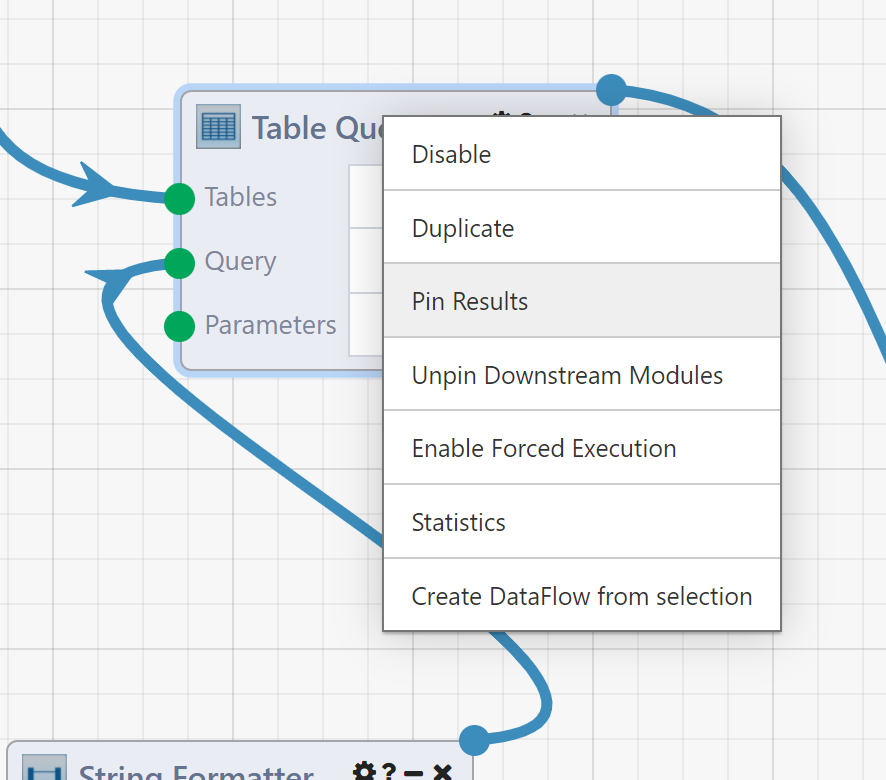
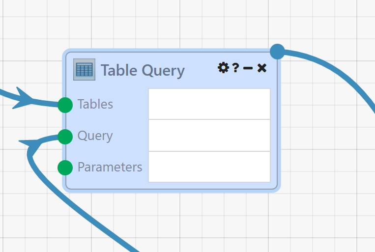
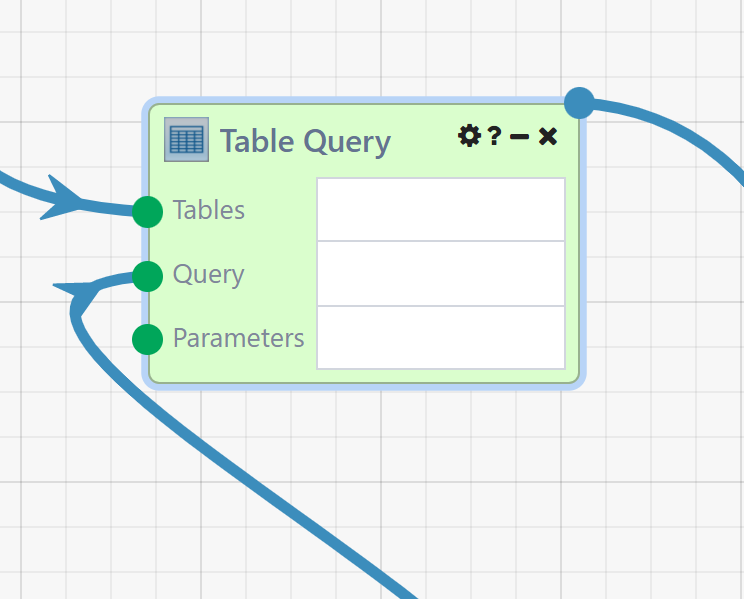

# Pinned Results and DataFlow Resume

In this section, we will cover Pinned Results and DataFlow Resume, two features that greatly facilitate DataFlow development and debugging by allowing you to reuse Results that have already been calculated, saving computation time and helping to consistently reproduce specific execution states.

## Pinned Results

Simply put, Pinned Results allow you to carry a Module's output values from one run to the next, allowing you to skip executing that Module and guaranteeing that its Results will not change. To pin a Module, right-click on it after the DataFlow has executed and select `Pin Results`.

Once `Pin Results` is selected, the pinned Module is set and highlighted in blue.

The Module context menu also has an option for `Force Execution`. `Force Execution` is another Module-level option (like Pin Results and Disable/Enable) that tells the execution engine to always execute this Module, regardless of whether it has Results from a previous Run it can draw from. In a sense, `Pin Results` and `Force Execution` are opposites; a Pinned Module will never execute and always use past Results, and a Forced Module will always execute and never use past Results. 
Modules that have `Force Execution` enabled are highlighted in green.

!!! note
    Module-level options set via the context menu when you right-click on a Module (e.g., `Disable`, `Pin Results`, `Force Execution`, etc.) are not permanently saved and will only apply to the current DataFlow Designer session. These functions are intended to be used for development and debugging, not persistent changes. If you need constant outputs from a Module that would otherwise vary, consider replacing that Module with one that allows you to manually input your desired output data directly, (i.e. String Input, Array Builder, or Table Editor).

Scenarios where Pinned Results can be useful include:

- Developing a DataFlow containing a Module with a long runtime: When the behavior you're testing doesn't specifically depend on that Module's Results, pinning it can save you time every run.
- Testing a DataFlow with side-effects, such as email and alert sending: Pinning the offending Modules can allow you to repeatedly try the logic you care about without spamming anyone's inbox.
- Debugging an error that occurs under specific conditions: The ability to freeze specific Module Results in place can help reproduce those conditions, particularly when opening a failed Run from the DataFlow's [Run History](./10.Runs.md) page.

!!! note
    Pinned Modules will not execute. when you pin a Module that has out-of-DataFlow side effects, such as a SQL Writer or Email Sender, those actions will not take place, even if the Module outputs indicate otherwise (remember, the output values are pinned, and do not necessarily reflect the current execution state).

!!! note
    Pinning Module Results is useful, but it can also be dangerous! A pinned Module will always produce its pinned output values, even if it's not provided with input values. If you pin a Module on one side of a branch, then make changes that toggle which branch output is set, both sides of the branch will execute (one via normal execution, the other due to pinning).

Pinning helps when isolating results from a small numbers of Modules, but what about scenarios where you want to keep more than that? To save you from having to pin wide swathes of your DataFlow, let's move on to discuss another feature you might find useful.

## DataFlow Resume

DataFlow Resume allows you to carry many Module output values from one Run to the next; when you click the `Resume` button in the Designer, the execution engine will automatically detect changes to your DataFlow since the previous Run and conditionally determine which Modules need to be re-executed based on the following criteria:

- Modules whose inputs (connections or values) have been changed since the last Run.
- Modules with errors in the previous Run.
- Modules that have the `Force Execution` option set.
- Modules whose outputs cannot be cached (certain File executors and Key (Property) loaders)
- Modules that are downstream of any of the above Modules.

All other Modules will skip execution and reuse their Results from the previous Run. For iterating Modules (i.e. loops, streams) that can execute multiple times in a Run, Resume will start from the most recent iteration, so resuming from a mid-loop failure will behave as expected.

For reference, the following table outlines the current Module options and their behavior.

|   Run Type    | Default                               | Disabled                     | Pinned	                         | Force Execution       |
| Standard Run  | Executes Sets Results	                | Does Not Execute; No Results | Does Not Execute Reuses Results | Executes Sets Results |
| Resumed Run	| Executes If Changed Set/Reuse Results | Does Not Execute; No Results | Does Not Execute Reuses Results | Executes Sets Results |

Here are a few scenarios where Resume can be useful:

- An activated DataFlow encountered an intermittent error (i.e. an external service it depends on was down), and you want to "rescue" the failed Run from the point where the error happened.
- You're developing a large/complex DataFlow, and want to see the results of your changes without having to re-execute the entire DataFlow every time.

The caveats that applied to Pinned Results also apply to DataFlow Resume. Specifically, when an unchanged Module reuses its prior Results, it will not execute and out-of-DataFlow side effects like SQL writes will not occur. Additionally, when modifying logic after a failure within a loop or stream that collects its Results in an Accumulator Module, if your correction changes the content or format of data that would be collected in the Accumulator, after resuming the Accumulator Module may contain a mixture of both data profiles (those cached from the prior Run, and those generated after Resume). To avoid this, you can set `Force Execution` on the parent loop/stream Module. This will force it to re-execute from scratch, thus re-populating the downstream Accumulator Module with only output data generated by the current logic.