# DataFlow Testing

Composable offers a range of tools to create unit tests for DataFlows. These tools include a set of Modules tailored to setting up expectations, a system for mocking some Modules and substituting in surrogates, and a UI for viewing individual tests and their results.

# Assert Modules

We will begin by looking at the Assert Modules, used for setting up expectations for our tests. We offer a range of Assert Modules including:
- Assert Boolean
    - Expects that two booleans match
- Assert Fail
    - Causes the test to fail with a message
- Assert Fixed Point
    - Asserts that two fixed point numbers are equal
- Assert Floating Point
    - Asserts that two floating point numbers are equal within some range epsilon
- Assert Not Null
    - Asserts that an input is not null
- Assert Null
    - Asserts that an input is null
- Assert String
    - Asserts that two strings are equal subject to some string comparison condition
- Assert Table
    - Asserts that two Composable table are equal
- Assert Valid File Format
    - Asserts that a string is a valid file (Json and XML are currently supported)

We will construct our example test below:

In this test we create a calculator that will sum two numbers and setup an expectation for the output of the calculator.

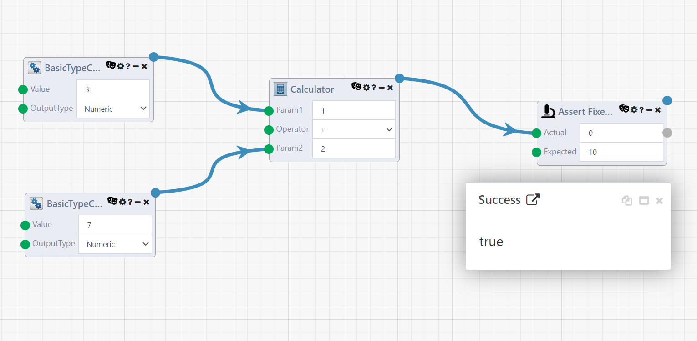

We can see in this example test that we have a Calculator Module which takes two inputs (7 and 3). We then are piping the output of this Calculator Module into an Assert Fixed Point Module and setting the expected value to be 10. Running this DataFlow and selecting the top output of the Assert Modules will show that the assert passed successfully. We will now look at a case where the assert is expected to fail.

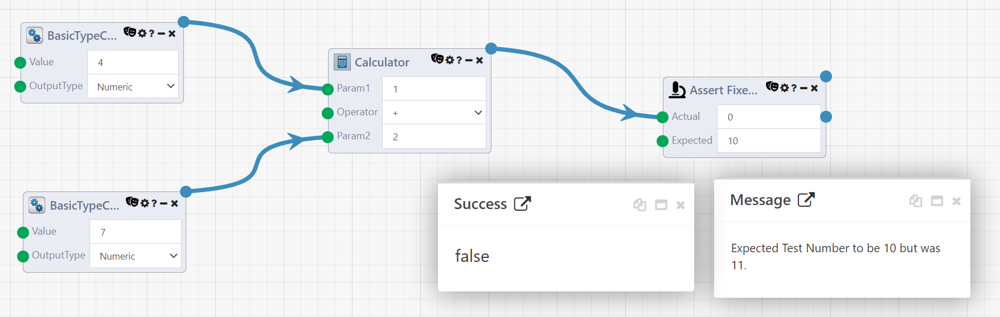

In this sample failing test, we have changed the input of the Calculator Module to 7 and 4, but left the expected value as 10. Running this Dataflow and selecting the output we can see that the assert is now no longer successful and we get a message about why the failure occured. In this case it was becuase the expected number was supposed to be 10, but we actually recieved 11.

# Viewing Your Tests

Composable offers a user interface that can be used to view the results of your tests. This UI can be accessed by (add access instructions). A sample of this UI, including the test we wrote above, can be seen below.

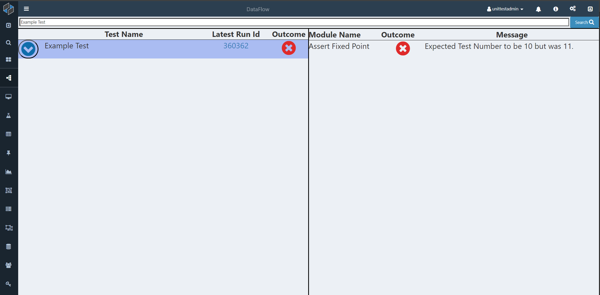

When you first open the testing UI, you will see all of your tests listed on the left. This list is comprised of the outermost parent of all DataFlows which have an Assert Module. We can filter this list based on the name of the test using the search feature at the top. Here we have applied a filter to just show "Example Test." 

The list of DataFlows on the left displays several pieces of information. These include the name of the test, the run id which is being display (which, when selected, will open that run), and the outcome of the test. This icon will display a green check mark when the test passes, a red X when the test fails (as seen here), or a blue exclamation point which indicates that the test has not been run yet. Using the blue arrow on the left of each row you are also able to inspect nested DataFlows. We will discuss this feature more later.

Using this list, you can select an individual test and explore the outcome of each Assert Module. For Modules that failed, you are able to see the message as seen here with the Assert Fixed Point failure. For Modules that succeed you will see a green check mark, similar to what is shown for a successful test in the left menu.

# Data Driven Tests

Given that Composable is largly a data driven platform, it is important to highlight how this testing framework supports testing a dataflow over a large amount of data. To show this, we will go through an example where we test a calculator. To start, we will create the DataFlow below.

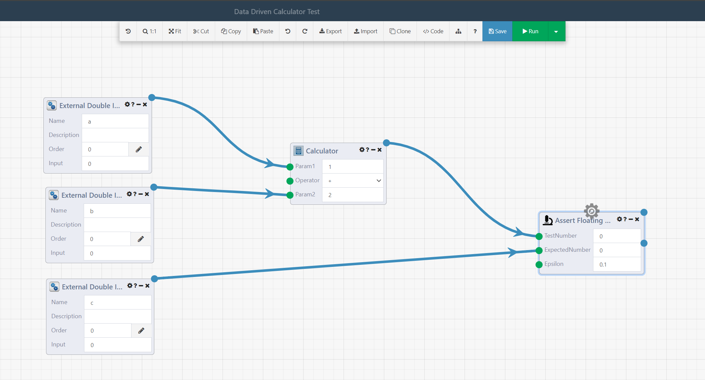

This DataFlow is our unit test for the calculator. It takes three inputs. A and B are the inputs to the calculator and C is the expected result. We now create a wrapper for this DataFlow which will drive what data we want to feed into our calculator test.

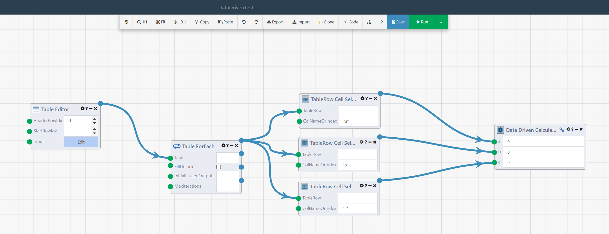

In this DataFlow, we take input from a Table Editor Module, loop through it, and the pass it into our calculator test. While this example just uses a Table Editor Module, you could imagine taking a table from another source such as a SQL Query Module and checking its results. We will now shift back to the interface for viewing tests to show how the data driven tests are displayed there.

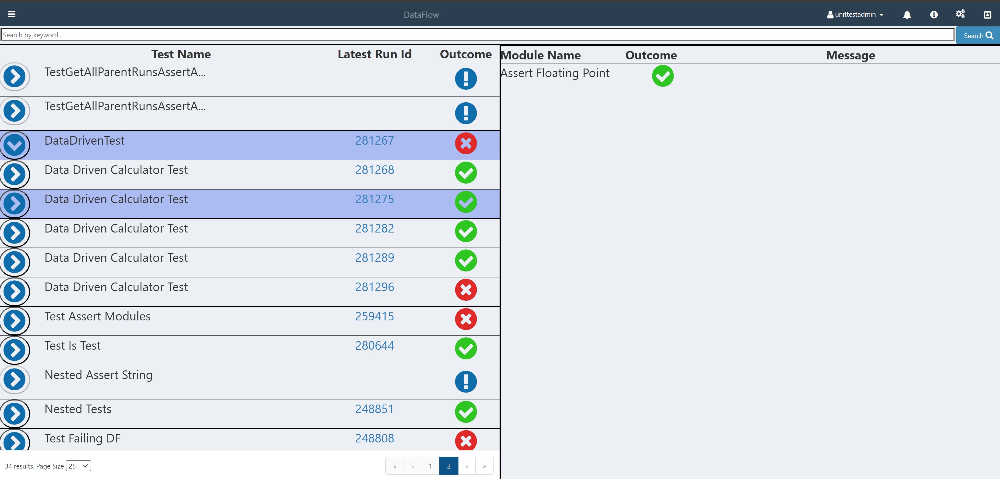

Here we can see that our data driven test has been run and has failed. We can use the arrow next to this test to expand this test and see the nested DataFlows which were involved in the run. We can see specifically that one instance of the test failed and the rest passed. You are able to select the row of this Run just as you would any other test, and also select the Run Id to view the Run.

# Surrogates

The Composable testing framework offers a mechanism for mocking Modules via substituting in surrogates. This can be useful in many circumstances. Some examples of use cases include simulating consuming a Kafka message and simulating a DataPortal Sync. These surrogates will execute when the DataFlow is executed in test mode. This can be enabled using the Mark Test Module or by selecting the run as test option as seen below. When using the Mark Test Module it is important to ensure that this Module runs before any surrogates (ideally it should be the first Module to run).

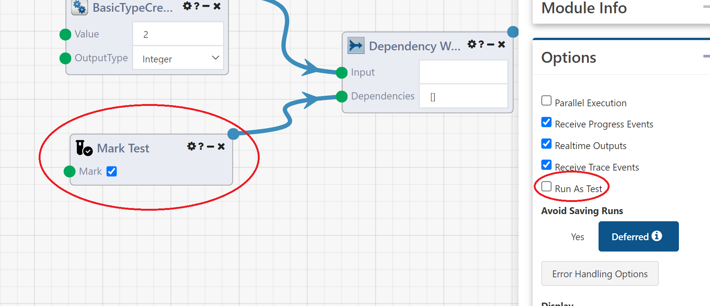

There are a few steps to create a surrogate. For this example, we will create a surrogate for the Calculator Module. The first thing we need to do is create a DataFlow which has the same inputs and outputs as a Calculator Module. An example of what this would look like can be seen below. It is important to note that the names of the inputs, as well as the types, must match those of the Module you are creating a surrogate for. You can also right click on the Module you want to create a surrogate for and selected "Create Surrogate Template" to automatically create the surrogate DataFlow with the correct inputs and outputs.

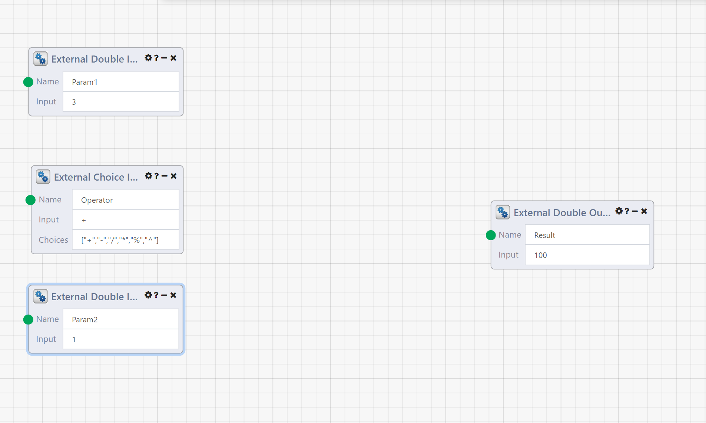

We will now create an example that will use this surrogate. We start by assigning a surrogate to this Module. This is done by selecting the settings gear on the Module and then the Module surrogates button.

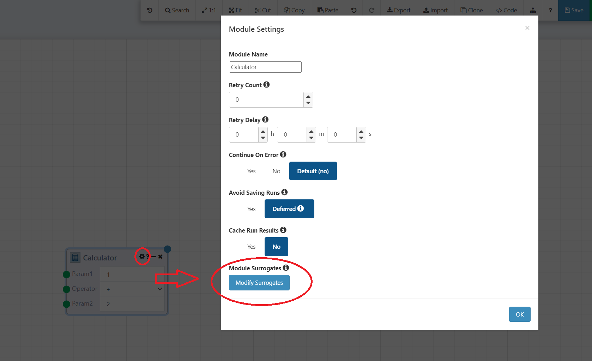

This will open a menu which allows you to assign a surrogate for the Module. This menu has two modes. The mode that opens by default allows you to assign a surrogate that will run every time the module runs in test mode. By pressing "Toggle Advanced Mode" in the lower right hand corner of the menu, you will open advanced mode. This allows you to assign multiple surrogates that will run depending on the chain of DataFlows that run. The surrogate that is run is determined by looking up that chain of nested DataFlows and selecting the last DataFlow which appears in the Parant DataFlow list. For this example we will just use basic mode to assign a surrogate that will make the calulator always output 100 when it is run in test mode.

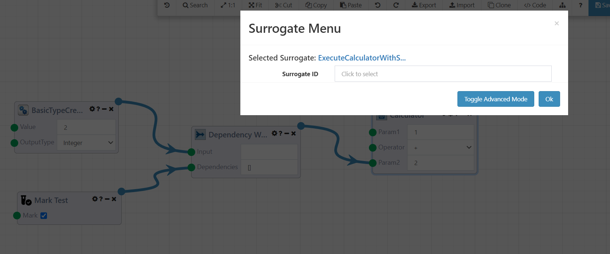

We can now run this DataFlow and see that the output of the calulator is 100 instead of 3.

We also can see that there is now an icon on the calculator module indicating that a surrogate has run in its place.

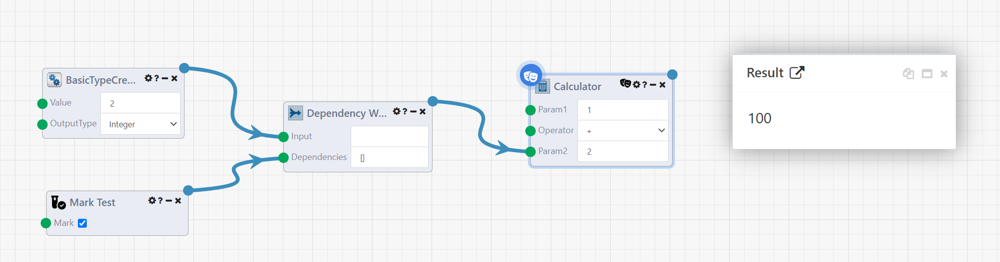

