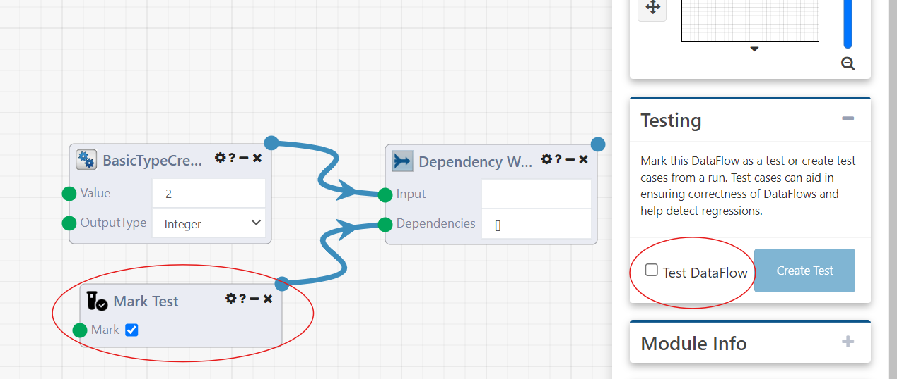

# DataFlow Testing

Composable offers a range of tools to create unit tests for DataFlows. These tools include a set of Modules tailored to setting up expectations, a system for mocking some Modules and substituting in surrogates, and a UI for viewing individual tests and their results.

# Assert Modules

We will begin by looking at the Assert Modules, used for setting up expectations for our tests. We offer a range of Assert Modules including:

- Assert Boolean
    - Expects that two booleans match
- Assert Fail
    - Causes the test to fail with a message
- Assert Fixed Point
    - Asserts that two fixed point numbers are equal
- Assert Floating Point
    - Asserts that two floating point numbers are equal within some range epsilon
- Assert Not Null
    - Asserts that an input is not null
- Assert Null
    - Asserts that an input is null
- Assert String
    - Asserts that two strings are equal subject to some string comparison condition
- Assert Table
    - Asserts that two Composable table are equal
- Assert Valid File Format
    - Asserts that a string is a valid file (Json and XML are currently supported)

We will construct our example test below:

In this test we create a calculator that will sum two numbers and setup an expectation for the output of the calculator.

We can see in this example test that we have a Calculator Module which takes two inputs (7 and 3). We then are piping the output of this Calculator Module into an Assert Fixed Point Module and setting the expected value to be 10. Running this DataFlow and selecting the top output of the Assert Modules will show that the assert passed successfully. We will now look at a case where the assert is expected to fail.

In this sample failing test, we have changed the input of the Calculator Module to 7 and 4, but left the expected value as 10. Running this Dataflow and selecting the output we can see that the assert is now no longer successful and we get a message about why the failure occured. In this case it was becuase the expected number was supposed to be 10, but we actually recieved 11.

# Test Suites

In Composable, Test Suites provide a structured way to manage and execute a series of tests. Test Suites allow you to run tests in both series an parallel. When you first open a Test Suite you will see the view below. This view gives you an overview of the current state of all of your tests, and allows you to see the individual tests which are included in the Test Suite.

To add tests to your Test Suite, select the "Add Tests" tab. Here you can use the existing search syntax in Composable. You can then select the "+" next to the tests you want to add. If you do not see your test in the list, or need to load more tests, select the "Load More" button.

To run your Test Suite, select the "Run" button in the upper right corner. This will begin the execution of all of your included tests with a degree of parallelism up the the number specified inb the "Test Suite Run Settings" tab. After your batch of tests has been setup, you will be switched to a view which will show you the current state. As your tests run, you will see the results appear live in the menu on the left.

# Surrogates

The Composable testing framework offers a mechanism for mocking Modules via substituting in surrogates. This can be useful in many circumstances. Some examples of use cases include simulating consuming a Kafka message and simulating a DataPortal Sync. These surrogates will execute when the DataFlow is executed in test mode. This can be enabled using the Mark Test Module or by selecting the run as test option as seen below. When using the Mark Test Module it is important to ensure that this Module runs before any surrogates (ideally it should be the first Module to run).

There are a few steps to create a surrogate. For this example, we will create a surrogate for the Calculator Module. The first thing we need to do is create a DataFlow which has the same inputs and outputs as a Calculator Module. An example of what this would look like can be seen below. It is important to note that the names of the inputs, as well as the types, must match those of the Module you are creating a surrogate for. You can also right click on the Module you want to create a surrogate for and selected "Create Surrogate Template" to automatically create the surrogate DataFlow with the correct inputs and outputs.

We will now create an example that will use this surrogate. We start by assigning a surrogate to this Module. This is done by selecting the settings gear on the Module and then the Module surrogates button.

This will open a menu which allows you to assign a surrogate for the Module. This menu has two modes. The mode that opens by default allows you to assign a surrogate that will run every time the module runs in test mode. By pressing "Toggle Advanced Mode" in the lower right hand corner of the menu, you will open advanced mode. This allows you to assign multiple surrogates that will run depending on the chain of DataFlows that run. The surrogate that is run is determined by looking up that chain of nested DataFlows and selecting the last DataFlow which appears in the Parant DataFlow list. For this example we will just use basic mode to assign a surrogate that will make the calulator always output 100 when it is run in test mode.

We can now run this DataFlow and see that the output of the calulator is 100 instead of 3.

We also can see that there is now an icon on the calculator module indicating that a surrogate has run in its place.

