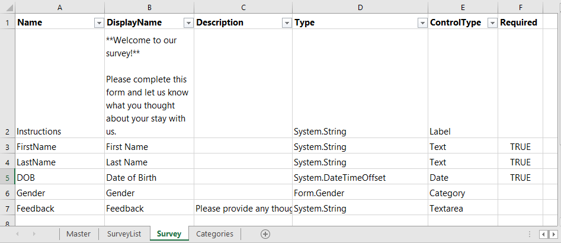

# DataPortal Basics

## Creating a DataPortal

Create a new DataPortal by choosing the icon in the side navigation bar.

You will be presented with an overview page. We urge you to read through the description shown, and also download the sample Excel template files that are available (on the right hand side of the screen).

## DataPortal Configuration

Begin with one of the Excel templates provided, then modify it to reflect the data model you are creating.

#### Sheet Types

Your Excel file can include sheets of a few different types:

- [**Master (required)**](./03.MasterSheet.md): This is the first sheet that is processed by Composable and acts as a link to all other container sheets that will ultimately be shown to the end user. Sheet name: `"Master"`. The [Name](06.Setting-Details/Name.md) field given as a value here will serve as the root database name.

- [**Container**](./04.ContainerSheet.md): These specify what input fields are listed out in each web page the user sees, as well as any controlling logic of how they are saved ([Type](./06.Setting-Details/Type.md)) and displayed ([ControlType](./06.Setting-Details/ControlType.md)).  Think of these sheets as tables in your data model, with each input field name representing a column in a SQL table. Most of your DataPortal sheets will be containers. Sheet name: anything not already used for another purpose (not Master/ReadMe/CSS).

- [**Category**](05.Categories.md): These specify a single picklist for the end user, such as Gender or the State you live in. They can either be an individual sheet or have multiple in the `Categories` sheet. In this sheet, each column represents its own category to simplify the Excel structure if you have a lot of categories in your data model. Sheet name: Either `Categories` or anything not already used for another purpose. 

- [**Settings**](./06.SettingSheet.md): These allow for customization of some DataPortal actions. Named like `<ContainerName>.settings`

- **ReadMe**: This sheet is not processed or displayed to the end user of forms, it is a place to store notes and comments on the model. Sheet name: `ReadMe`.

- **CSS**:  An optional sheet for the user to enter custom CSS rules to style the forms page with any colors, margins or other custom style behavior. Sheet name: `CSS`.

  

### Container Sheet Basics

Each sheet in the Excel workbook represents a container which is a similar object to a table. Column headings in a sheet define the control setting, with rows representing values. The following column headers are typically found on each of the Excel sheets:

- [Name (required):](06.Setting-Details/Name.md) A whitespace-free name for the field. Think of this as the name you would give this field in a database.
- [DisplayName:](06.Setting-Details/DisplayName.md) A human-friendly label that will be displayed above the input box for the field on the user interface. This can contain rich text written in [Markdown.](https://daringfireball.net/projects/markdown/)
- [Description:](06.Setting-Details/Description.md) A longer description that can be displayed in a tooltip on the user interface to more fully explain the field.
- [Type (required):](06.Setting-Details/Type.md) The name of the data type of the given field, such as integer or string, that the data will be stored as in the database.
- [ControlType (required):](06.Setting-Details/ControlType.md) The type of field interface that the user will input their data into, also known as a [form control](https://www.w3.org/TR/2002/WD-xforms-20020118/slice8.html). Examples are a textbox ([Text](./05.Control-Details/Text.md)) or calendar date selection ([Date](./05.Control-Details/Date.md)), or a [checkbox](./05.Control-Details/CheckBox.md).
- [Required:](06.Setting-Details/Required.md) Indicates whether the field is required.
- For each ControlType, other columns can be added which specify settings. These are in "5.6 Container Fields", which provide additional features or restrictions on a field.

## DataPortal Syntax

When referncing another container/sheet, the syntax is `Form.<SheetName>`.

When selecting multiple values, such as the [Columns](./06.Setting-Details/Columns.md) in a [Table](05.Control-Details/Table.md), put square brackets around the column names to select multple values. `[Form.<ContainerName>.<Column1>, Form.<ContainerName>.<Column2>, Form.<ContainerName>.<Column3>]`.

## Building a DataPortal 

To build the DataPortal, simply save the Excel template, and drag and drop it into Composable. Done.
