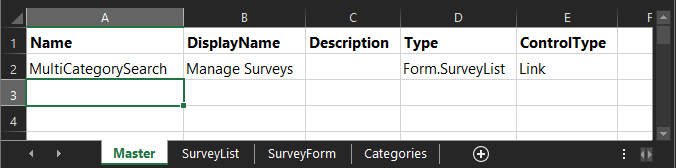

# DataPortal Master Sheet

This is the first sheet that is processed by Composable and acts as a link to all other container sheets that will ultimately be shown to the end user. This is a required sheet in the workbook and must be named `Master`. The master sheet will only have 2 rows; the header, and a row that describes the database. It is a sepcial case of a [Container Sheet](./04.ContainerSheet.md).

- [Name](06.Setting-Details/Name.md) will serve as the root database name.  
- ControlType will be [`Link`](./05.Control-Details/Link.md) 
- Type will be `Form.<SheetName>` to another sheet in the file. That sheet will be the one that defines what the user sees when first viewing a dataportal. 
  - The connected sheet should probably have some `Table` ControlTypes, as the main inputs for data into tables in your data model.

