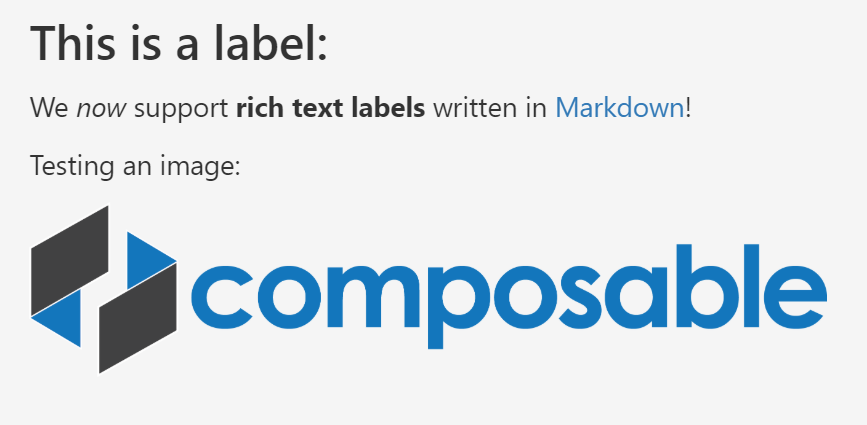

# Label

## Overview

The **Label** control type puts static text on the page. This text can optionally be written in [Markdown](https://daringfireball.net/projects/markdown/), including linked images.

Simple Label                            | Markdown Label
:---------------------------------------:|:------------------------:
 | 

## Required Fields

- [**Name**](../06.Setting-Details/Name.md): The name of the field.

- [**DisplayName**](../06.Setting-Details/DisplayName.md): The text that will be displayed for the label.

- [**Type**](../06.Setting-Details/Type.md): Must be set to `System.String`.

- [**ControlType**](../06.Setting-Details/ControlType.md): Must be set to `Label`.

## Optional Fields

- [**Group**](../06.Setting-Details/Group.md): The layout group position for this control.

- [**MaskedCondition**](../06.Setting-Details/MaskedCondition.md)

- [**VisibilityCondition**](../06.Setting-Details/VisibilityCondition.md)
