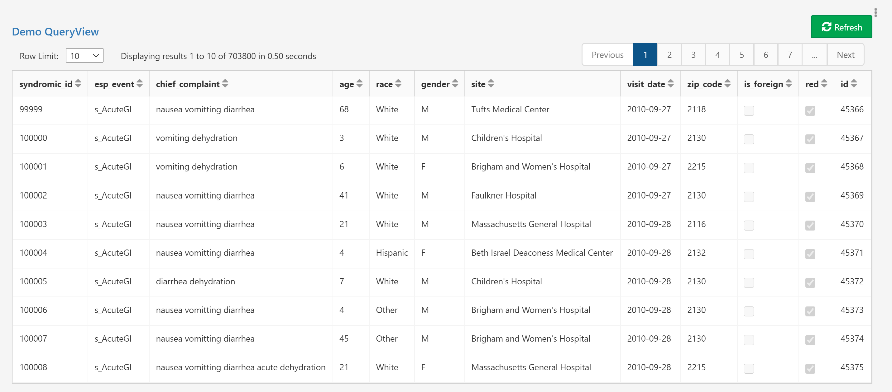

# QueryView

## Overview

The **QueryView** control type displays the results of a Composable [QueryView](../../QueryViews/01.Overview.md) as a table.

## Excel Sheet Input

## Required Fields

- [**Name**](../06.Setting-Details/Name.md): The name of the field saved to the database.

- [**Type**](../06.Setting-Details/Type.md): Must be set to `System.Int32`.

- [**ControlType**](../06.Setting-Details/ControlType.md): Must be set to `QueryView`.

- [**DefaultValue**](../06.Setting-Details/DefaultValue.md): Must be the `Id` of the QueryView to run.

## Optional Fields

- [**Description**](../06.Setting-Details/Description.md): Optional further details about the field.

- [**DisplayName**](../06.Setting-Details/DisplayName.md): The name that will be shown for the field above the input box. This can be any string. If no **DisplayName** is provided, **Name** will be shown.

- [**Group**](../06.Setting-Details/Group.md): The layout group position for this control.

- [**MaskedCondition**](../06.Setting-Details/MaskedCondition.md)

- [**TabIndex**](../06.Setting-Details/TabIndex.md)

- [**VisibilityCondition**](../06.Setting-Details/VisibilityCondition.md)
