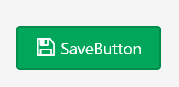

# SaveButton

## Overview

The **SaveButton** control type creates a button that can be used to save all the results on the page.

## Required Fields

- [**Name**](../06.Setting-Details/Name.md): The name of the field saved to the database.

- [**Type**](../06.Setting-Details/Type.md): Must be set to `System.String`.

- [**ControlType**](../06.Setting-Details/ControlType.md): Must be set to `SaveButton`.

## Optional Fields

- [**AfterSaveUri**](../06.Setting-Details/AfterSaveUri.md)

- [**DisplayName**](../06.Setting-Details/DisplayName.md): The name that will be shown for the field above the input box. This can be any string. If no **DisplayName** is provided, **Name** will be shown.

- [**Group**](../06.Setting-Details/Group.md): The layout group position for this control.

- [**MaskedCondition**](../06.Setting-Details/MaskedCondition.md)

- [**ReadOnlyCondition**](../06.Setting-Details/ReadOnlyCondition.md)

- [**TabIndex**](../06.Setting-Details/TabIndex.md)

- [**VisibilityCondition**](../06.Setting-Details/VisibilityCondition.md)