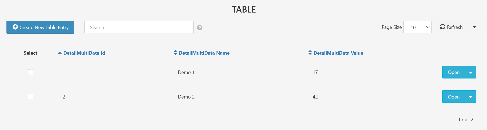

# Table

## Overview

The **Table** control type displays a collection of instances of a linked child container.

See [Search Features](../03.Search-Features.md) for more discussion of the special capabilities of tables.

## Required Fields

- [**Name**](../06.Setting-Details/Name.md): The name of the field saved to the database.

- [**Type**](../06.Setting-Details/Type.md): Must be set to `[Form.<ContainerName>]` where `<ContainerName>` is the name of the Excel sheet representing the linked container. It must be enclosed in `[]` brackets

- [**ControlType**](../06.Setting-Details/ControlType.md): Must be set to `Table`.

## Optional Fields

- [**Columns**](../06.Setting-Details/Columns.md) Columns are selected with the syntax `[Form.<ContainerName>.<Name1>, Form.<ContainerName>.<Name2>, Form.<ContainerName>.<Name3>]` Note the square brackets to select multiple columns.

- [**DefaultSearchFilter**](../06.Setting-Details/DefaultSearchFilter.md)

- [**DeleteType**](../06.Setting-Details/DeleteType.md)

- [**Description**](../06.Setting-Details/Description.md): Optional further details about the field.

- [**DisplayName**](../06.Setting-Details/DisplayName.md): The name that will be shown for the field above the input box. This can be any string. If no **DisplayName** is provided, **Name** will be shown.

- [**Group**](../06.Setting-Details/Group.md): The layout group position for this control.

- [**MaskedCondition**](../06.Setting-Details/MaskedCondition.md)

- [**ReadOnlyCondition**](../06.Setting-Details/ReadOnlyCondition.md)

- [**SearchBoxes**](../06.Setting-Details/SearchBoxes.md)

- [**Style**](../06.Setting-Details/Style.md)

- [**TabIndex**](../06.Setting-Details/TabIndex.md)

- [**VisibilityCondition**](../06.Setting-Details/VisibilityCondition.md)