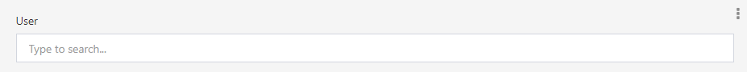
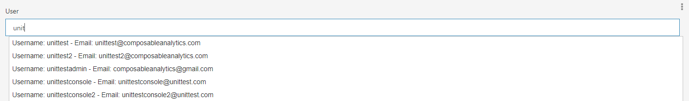

# User

## Overview

The Date control type allows you to select a user from a list of available users.

Menu Closed                      | Menu Open
:-------------------------------:|:------------------------:
 | 

## Required Fields

- [**Name**](../06.Setting-Details/Name.md): The name of the field.

- [**Type**](../06.Setting-Details/Type.md): Must be set to `System.Guid`.

- [**ControlType**](../06.Setting-Details/ControlType.md): Must be set to `User`.

## Optional Fields

- [**DisplayName**](../06.Setting-Details/DisplayName.md): The name that will be shown for the field above the input box. This can be any string. If no DisplayName is provided, Name will be shown.

- [**MaskedCondition**](../06.Setting-Details/MaskedCondition.md)

- [**Required**](../06.Setting-Details/Required.md)

- [**VisibilityCondition**](../06.Setting-Details/VisibilityCondition.md)

