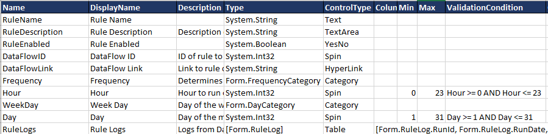

# ValidationCondition

The **ValidationCondition** column on a container field defines conditions for whether an entered value is valid or not. Invalid values cannot be saved to the database.

As shown in the above screenshot, ValidationConditions are simply standard C# equality operators with `AND`'s or `OR`'s. You may reference existing entries on the same page by their name, in this case, `Day` and `Hour`.

## Controls

The **ValidationCondition** column applies to the following controls:

- [Category](../05.Control-Details/Category.md)
- [CheckBox](../05.Control-Details/CheckBox.md)
- [Computed](../05.Control-Details/Computed.md)
- [Date](../05.Control-Details/Date.md)
- [DateTime](../05.Control-Details/DateTime.md)
- [NumberFormatting](../05.Control-Details/NumberFormatting.md)
- [Phone](../05.Control-Details/Phone.md)
- [Pill](../05.Control-Details/Pill.md)
- [Radio](../05.Control-Details/Radio.md)
- [Rating](../05.Control-Details/Rating.md)
- [Reference](../05.Control-Details/Reference.md)
- [Spin](../05.Control-Details/Spin.md)
- [SSN](../05.Control-Details/SSN.md)
- [Text](../05.Control-Details/Text.md)
- [Textarea](../05.Control-Details/Textarea.md)
- [Voice](../05.Control-Details/Voice.md)
- [YesNo](../05.Control-Details/YesNo.md)
- [ZIP](../05.Control-Details/ZIP.md)

