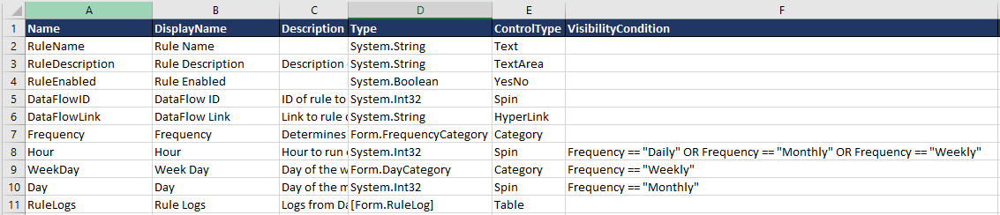

# VisibilityCondition

The **VisibilityCondition** column on a container field checks the value of another input field on the page to see if this field is displayed to the user. Supports Boolean logic `AND`'s (&&), `OR`'s (||) and parenthesis. Uses standard C# equality and relational operators (==, !=, <, >, <=, >=). If the check returns false, the input is not displayed to the user.



Identical to [MaskedCondition](MaskedCondition.md), but instead of shows white space where the input field would be, does not display the item at all or preserve space for it.

## Controls

The **VisibilityCondition** column applies to the following controls:

- [AppRun](../05.Control-Details/AppRun.md)
- [Category](../05.Control-Details/Category.md)
- [ClearButton](../05.Control-Details/ClearButton.md)
- [CheckBox](../05.Control-Details/CheckBox.md)
- [Computed](../05.Control-Details/Computed.md)
- [Date](../05.Control-Details/Date.md)
- [DateTime](../05.Control-Details/DateTime.md)
- [HyperLink](../05.Control-Details/HyperLink.md)
- [Label](../05.Control-Details/Label.md)
- [NumberFormatting](../05.Control-Details/NumberFormatting.md)
- [Page](../05.Control-Details/Page.md)
- [Phone](../05.Control-Details/Phone.md)
- [Pill](../05.Control-Details/Pill.md)
- [QueryView](../05.Control-Details/QueryView.md)
- [QueryViewChooser](../05.Control-Details/QueryViewChooser.md)
- [Radio](../05.Control-Details/Radio.md)
- [Rating](../05.Control-Details/Rating.md)
- [Reference](../05.Control-Details/Reference.md)
- [SaveButton](../05.Control-Details/SaveButton.md)
- [Spin](../05.Control-Details/Spin.md)
- [SSN](../05.Control-Details/SSN.md)
- [Tab](../05.Control-Details/Tab.md)
- [Table](../05.Control-Details/Table.md)
- [Text](../05.Control-Details/Text.md)
- [Textarea](../05.Control-Details/Textarea.md)
- [Voice](../05.Control-Details/Voice.md)
- [YesNo](../05.Control-Details/YesNo.md)
- [ZIP](../05.Control-Details/ZIP.md)


Below is the grammar for visisbility conditions in the Backus Naur Form, and is also applicable for other conditional clauses (ReadOnlyCondition, CategoryCondition, ComputedCondition, MaskedCondition).   This describes the possible tokens, and how they can be combined.
```

/* lexical grammar */
%lex
%%

\s+                   /* skip whitespace */
"=="                  return '=='
"!="                  return '!='
">="                  return '>='
"<="                  return '<='
">"                   return '>'
"<"                   return '<'
"IN"                  return 'IN'
"("                   return '('
")"                   return ')'
"AND"                 return 'AND'
"and"                 return 'AND'
"OR"                  return 'OR'
"or"                  return 'OR'
"not"                 return 'NOT';
"NOT"                 return 'NOT';
"null"                return 'NULL';
"NULL"                return 'NULL';
"true"                return 'TRUE';
"True"                return 'TRUE';
"TRUE"                return 'TRUE';
"false"               return 'FALSE';  
"False"               return 'FALSE';  
"FALSE"               return 'FALSE';  
[0-9]+("."[0-9]+)?\b  return 'NUMBER';
\"([^\\\"]|\\.)*\"    return 'STRING';
[aA-zZ]+([aA-zZ0-9]+)?   return 'VARIABLENAME';
<<EOF>>               return 'EOF';
.                     return 'FAIL';

/lex

/* condition associations and precedence */

%left 'NOT'

%left 'OR'

%left 'AND'

%start statement

%% /* language grammar */

statement
    : conditions EOF
        {return $1;}
    ;

expression
    : boolean { $$ = ($1); }
    | NULL { $$ = null; }
    | NUMBER { $$ = Number($1); }
    | STRING { $$ = ($1).substring(1, ($1).length-1); }
    | variable
    ;

boolean 
   : TRUE { $$ = true;}
   | FALSE { $$ = false; }
   ;

variable
    : VARIABLENAME {
	   var getVariableValue;
	   try {
		  getVariableValue = ConditionGrammar.getVariableValue;
	   }
	   catch(err) {
	      console.warn("ConditionGrammar.getVariableValue hook has not been sent. Returning variable name instead.");
	   }
	   if(getVariableValue) {
	      $$  = getVariableValue($1); 
	   } else {
		  $$ = $1; 
	   }
	}
    ;

condition
    : expression '==' expression
        {$$ = $1 == $3;}
    | expression '!=' expression
        {$$ = $1 != $3;}
    | expression '>' expression
        {$$ = $1 > $3;}
    | expression '<' expression
        {$$ = $1 < $3;}
    | expression '>=' expression
        {$$ = $1 >= $3;}
    | expression '<=' expression
        {$$ = $1 <= $3;}
    | expression IN variable 
        {	
			if($1 == $3) {
			  $$ = true;
			} else {	
				$$ = false
				if($3 && $3.Entries) {
					for(var idx = 0; idx < $3.Entries.length; idx++) {
						var category = $3.Entries[idx];
						if($1 == category.Value) {
							$$ = true;
						}
					}
				}
			}
		}
    | expression
        {
          if($1 == true) {
            $$ = true;
          } else if($1 == false) {
            $$ = false;
          } else {
            $$ = (($1) != undefined && ($1) != null);
          }
       }
    ;

conditions
    :  conditions 'AND' conditions
        {$$ = $1 && $3;}
    |  conditions 'OR' conditions
        {$$ = $1 || $3;}    
    | NOT conditions
        {$$ = !($2);}
    | '(' conditions ')'
        {$$ = ($2);}
    | condition
        {$$ = ($1);}
    ;
```
