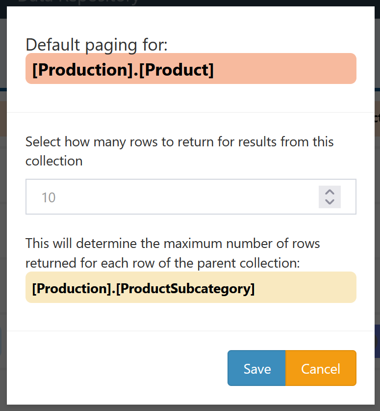
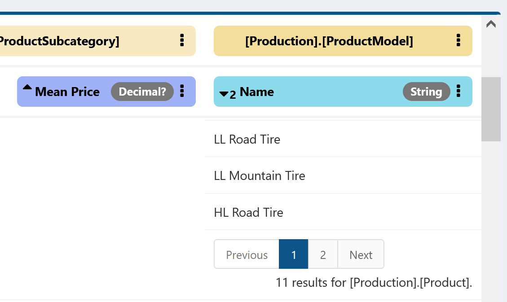
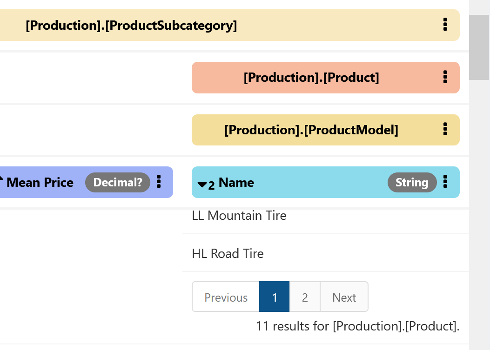

# Default Paging

Edit the paging behavior for rows of this collection.

View and edit the maximum number of rows to return in a single page of results for this collection. The placeholder value is the page size for the whole query, which can be overridden here for this collection. See [paging](../DataQuery-Details.md#paging) for more discussion of paging.

Note that in some circumstances the collection that determines the visible paging will not be the collection the visible field belongs to directly, if the collection introducing the multple rows does not show any fields in the query. For example, consider these query results on `[Production].[ProductModel].Name`:

For each row of `[Production].[ProductSubcategory]` there are many rows of `[Production].[ProductModel]`, but the paging controls shown above are actually on the intermediate table `[Production].[Product]`. To modify the paging behavior for a given control, always look for the collection identified by the total count for those paging controls (in this case `11 results for [Production].[Product]`). The underlying behavior becomes more clear when using the expanded header mode:

