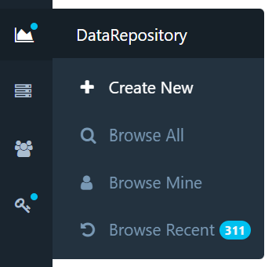
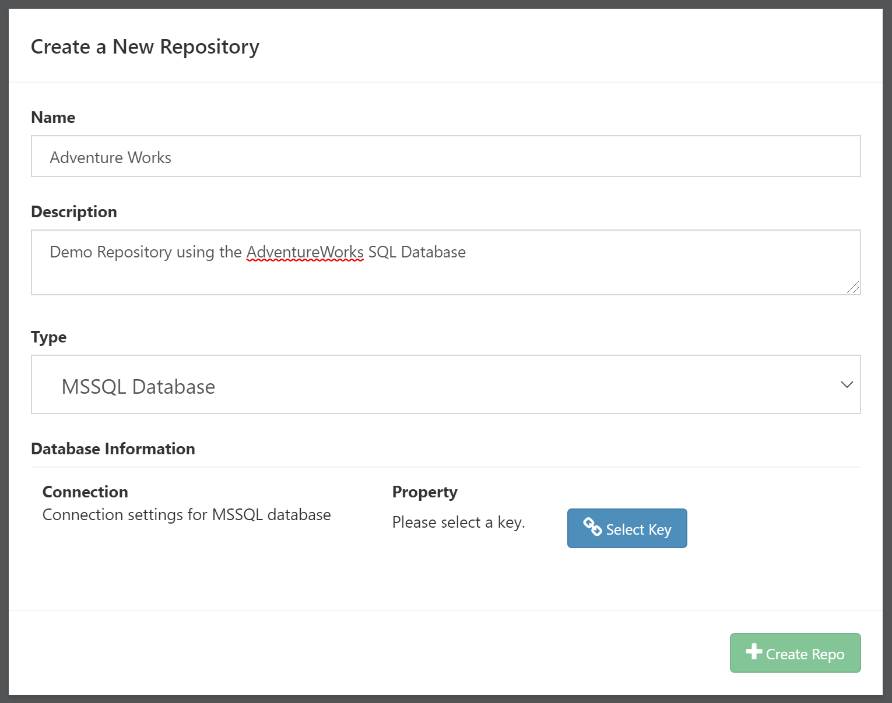
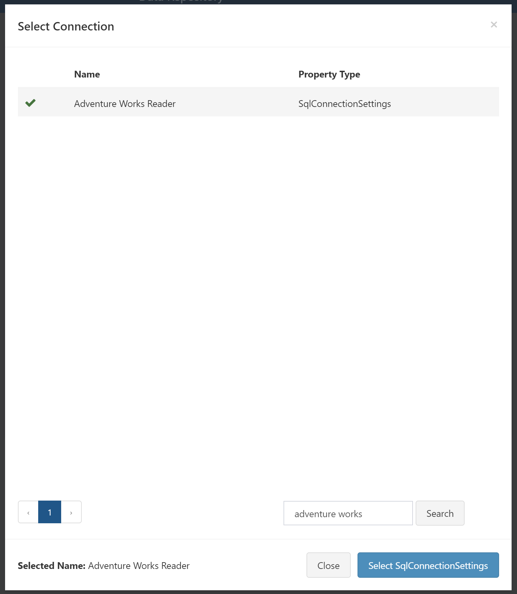

# DataRepository Basics

## Creating a DataRepository

Create a new DataRepository by choosing the icon in the side navigation bar.

You will be presented with a simple configuration screen for your repository.

Simply enter a name and description for the repository, then select which type of repository you'd like to create. The currently supported types are:

- MSSQL Database
    - Uses a [Composable Key](../Keys/01.Overview.md) to connect to any MSSQL database
- Composable DataPortal
    - Connect to a [Composable DataPortal](../DataPortals/01.Overview.md) backed by a MSSQL database

Once you have selected your type, use the appropriate button to select the data source. In the MSSQL Database example above, clicking `Select Key` will bring up a searchable list of `SqlConnectionSettings` keys you have access to. 

Once everything is configured, click `Create Repo` and Composable will generate your new DataRepository.
