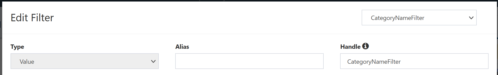

# Edit Filter

View and modify any filters applied to the selected field. If there are multiple filters applied to the field, switch between them via the dropdown menu in the top right corner. Filters will be identified by `Alias` if set, or `Handle` if no `Alias`. If neither is set, an internal identifier will be shown.

See [Filtering](../QueryDive-Details.md#filtering) for more details on filters.