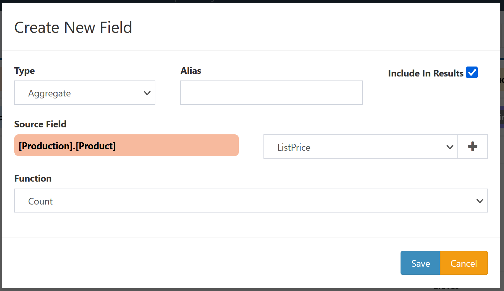
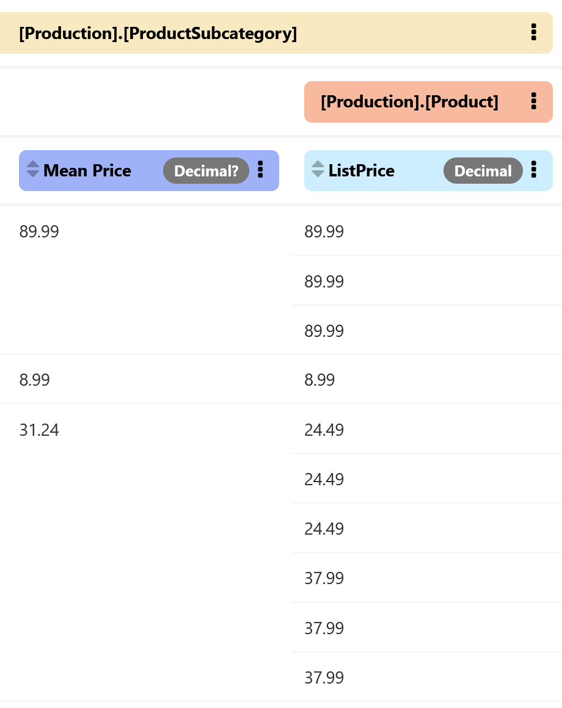

# Aggregate Fields

Aggregate fields are computed from a set of rows of another field, providing summary information about that field.

## Creation

Aggregate fields can be added in several ways:

- Clicking the `Field` button in the `Add` section in the Query sidebar,
- Selecting the [Add field](../Collection-Menu-Options/Add-Field.md) option from a collection menu,
- Selecting the [Aggregate](../Field-Menu-Options/Aggregate.md) option from a field menu,
- Clicking the `+` button next to the dropdown menu allowing selection of an existing field when creating or editing some other DeepQuery object.

Most of these options will bring up a window for creating a new field of any type. To create an aggregate field, select `Aggregate` from the `Type` dropdown.

This brings up the configuration options for an aggregate field:

- **Alias**: Display name for the field. (optional)
- **Include In Results**: Whether to display the field in query results. Aggregate fields default to being shown.
- **Source Field**: Which existing field to aggregate into the new field. The collection part of this option will be pre-selected and uneditable if the field creation was triggered from a collection or field.
- **Function**: What operation should be performed on the **Source Field** to compute the aggregate field. See [below](#aggregate-functions) for details.

Click `Save` to create the new field and add it to the DeepQuery. Click `Cancel` to close the window without creating the field.

## Aggregate Functions

The following aggregation functions are supported.

|Function|Description                           |
|--------|--------------------------------------|
|Max     |Maximum value in the aggregated field |
|Min     |Minimum value in the aggregated field |
|Mean    |Mean value in the aggregated field    |
|Sum     |Sum of all values in the aggregated field|
|Count   |Count of non-`NULL` values in the aggregated field|
|Count Distinct|Count of unique non-`NULL` values in the aggregated field|
|Standard Deviation|Standard deviation of values in the aggregated field, treating the data as a sample of a larger population|
|Variance|Variance of values in the aggregated field, treating the data as a sample of a larger population|
|Population Variance|Standard deviation of values in the aggregated field, treating the data as the entire population of interest|
|Population Standard Deviation|Variance of values in the aggregated field, treating the data as the entire population of interest|

## Grouping

The behavior of aggregate fields is determined by the grouping conditions on the collection containing the source field and whether the source field is on the root collection or a nested collection. The basic behavior is summarized in this table.

<table>
    <tr>
        <th></th>
        <th>Root Collection</th>
        <th>Nested Collection</th>
    </tr>
    <tr>
        <th>No Grouping</th>
        <td>Aggregates Only</td>
        <td>Aggregates Promoted</td>
    </tr>
    <tr>
        <th>Grouping</th>
        <td>Aggregates Same Level</td>
        <td>Aggregates Same Level</td>
    </tr>
</table>

### Nested Collection, No Grouping

This is the most common type of aggregate field, in which data from a joined collection is aggregated up to a higher level of the query. For example, consider the following snippet of DeepQuery results from the [AdventureWorks](https://docs.microsoft.com/en-us/sql/samples/adventureworks-install-configure) database:

The `Mean Price` column of these results is an aggregate field with `ListPrice` as its **Source Field**, and the collection `[Production].[Product]` is not grouped by any fields. Thus the aggregate field appears on the parent collection `[Production].[ProductSubcategory]`, showing the mean price for every product in each product subcategory. We have also included the `ListPrice` to show each of the values included in the aggregate calculation for each row.

### Root Collection, No Grouping

If the DeepQuery contains any aggregate field with a source field on the root collection and does not have any grouping on the root collection, the only results that can be shown for that DeepQuery are aggregates of the root collection. Rather than showing a row for each row of the root collection, the results will include a single row for aggregates of the root collection.

### With Grouping

For any collection with grouping, whether that collection is the root or not, aggregate fields based on that collection will be displayed as rows of that collection. That is, the displayed results for the collection will include one row for every group in that collection, rather than one row for every row of the underlying collection. Thus the only fields that can be shown on that collection are either aggregate fields or the fields that are being grouped on. In the case of nested collections, the fields acting as join conditions can also be shown.

One exception to the above is if the **Source Field** is itself an aggregate field on a grouped collection. In that case, the aggregation function will be applied across the values for all groups. The result display behavior is similar to the case of ungrouped collections: if the fields are on a nested collection the aggregate of an aggregate will be promoted to the parent collection and if the fields are on the root collection the aggregate of an aggregate will be the only displayed row (in which case both the source aggregate field and its own source field must be hidden).