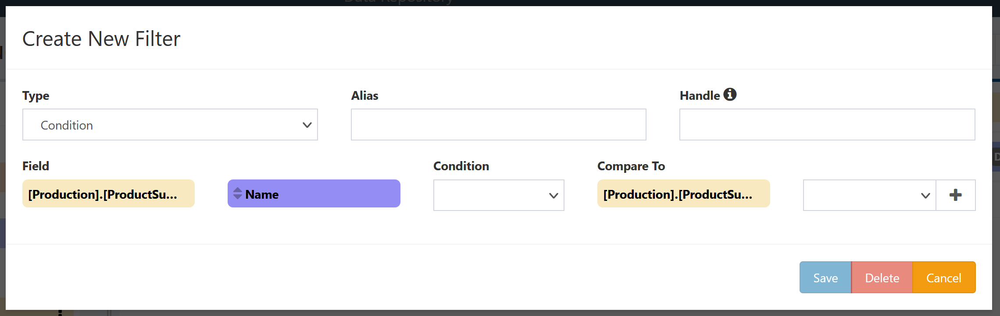

# Condition Filters

A Condition Filter limits the results that will be returned on a collection by comparing a field against another field on the same collection.

## Creation

Condition Filters can be added by selecting the [Add filter](../Field-Menu-Options/Add-Filter.md) option from a field menu. For most fields this will default to creating a [Value Filter](./Value.md); to create a condition filter select `Condition` from the **Type** dropdown.

These will bring up a window for creating a condition filter, with the following configuration options:

- **Type**: What type of filter to create; set to `Condition` for a Condition Filter.
- **Alias**: Display name for the filter. (optional, used when switching between multiple filters on a single field when editing)
- **Handle**: External handle to use in modifying or overriding this filter when running this DeepQuery in other contexts.
- **Field**: Which existing field this filter will act on. This is preset by the field selected to add a filter to.
- **Condition**: The operation to apply between **Field** and **Compare To**
- **Compare To**: Which existing field to compare to **Field**. This is hidden for some values of **Condition**.

Click `Save` to create the new filter and add it to the DeepQuery. Click `Cancel` to close the window without creating the filter.

## Conditions

The following conditions are supported.

|Condition          |Description        |Note |
|-------------------|-------------------|-----|
|=                  |**Field** is equal to **Compare To**|
|≠                  |**Field** is not equal to **Compare To**|
|>                  |**Field** is strictly greater than **Compare To**|
|≥                  |**Field** is greater than or equal to **Compare To**|
|<                  |**Field** is less than **Compare To**|
|≤                  |**Field** is less than or equal to **Compare To**|
|Like               |**Field** matches the string pattern **Compare To**|See [Sql Server LIKE](https://docs.microsoft.com/en-us/sql/t-sql/language-elements/like-transact-sql)|
|IsNull             |**Field** is `NULL`|**Compare To** option hidden|
|IsNotNull          |**Field** is not `NULL`|**Compare To** option hidden|