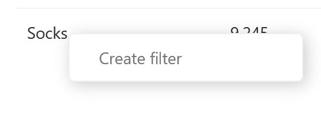
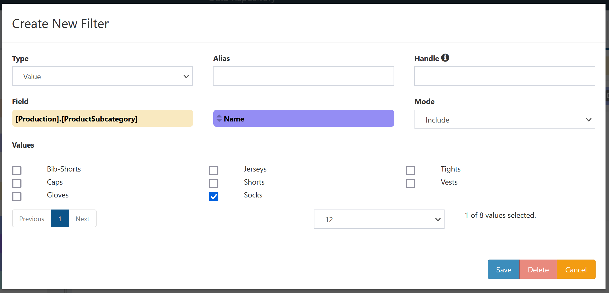

# Value Filters

A Value Filter limits the results that will be returned on a collection by comparing a field against a chosen set of values. These values may either define the rows of the collection that should be included or those that should be excluded.

## Creation

Value Filters can be added in two ways:

- Selecting the [Add filter](../Field-Menu-Options/Add-Filter.md) option from a field menu,
- Right-clicking an value in the grid of results and selecting `Create Filter` from the menu

These will bring up a window for creating a value filter, with the following configuration options:

- **Type**: What type of filter to create; set to `Value` for a Value Filter.
- **Alias**: Display name for the filter. (optional, used when switching between multiple filters on a single field when editing)
- **Handle**: External handle to use in modifying or overriding this filter when running this DeepQuery in other contexts.
- **Field**: Which existing field this filter will act on. This is preset by the field selected to add a filter to.
- **Mode**: Whether the selected **Values** should be those included in query results or those excluded from query results.
- **Values**: Selected values to include or exclude from the query results, depending on the **Mode**. These can be selected from any of the possible values of the **Field** given the current state of the query.

Click `Save` to create the new filter and add it to the DeepQuery. Click `Cancel` to close the window without creating the filter.