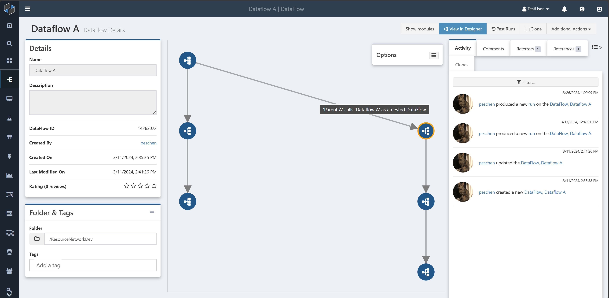
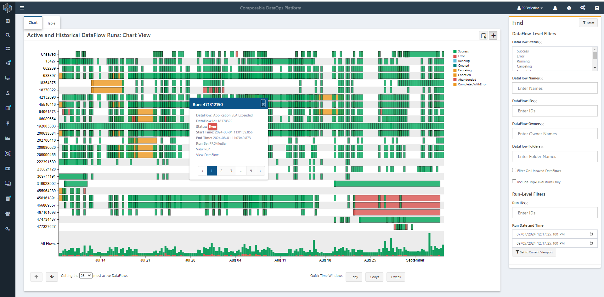

# Overview

The Composable DataOps Platform provides several tools for monitoring the configuration and performance of the platform and the solutions built upon it. 

## [Resource Networks](./02.Resource-Network.md)

As Composable solutions grow, they come to involve many different resources such as [DataFlows](../DataFlows/01.Overview.md), [Keys](../Keys/01.Overview.md), and [QueryViews](../QueryViews/01.Overview.md), which will often be used together and depend upon each other. These resources can also be organized into Folders.

Resource networks provide a way to visualize these relationships between resources and see an overview of a solution built on Composable. For example, a DataFlow that [calls and is called by several other DataFlows](../DataFlows/06.DataFlow-Reuse.md) will show possible calls between them.

## [Runs Visualization](./03.Runs-Visualization.md)

The Runs Visualization page provides an overview of recent runs of DataFlows across the system, showing frequency, duration, and status.

