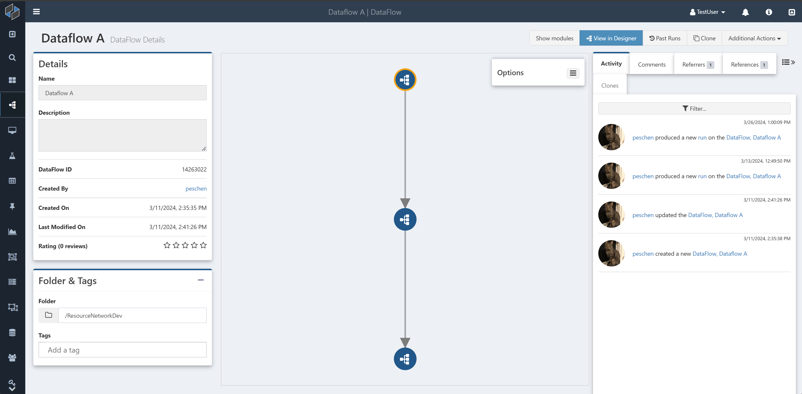

# Resource Network

Resource networks provide a visual overview of how a given Composable resource (e.g. a [DataFlow](../DataFlows/01.Overview.md), [QueryView](../QueryViews/01.Overview.md), or [Key](../Keys/01.Overview.md)) relates to other such resources.

## Basics

### Nodes

Each circle in a resource network represents a single Composable resource. The color and icon indicate what kind of resource it is.

Hovering over the resource will show its name. Double-click on a circle to open the page for the resource in a new tab.

### Edges

Each connection between circles represents a relationship between two resources. Hover over the edge for a description of the connection.

Edges are directed. The exact meaning of the edge direction depends on the type of relationship, but generally if the relationship between A and B can be described as "A uses B" or "A contains B", then the edge will point from A to B. For example, if DataFlow B can be called as a nested DataFlow during the execution of DataFlow A, there will be an edge from A to B.

Edges are weighted. If multiple iterations of the same relationship exist between two resources, the edge will be thicker. For example, if there are two different modules in DataFlow A that both call DataFlow B, the edge from A to B will have weight 2.

## Locations

Resource network views can be found on the following pages, with a default view showing the most relevant connections for that resource type

- DataFlow: see other DataFlows that reference or are referenced by the current DataFlow [as a nested DataFlow](../DataFlows/06.DataFlow-Reuse.md).
- DataFlow Run: see other DataFlow Runs involved in the execution of this run, including asynchronous activations.
- Folder: see all resources that are contained in this folder or any of its descendant folders, along with any other resources referenced by those resources.

## Customization

Anywhere a resource network is shown, options can be selected to change what relationships are shown and how they are visualized. Different resources will have different default options selected, representing the most useful data for that particular resource.

### Network Type

The network type setting determines how edges are traversed to build the graph. All networks start from a single base resource, which is highlighted by an orange border. The following examples all represent the same set of DataFlow references.

| Network&nbsp;Type | Description | Image |
| -------------| ------------|-------------|
| Downstream   | Edges are followed only in the forward direction. For nested DataFlows, this represents all DataFlows that may be called by the base DataFlow or any of the DataFlows it calls. |  |
| Upstream     | Edges are followed only in the reverse direction. For nested DataFlows, this represents all DataFlows that may call the base DataFlow or any DataFlows that may call them. |  |
| From Roots   | Edges are followed in the reverse direction from the base to identify a set of "root" resources, then a downstream network is generated from that set. For nested DataFlows, this represents all DataFlows that may call the base DataFlow and all other DataFlows that may be called by those DataFlows. |  |
| Full         | Edges are followed in both directions across the entire network. For nested DataFlows this represents any DataFlow that shares some connection with the base DataFlow via nested DataFlows, even if they could never be called in the same run of any particular DataFlow (e.g. if X calls B and Y and Z calls A and B, then Y would appear in the Full network for A). Note that Full networks use a different layout algorithm, so even if the set of nodes and edges is the same as From Roots, the results will be displayed differently. | 

### Resource Types

The resource type setting determines which resources are considered in generating the graph. If no resource types are selected then all available resource types will be included.

Available resource types:

- Alert
- Attribute
- [Board](../Boards/01.Overview.md)
- [DataCatalog](../DataCatalogs/Overview.md)
- [DataFlow](../DataFlows/01.Overview.md)
- [DataLab](../DataLabs/Overview.md)
- DataLab Cluster
- [DataPortal](../DataPortals/01.Overview.md)
- [DataRepository](../DataRepository/01.Overview.md)
- [DeepQuery](../DataRepository/DeepQuery-Overview.md)
- EntityHub
- Folder
- [Group](../Users-and-Groups/01.Overview.md#groups)
- [Key](../Keys/01.Overview.md)
- [QueryView](../QueryViews/01.Overview.md)
- [Run](../DataFlows/10.Runs.md) <small>Note that DataFlow runs are never intermingled with other resources in a resource network. Runs cannot be included in a network with non-run resources.</small>
- [UserDetail](../Users-and-Groups/01.Overview.md)
- [WebApp](../WebApps/01.Overview.md)

### Hide Connection or Resource Types

Any connection type between two included resource types will be used to generate the set of resources included in the graph. The Hide Connection Types and Hide Resource Types options allow some of these connections and resources to be suppressed in the display and layout of the graph, to better highlight the relevant information. A simple example of this is the default view of a Folder network, which hides connections representing a resource belonging to a folder and also hides the folder itself.

This allows the network to focus on the resources in the folder and the connections between them, rather than emphasizing the folder relationship. For a more deeply-nested folder structure, it may be useful to include the folder nodes and edges to see how resources are sorted into folders

#### Available Connection Types

More resource and connection types will be added over time. These are the connection types currently available, with a description of a connection from A to B:

- **Foldered Resource**: Folder A contains Resource B (of any folderable type)
- **Nested DataFlow**: DataFlow A calls DataFlow B as a module
- **Nested Run**: DataFlow Run A called DataFlow Run B as a module
- **Alert Activated Run**: DataFlow Run A asynchronously activated DataFlow Run B