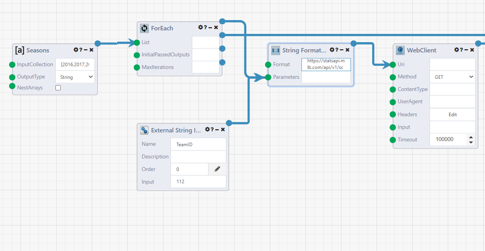
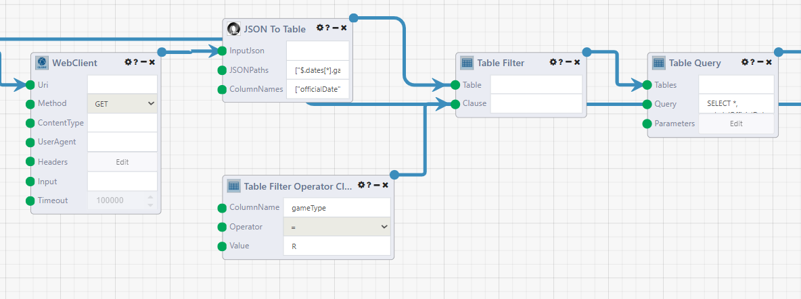
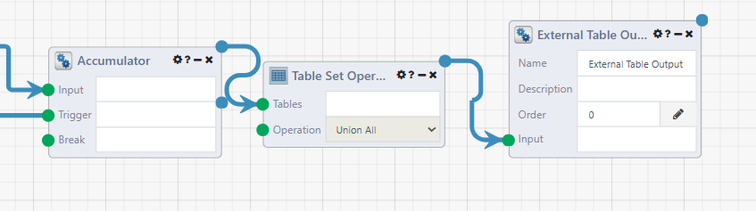
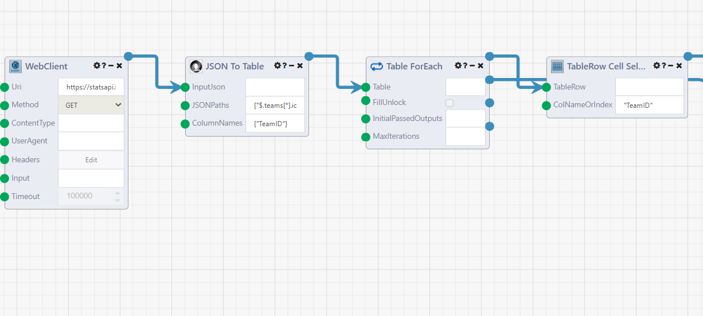
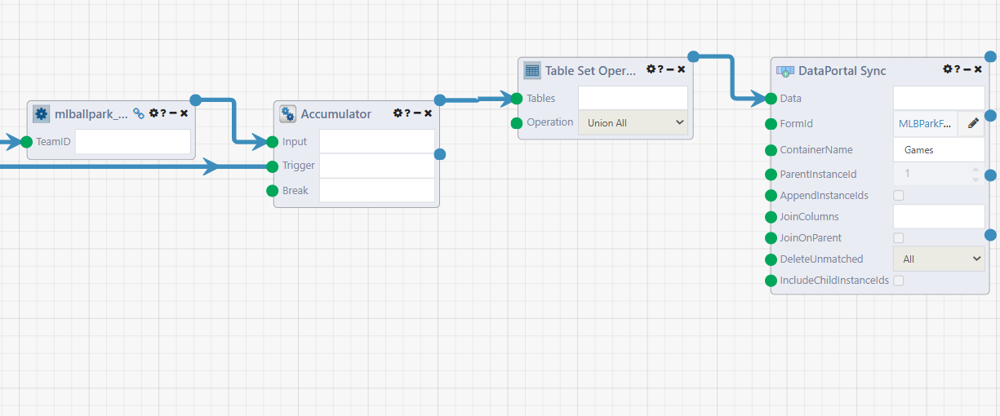
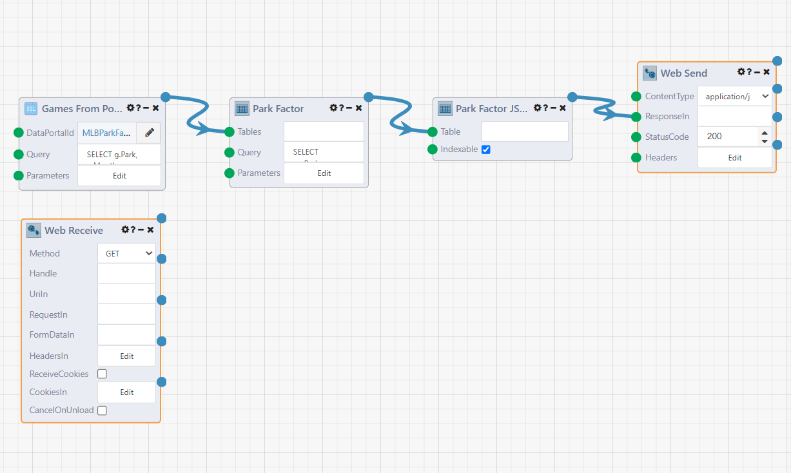
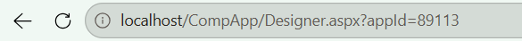

# Reading Ballpark Data from the MLB Stats API

Every analysis starts by collecting data. In this lab we build three [DataFlows](../../DataFlows/01.Overview.md): the first extracts and cleans a single team's games, the second runs it for the whole league and stores the results in a DataPortal, and the third serves those results back out over HTTP as JSON.

The dataset is the [MLB Stats API](https://statsapi.mlb.com) schedule endpoint, which is public and needs no API key. A single request returns every game a team played in a season, including the venue, the final score, and whether the game was played in the day or at night.

The DataFlows in the second and third parts of this lab address the DataPortal we create in the [next lab](2-DataPortal.md), so they need its ID. Either jump ahead and create the portal first, since it is a five minute step, or build these DataFlows now and fill in the ID afterwards.

## Extracting One Team's Games

This DataFlow does the real work of talking to the API. It takes a team ID, walks eleven seasons, and returns one clean table of that team's home games.

Create a DataFlow named `mlballpark_TOD`, and describe it as *Analysis of Hitting/Pitching statistics relative to Time of Day in MLB Ballparks*.

### Looping Through the Seasons

Start with an `External String Input` module named `TeamID`, with the value `112`. Declaring it as an *external* input is what lets the next DataFlow call this one as a module and pass a different team each time.

Add an `Array Builder` module named `Seasons`. Set `OutputType` to `String` and list the seasons to cover.

```
2016, 2017, 2018, 2019, 2020, 2021, 2022, 2023, 2024, 2025, 2026
```

Add a `ForEach Map` module and connect `Seasons.ArrayOutput` to its `List` input. Everything downstream of it runs once per season.

Now build the request url with a `String Formatter` module. Connect `External String Input` to its `Parameters` input first, then `ForEach.Object`. The format string reads them positionally, so the order of these two connections is the difference between a working url and a 404. Enter the following as the `Format`.

```
https://statsapi.mlb.com/api/v1/schedule?sportId=1&teamId={0}&startDate={1}-04-01&endDate={1}-10-31&hydrate=team,linescore,venue
```

Connect `String Formatter.Result` to the `Uri` input of a `WebClient` module, set the `Method` to `GET`, and set the `Timeout` to `100000`.



Reading the connection dots left to right, `Seasons` feeds the `List` input of `ForEach`, and both `ForEach.Object` and `External String Input` feed `String Formatter.Parameters`. The formatted url then feeds `WebClient.Uri`.

### Parsing and Cleaning the Response

The response is JSON, so the `JSON To Table` module turns it into a Composable Table. Connect `WebClient.Result` to its `InputJson` input, and enter the following eight expressions as the `JSONPaths`. The filter in each path drops any game that never reached a final score.

```
$.dates[*].games[?(@.status.detailedState=='Final')].officialDate
$.dates[*].games[?(@.status.detailedState=='Final')].dayNight
$.dates[*].games[?(@.status.detailedState=='Final')].gameType
$.dates[*].games[?(@.status.detailedState=='Final')].status.detailedState
$.dates[*].games[?(@.status.detailedState=='Final')].teams.home.team.venue.name
$.dates[*].games[?(@.status.detailedState=='Final')].teams.home.score
$.dates[*].games[?(@.status.detailedState=='Final')].teams.away.score
$.dates[*].games[?(@.status.detailedState=='Final')].season
```

Enter the matching `ColumnNames`, in the same order.

```
officialDate, dayNight, gameType, status, venue, homeScore, awayScore, season
```

Next, filter to regular season games only, since spring training and postseason games are played under different conditions and would pollute the averages. Add a `Table Filter` module, then right click on its `Clause` input and Composable will suggest the `Table Filter Operator Clause` module. Set `ColumnName` to `gameType`, `Operator` to `=`, and `Value` to `R`. Connect `JSON To Table.Table` to the `Table` input.

Finally, add a `Table Query` module fed from `Table Filter.Result`. This is the cleaning step, deriving the month bucket and giving the venue the name the rest of the pipeline uses.

```sql
SELECT *, substr(OfficialDate, 1, 7) AS Month, Venue AS Park
FROM [t0]
```



The Designer truncates long input values, so the boxes read `["$.dates[*].ga`, `["officialDate"` and `SELECT *,`. The full values are the code blocks above. Note that `Table Filter` takes two connections: the table arrives at `Table`, and the clause at `Clause`.

### Combining the Seasons into One Table

Add an `Accumulator` module, connecting `Table Query.Result` to `Input` and `ForEach.LoopComplete` to `Trigger`. The accumulator collects one table per season and releases them together when the loop finishes.

Then add a `Table Set Operation` module with the operation set to `Union All`, fed from `Accumulator.Result`. Eleven season tables become one.

Finish with an `External Table Output` module fed from `Table Set Operation.Result`. This is the port the next DataFlow reads, allowing this DataFlow to be used [from another DataFlow](../../DataFlows/06.DataFlow-Reuse.md).



Save, then run the DataFlow once. It should finish in a couple of seconds and produce a few hundred rows. Open the `External Table Output` result and confirm you have `Park`, `Month`, `dayNight`, `homeScore` and `awayScore` columns holding sensible values before moving on.

## Running the League and Loading the DataPortal

The second DataFlow fans the first one out across the league and lands the results in the DataPortal.

Create a DataFlow named `mlballparksync`.

### Looping Through the Teams

Add a `WebClient` module with the `Method` set to `GET`, the `Timeout` set to `100000`, and the following `Uri`.

```
https://statsapi.mlb.com/api/v1/teams?sportId=1
```

Add a `JSON To Table` module fed from `WebClient.Result`, with a single `JSONPath`.

```
$.teams[*].id
```

And a single `ColumnName`.

```
TeamID
```

Add a `Table ForEach Map` module wired from that table, which loops once per team, and a `TableRow Cell Selector` module with `ColNameOrIndex` set to `TeamID`, fed from `Table ForEach.TableRow`.



Here the `JSON To Table` module shows its single path and column name truncated as `["$.teams[*].ic` and `["TeamID"]`. The `TableRow Cell Selector` reads `"TeamID"` as well, because it pulls that column out of each row.

### Nesting the First DataFlow

In the module sidebar, go to `My DataFlows` or `Search All DataFlows` and enter `mlballpark_TOD`, then drag it onto the canvas. Composable adds it as an `App Reference Module` whose ports are the external inputs and outputs we declared in the first DataFlow. Connect `TableRow Cell Selector.CellValue` to its `TeamID` input.

Add an `Accumulator` module fed from the nested DataFlow's `External Table Output` and triggered by `Table ForEach.LoopComplete`, followed by a `Table Set Operation` module set to `Union All`. This is the same pattern as before, one level up: every team's table becomes one league wide table.

### Inserting Data with the DataPortal Sync Module

Add a `Table to Form Automapper` module, which the Designer labels `DataPortal Sync`, and connect `Table Set Operation.Result` to its `Data` input. The [DataPortalSync](../../DataFlows/09.Module-Details/DataPortalSync.md) module takes care of auditing changes to the database table as well as transforming category fields to an integer lookup.

| Input            | Value                                                                 |
| ---------------- | --------------------------------------------------------------------- |
| FormId           | The ID of the `MLBParkFactor` DataPortal                              |
| ContainerName    | Games                                                                 |
| ParentInstanceId | 1 (the single `MLBParkFactorHome` instance that owns the Games table) |
| DeleteUnmatched  | All                                                                   |



On the far left, `mlballpark_...` is the nested `mlballpark_TOD`, marked with a chain link icon and exposing a single `TeamID` port. On the far right, `DataPortal Sync` shows `FormId` as `MLBParkF...`, `ContainerName` as `Games`, `ParentInstanceId` as `1` and `DeleteUnmatched` as `All`. Leave `AppendInstanceIds`, `JoinColumns`, `JoinOnParent` and `IncludeChildInstanceIds` at their defaults.

The module maps source columns onto container fields by name, so `Park`, `Month`, `season`, `homeScore`, `awayScore`, `officialDate` and `dayNight` each land in their matching field. The `gameType` and `status` columns have no matching field and are ignored, which is fine, since we already filtered on them.

Save and run this DataFlow. It takes a few minutes, because it makes one API request per team per season. When the run finishes, open the `Counts` output to see what the sync did.

```
Records Inserted        48494
Records Updated             0
Records Deleted           647
Total Records Processed 49141
```

Check the `Errors` output as well. It should be an empty list, and anything in it is almost always a field name mismatch back in the DataPortal model file.

!!! note
	`DeleteUnmatched: All` makes every run a full refresh. Because we set no `JoinColumns`, the module cannot match existing records, so it inserts the whole table fresh and deletes whatever was there before. That is what we want for a rebuild from source pipeline, and it is why the deleted count is non-zero on second and later runs. To update in place instead, set `JoinColumns` to a combination that uniquely identifies a game.

## Serving the Results as JSON

A WebApp cannot read a QueryView directly, so we publish the same result set from an HTTP activated DataFlow. This version queries the portal through Composable rather than through SQL, so it needs no database credentials at all.

Create a DataFlow named `mlballpark_TOD_api`.

Add a `Web Receive` module with the `Method` set to `GET`. Its presence is what makes the DataFlow reachable over HTTP.

Add a [DataPortal Query](../../DataFlows/09.Module-Details/DataPortalQuery.md) module named `Games From Portal`. Set `DataPortalId` to the ID of the DataPortal and enter the query below. The module speaks Entity SQL, in which container names are pluralized and aliased.

```sql
SELECT g.Park, g.Month, g.DayNight, g.HomeScore, g.AwayScore FROM Games AS g
```

Add a `Table Query` module named `Park Factor`, fed from `Games From Portal.Results`. It performs the same aggregation as the QueryView we build in the third lab, in sqlite syntax this time, and names the columns exactly as the WebApp expects them.

```sqlite
SELECT
  p.Park,
  p.CalendarMonth,
  p.DayNight,
  p.AvgRuns AS ParkAvgRuns,
  l.AvgRuns AS LeagueAvgRuns,
  p.AvgRuns / l.AvgRuns AS ParkFactor,
  (p.AvgRuns / l.AvgRuns - 1) * 100 AS ParkFactorDeviationPct
FROM
  (SELECT Park, substr(Month, 6, 2) AS CalendarMonth, DayNight,
          AVG(CAST(HomeScore AS FLOAT) + CAST(AwayScore AS FLOAT)) AS AvgRuns
   FROM [t0]
   GROUP BY Park, substr(Month, 6, 2), DayNight) p
JOIN
  (SELECT substr(Month, 6, 2) AS CalendarMonth, DayNight,
          AVG(CAST(HomeScore AS FLOAT) + CAST(AwayScore AS FLOAT)) AS AvgRuns
   FROM [t0]
   GROUP BY substr(Month, 6, 2), DayNight) l
ON p.CalendarMonth = l.CalendarMonth AND p.DayNight = l.DayNight
ORDER BY p.Park, p.CalendarMonth, p.DayNight
```

Add a `Table to JSON` module named `Park Factor JSON`, fed from `Park Factor.Result`, with `Indexable` checked. Indexable output gives each row named properties, which is what the page reads.

Finish with a `Web Send` module. Connect `Park Factor JSON.Json` to `ResponseIn`, set the `ContentType` to `application/json` and the `StatusCode` to `200`.



`Web Receive` sits alone at the bottom left and wires into nothing, because we do not read anything out of the request. Its only job is to make the DataFlow reachable over HTTP. The data path runs along the top, from `Games From Po...` to `Park Factor` to `Park Factor JS...` to `Web Send`.

Save and run the DataFlow once from the Designer. A manual run exercises every module except the HTTP plumbing, and the `Web Send` output shows exactly what a caller will receive.

```json
{
  "Headers": ["Park", "CalendarMonth", "DayNight", "ParkAvgRuns",
              "LeagueAvgRuns", "ParkFactor", "ParkFactorDeviationPct"],
  "Rows": [ ... 593 rows ... ]
}
```

Now note the DataFlow's ID, which is the `appId` in the Designer's own address bar.



In `localhost/CompApp/Designer.aspx?appId=89113`, the number after `appId=` is the ID this DataFlow answers on. Its activation url follows the pattern below, and is what the WebApp will call in the fourth lab.

```
<your-server>/services/WebActivationService.svc/Activate?appId=<api-dataflow-id>
```

!!! note
	Anyone loading the WebApp needs Execute permission on this DataFlow, because their browser is what calls the url. Without it the request comes back `500` with *"User does not have Execute permissions for resource ..."*. Grant Execute to whichever group should see the page.

## Next Steps

We now have the data extracted, cleaned, and available both as a stored table and as JSON over HTTP. Next, we set up the database that the sync module writes into, with a [DataPortal](2-DataPortal.md).
