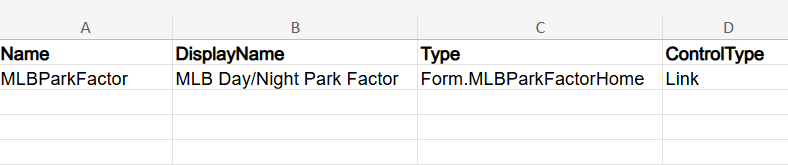
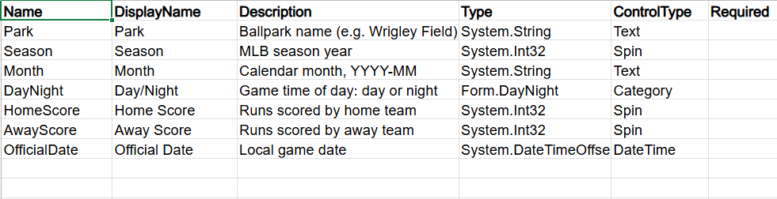
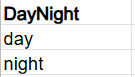
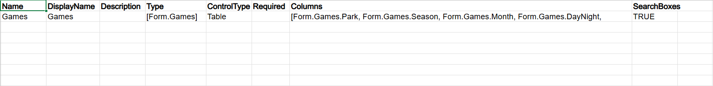
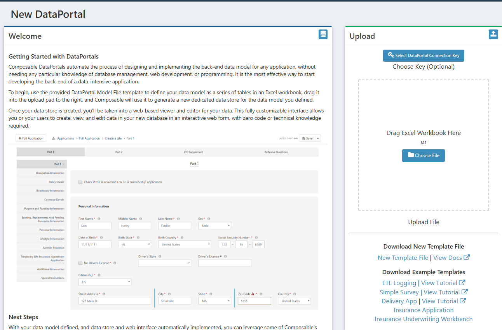
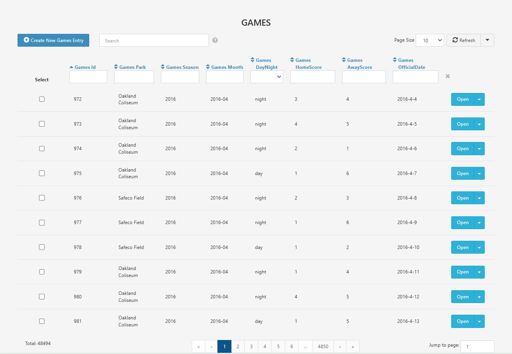

# Creating the Park Factor DataPortal

In an ETL pipeline, the next step after processing data from an external source is to put it in a data store. A [DataPortal](../../DataPortals/01.Overview.md) makes setting up a database from the data model very simple.

In this lab we build the DataPortal that the `mlballparksync` DataFlow from the [previous lab](1-DataFlows.md) writes into. One record is stored per game played, so that the park factor calculation always runs against the same permanent store rather than against a fresh set of API calls.

The field names we choose here are a contract. The `DataPortal Sync` module matches source columns to container fields by name, so a typo on this page silently drops a column in the DataFlow.

## The DataPortal Model File

A DataPortal's data model lives in an Excel workbook, with one sheet per container and one row per field. You build the workbook, upload it, and Composable creates the portal, its containers, its picklists, and the database behind them.

The Excel file used in this lab is available here: <a href="../../MLB-Park-Factor/img/MLBParkFactorDataPortal.xlsx" download="MLBParkFactorDataPortal.xlsx">Download MLB Park Factor DataPortal Model (xlsx)</a>

### Master Sheet

In the [master sheet](../../DataPortals/03.MasterSheet.md), we name the database, and use the `Link` ControlType to point towards the entry page of the DataPortal. As `Type`, enter `Form.MLBParkFactorHome`, which points towards another sheet in the file.

| [Name](../../DataPortals/06.Setting-Details/Name.md) | [DisplayName](../../DataPortals/06.Setting-Details/DisplayName.md) | [Type](../../DataPortals/06.Setting-Details/Type.md) | [ControlType](../../DataPortals/06.Setting-Details/ControlType.md) |
| ---------------------------------------------------- | ------------------------------------------------------------------ | ---------------------------------------------------- | ------------------------------------------------------------------ |
| MLBParkFactor                                        | MLB Day/Night Park Factor                                          | Form.MLBParkFactorHome                               | [Link](../../DataPortals/05.Control-Details/Link.md)               |

Row 1 is the header and row 2 is the portal itself.

### Master.settings (optional step)

[Settings pages](../../DataPortals/06.SettingSheet.md) are optional. The heading fields are `Option, Value`. Here, we disable the AutoSave feature. With AutoSave enabled, when you start entering data on a DataPortal page, it is automatically saved, even if your entry is not complete. When it is turned off, you need to click the `Save` Button for the data to be saved.

| Option   | Value |
| -------- | ----- |
| AutoSave | FALSE |

### Games Container Page

We're going to skip over the `MLBParkFactorHome` sheet that we linked from the master page, and instead first create the container where we will be storing the game data that we processed in the previous DataFlow. This is where we define the schema of the table, defining the names and datatypes. In our DataPortal, we also pick a ControlType for how to display these fields to a user entering in data.

Now go through each of the fields in the dataset, and list out their properties. In the [`Name`](../../DataPortals/06.Setting-Details/Name.md) column, we want these to match our dataset exactly, since these are the names the `DataPortal Sync` module matches against. In the [`DisplayName`](../../DataPortals/06.Setting-Details/DisplayName.md) field, we make them more readable. In the [`Type`](../../DataPortals/06.Setting-Details/Type.md) column, we are mostly using C# System Types: strings for the park and month text, integers for the scores and the season, and datetime for the game date. For the DayNight field, we instead use a [`Category`](../../DataPortals/05.Control-Details/Category.md) control type to limit the input values to the two times of day. We define the category values in the `Categories` sheet of our excel file.

| [Name](../../DataPortals/06.Setting-Details/Name.md) | [DisplayName](../../DataPortals/06.Setting-Details/DisplayName.md) | [Description](../../DataPortals/06.Setting-Details/Description.md) | [Type](../../DataPortals/06.Setting-Details/Type.md) | [ControlType](../../DataPortals/06.Setting-Details/ControlType.md) |
| ---------------------------------------------------- | ------------------------------------------------------------------ | ------------------------------------------------------------------ | ---------------------------------------------------- | ------------------------------------------------------------------ |
| Park                                                 | Park                                                               | Ballpark name (e.g. Wrigley Field)                                 | System.String                                        | [Text](../../DataPortals/05.Control-Details/Text.md)               |
| Season                                               | Season                                                             | MLB season year                                                    | System.Int32                                         | [Spin](../../DataPortals/05.Control-Details/Spin.md)               |
| Month                                                | Month                                                              | Calendar month, YYYY-MM                                            | System.String                                        | Text                                                               |
| DayNight                                             | Day/Night                                                          | Game time of day: day or night                                     | Form.DayNight                                        | [Category](../../DataPortals/05.Control-Details/Category.md)       |
| HomeScore                                            | Home Score                                                         | Runs scored by home team                                           | System.Int32                                         | Spin                                                               |
| AwayScore                                            | Away Score                                                         | Runs scored by away team                                           | System.Int32                                         | Spin                                                               |
| OfficialDate                                         | Official Date                                                      | Local game date                                                    | System.DateTimeOffset                                | [DateTime](../../DataPortals/05.Control-Details/DateTime.md)       |

One row per field. Column A is the name the sync module matches against, and column B is only the label a person sees.

Now let's go to the [`Categories`](../../DataPortals/05.Categories.md) sheet, so we can define the times of day we referenced as `Form.DayNight`. Here, "DayNight" is the header of a column of the Categories sheet. We add in the two values `day` and `night`, spelled exactly as the MLB Stats API returns them.

| DayNight |
| -------- |
| day      |
| night    |

### MLBParkFactorHome Container Page

Now let's go back to the `MLBParkFactorHome` sheet we referenced in the master sheet. Here we describe what to show as the main page of the DataPortal. We need to reference our `Games` container, and list what columns we want to display.

For Type, enter `[Form.Games]`. The square brackets are what make this a repeating table rather than a single record.

Under `Columns` enter: `[Form.Games.Park, Form.Games.Season, Form.Games.Month, Form.Games.DayNight, Form.Games.HomeScore, Form.Games.AwayScore, Form.Games.OfficialDate]`

Optionally, the column [`SearchBoxes`](../../DataPortals/06.Setting-Details/SearchBoxes.md) set to `TRUE` will allow us to search on a column level, such as to only view games at a specific park.

### Upload DataPortal

On the New DataPortal page, either click the `Choose File` button, or drag your file over to the upload box, and in the background Composable creates your database. Leave `Select DataPortal Connection Key` alone, since it is optional, and without it Composable creates and manages the database for you.

The `Upload` panel on the right holds the connection key button at the top, the drag pad in the middle, and `Upload File` beneath it. `Download New Template File` at the bottom is where a blank workbook comes from if you want to start one from scratch.

Once it's finished processing, click on the `Open DataPortal` button and you'll be brought to the homepage of your DataPortal, which will look empty, since we haven't added any data. After running the `mlballparksync` DataFlow from the previous lab, the same page looks like this.

The seven fields appear as sortable, searchable columns, with `Total: 48494` at the bottom left once the sync has run.

Note the portal's ID, which is the number in the url, `DataPortal.aspx#/form/<id>`. This is the value that goes into the `FormId` input of the `DataPortal Sync` module and the `DataPortalId` input of the `DataPortal Query` module in the previous lab. Also note the database that Composable created to back the portal, which is named after the portal with a `Model` suffix, `MLBParkFactorModel`. We need that name in the next lab.

!!! note
	The workbook stays the source of truth. To change the model you edit it and [reupload it](../../DataPortals/10.UpdateDataPortals.md) on the portal's Manage page. Renames are the trap, since a DataPortal cannot detect that a field was renamed, so changing a `Name` deletes the old field and adds a new one, taking its data with it. Change the `DisplayName` instead when you only want the label to read differently.

!!! note
	Because `DayNight` is a `Category` whose members live on the `Categories` sheet, Composable stores it in its own lookup table. The `Games` table in the portal's database carries a `DayNight_Id` column pointing at a `DayNights` table, rather than the string itself. That decides how we write SQL in the next lab, and it is the easiest thing in this pipeline to get wrong.

## Next Steps

With an excel file and a two module DataFlow, we've created a database and inserted 48,000 games without writing any SQL. Next, we query that data with a [QueryView](3-QueryView.md).
